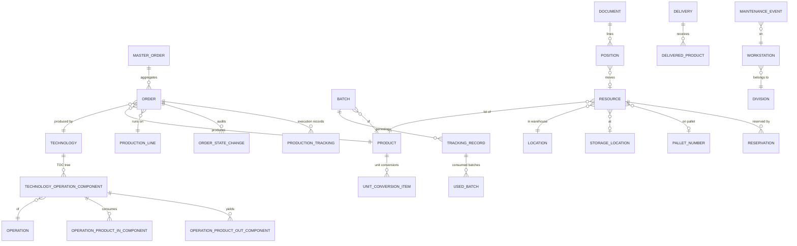
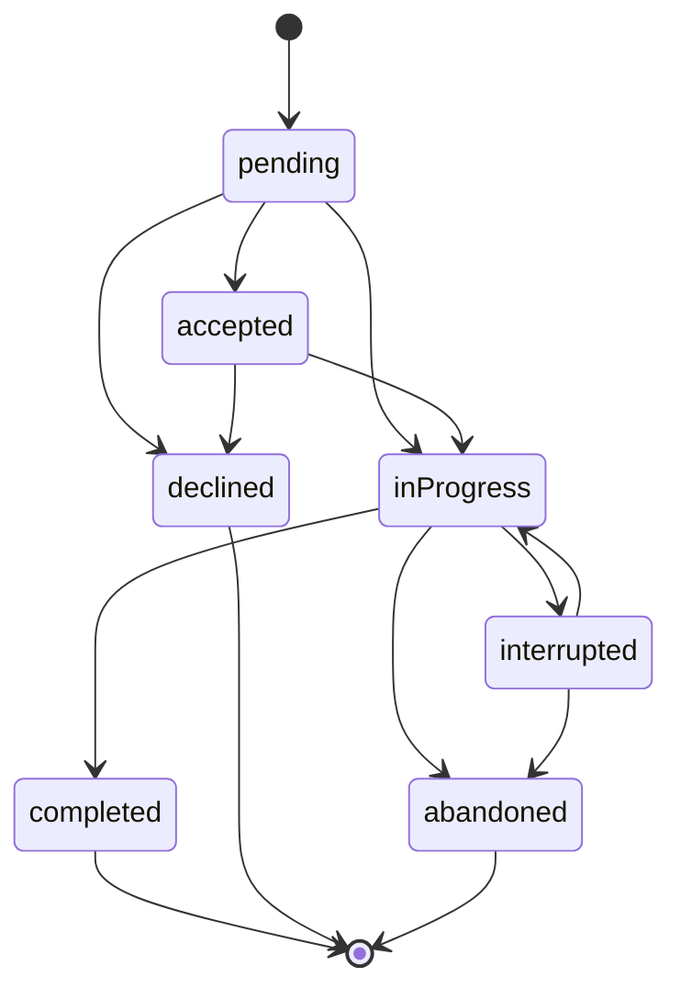
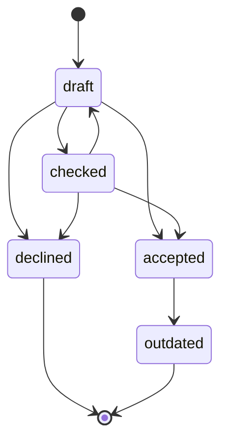
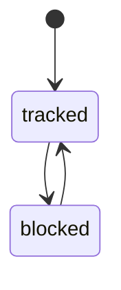
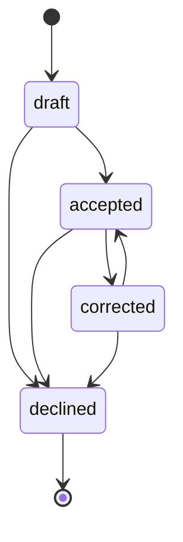
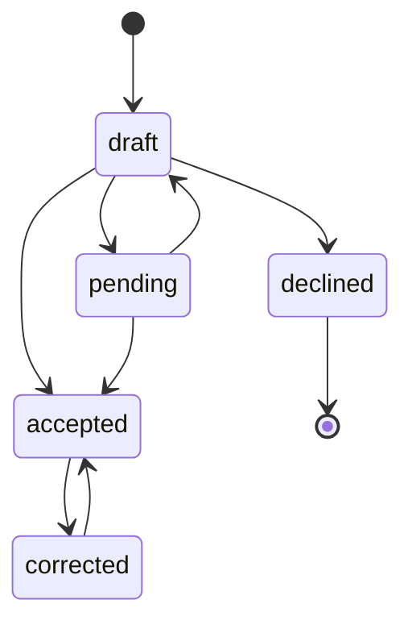
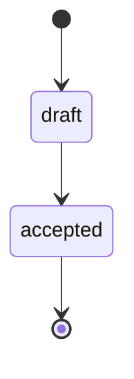
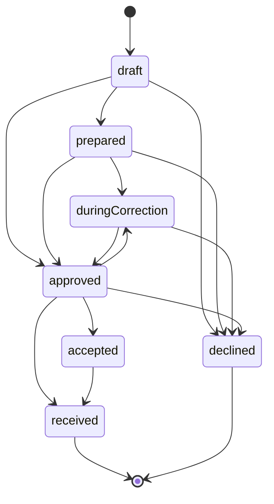

# Application Dossier: Qcadoo MES (Chem_mes) — Plant A

## A. Identification

| Item | Value |
|---|---|
| Repository | `SachetCognition/Chem_mes` |
| Ref / branch | `master` |
| Commit SHA | `81d6bb59392d782200fc0ca96c1dce046be26954` |
| Analysis date | 2026-07-28 |
| Application | Qcadoo MES, fork of the open-source qcadoo/mes (AGPLv3), version `1.5-SNAPSHOT`, "buildVersionForUser" `3.1.16` (`pom.xml`) |
| Modules | 1 WAR assembly module (`mes-application`) + 56 plugin modules under `mes-plugins/` (55 plugins + aggregator `pom.xml`) |

LOC by language (cloc at the analysed commit):

| Language | Files | Code LOC | Note |
|---|---:|---:|---|
| SQL (PL/pgSQL schema dumps) | 8 | 245,122 | `mes-application/src/main/resources/schema/` (mes/wms/aps × en/pl/fr/cn variants) |
| Java | 3,162 | 196,280 | plugin business logic |
| XML | 1,294 | 90,998 | Qcadoo model/view/plugin descriptors |
| JavaScript | 47 | 26,284 | jqGrid/Angular-style UI extensions |
| CSS | 17 | 19,640 | |
| JSP | 51 | 5,624 | dashboards, document positions grid, etc. |
| Maven POM | 58 | 2,740 | |
| **Total** | 4,642 | **587,603** | |

Confidence: High (direct manifest and cloc measurement).

## B. Business layer

### B.1 Purpose

A plugin-modular Manufacturing Execution System covering: production order management and scheduling, technology (BOM + routing) definition with approval lifecycle, batch tracking and genealogy, granular warehouse resource management (lots, pallets, storage locations, FIFO/LIFO/FEFO/LEFO disposal), production execution recording ("production tracking"), procurement deliveries, maintenance (CMMS), and cost calculation. Vocabulary of the shipped product (localisation files in en/pl/fr/de/cn) is the Qcadoo dialect: *Order*, *Technology*, *Technology Operation Component (TOC)*, *Master Order*, *Resource*, *Document*, *Batch*, *Tracking Record*, *Production Tracking*, *Delivery*. Confidence: High (module inventory in §A; locale files, e.g. `mes-plugins/mes-plugins-orders/src/main/resources/orders/locales/orders_en.properties`).

### B.2 Personas / roles (from the shipped security model)

The security model is Spring-Security-based with a shipped role hierarchy `ROLE_SUPERADMIN > ROLE_ADMIN > ROLE_USER` (`mes-application/src/main/resources/security.properties:25`) plus **151 distinct fine-grained roles** declared via `<security:role identifier="ROLE_…"/>` across the plugins' `qcadoo-plugin.xml` descriptors (count from grep across `mes-plugins/*/src/main/resources/qcadoo-plugin.xml`). Roles are attached to menu items/views (`add_view_item(... auth_role ...)` PL/pgSQL helper, `mes-application/src/main/resources/schema/mes_db_en.sql:227`). Confidence: High.

Representative personas implied by the role groups:

| Persona | Evidence roles (citations) |
|---|---|
| Master-data / product manager | `ROLE_PRODUCTS`, `ROLE_PRODUCT_FAMILIES`, `ROLE_PRODUCT_COSTS`, `ROLE_COMPANY_STRUCTURE` (`mes-plugins/mes-plugins-basic/src/main/resources/qcadoo-plugin.xml:79-84`) |
| Production planner / supervisor | order/planning/kanban roles: `ROLE_DASHBOARD_KANBAN`, `ROLE_DASHBOARD_KANBAN_CREATE_ORDERS`, `ROLE_DASHBOARD_KANBAN_GOTO_ORDER_EDIT` (grep across plugin descriptors) |
| Warehouse operator | `ROLE_DOCUMENTS_STATES_ACCEPT`, `ROLE_DOCUMENT_POSITIONS`, `ROLE_DOCUMENTS_CORRECTIONS_MIN_STATES` |
| Buyer / procurement | `ROLE_DELIVERIES`, `ROLE_DELIVERIES_EDIT`, `ROLE_DELIVERIES_PRICE`, `ROLE_DELIVERIES_STATES_ACCEPT/APPROVE/DECLINE` |
| Quality/genealogy officer | `ROLE_ADVANCED_GENEALOGY`, `ROLE_BATCHES`, `ROLE_GENEALOGY` |
| Maintenance technician / planner | `ROLE_EVENTS_*` family (ADD_FAILURE, ADD_ISSUE, PLAN, START, STOP, ACCEPT, CLOSE, REVOKE), `ROLE_CMMS_SCHEDULER_*` |
| System administrator | `ROLE_SUPERADMIN`, `ROLE_ADMIN`, `ROLE_ARCHIVING`, `ROLE_CLEAN_EXTERNAL_NUMBER` |

Confidence: High for role identifiers, Medium for the persona mapping (inferred from role naming, not documented job descriptions).

### B.3 Business object model

Core objects (entity XML models per plugin, `*/src/main/resources/*/model/*.xml`):

Evidence: order/orderStateChange/schedule models (`mes-plugins/mes-plugins-orders/src/main/resources/orders/model/`), TOC structure (`mes-plugins/mes-plugins-technologies/src/main/java/com/qcadoo/mes/technologies/constants/TechnologyOperationComponentFields.java:34-58` — `OPERATION`, `PARENT`, `CHILDREN`, `OPERATION_PRODUCT_IN_COMPONENTS`, `OPERATION_PRODUCT_OUT_COMPONENTS`), batch/tracking record (`mes-plugins/mes-plugins-advanced-genealogy/.../constants/BatchFields.java:32-58`, `TrackingRecordFields.java:31-49`), resource/document/reservation/storageLocation/palletNumber models (`mes-plugins/mes-plugins-material-flow-resources/src/main/resources/materialFlowResources/model/` — `resource.xml`, `document.xml`, `position.xml`, `reservation.xml`, `storageLocation.xml`, `palletBalance.xml`), product conversions (`mes-plugins/mes-plugins-basic/src/main/resources/basic/model/product.xml:55`), division/factory/subassembly (`mes-plugins/mes-plugins-basic/src/main/resources/basic/model/division.xml`, `factory.xml`). Confidence: High for entities and named relations; Medium for cardinalities (read from model XML `belongsTo`/`hasMany` but not exhaustively verified per relation).

### B.4 Business consequences of the design

- **Warehouse truth is lot-level.** Stock is a set of `Resource` rows, each a concrete lot with `batch`, `expirationDate`, `productionDate`, `price`, `storageLocation`, `palletNumber`, `qualityRating`, `blockedForQualityControl`, `reservedQuantity`, `availableQuantity` (`ResourceFields.java:32-90`). All stock movements are `Document`s (Receipt/Internal In/Out/Release/Transfer) whose acceptance consumes/creates resources — physical fidelity is enforceable, but every movement demands a document. Confidence: High.
- **Governed recipes.** Orders must reference a `Technology`; technologies pass a validation battery before acceptance and become immutable/outdated rather than edited in place (§C.2/C.3). This creates real change control on the BOM/routing but no versioned e-signature workflow. Confidence: High.
- **Genealogy is opt-in and parallel to WMS.** Batch/TrackingRecord genealogy (advanced-genealogy plugin) is a separate object model from warehouse `Resource.batch`; consistency between the two is by convention, so traceability quality depends on operating discipline. Confidence: Medium (model separation is High; operational consequence inferred).
- **Extensible-by-plugin monolith.** All 55 plugins deploy into one WAR/one PostgreSQL schema; cross-plugin behaviour is wired via AOP state-listeners (e.g. warehouse documents generated from order state changes in `product-flow-thru-division`). Functional breadth is high, but coupling is at the database and event level. Confidence: High.

## C. Functional layer

### C.1 Capability inventory

| Capability | Depth description | Evidence | Confidence |
|---|---|---|---|
| Production order lifecycle | 7-state machine with per-state allowed transitions encoded in enum; state-change audit entity with worker/shift/timestamps; reason-type dictionaries for date corrections & deviations | `orders/states/constants/OrderState.java:31-81`; `orders/model/orderStateChange.xml:36-47`; `orders/model/reasonTypeOfChangingOrderState.xml` | High |
| Master (sales) orders | `MasterOrder` aggregates production orders; own 4-state status | `masterOrders/constants/MasterOrderState.java:30-32` | High |
| Technology (BOM+routing) | Hierarchical TOC tree; each node = operation with input/output product components; per-order copies (`orderTechnologicalProcess`) | `technologies/constants/TechnologyOperationComponentFields.java:34-58`; `orders/model/orderTechnologicalProcess.xml` | High |
| Technology approval governance | 5-state lifecycle (draft/checked/accepted/declined/outdated) + ~20 validation checks executed as state-change listeners (tree set, cycles, units match, in-components present, waste marking, not-used-in-active-order) | `technologies/states/constants/TechnologyState.java:33-66`; `technologies/states/listener/TechnologyValidationService.java:91-707` | High |
| Batch master data & genealogy | `Batch` (number, product, supplier, parent/children tree) + `TrackingRecord` linking produced batch to used batches; producedFrom / usedToProduce tree browsing; genealogy PDF report | `advancedGenealogy/constants/BatchFields.java:32-58`; `TrackingRecordFields.java:31-49`; `tree/AdvancedGenealogyTreeViewListeners.java:71-73`; `print/AdvancedGenealogyPdfService.java` | High |
| Batch blocking / quarantine | Batch state machine TRACKED⇄BLOCKED; warehouse resources carry `blockedForQualityControl` and are filtered out of issue candidate lists | `advancedGenealogy/states/constants/BatchState.java:31-44`; `materialFlowResources/criteriaModifiers/ResourceCriteriaModifiers.java:59,70` | High |
| Warehouse / material flow resources | Lot-level `Resource` with expiry, price, pallet, storage location; documents (5 types, draft→accepted) create/consume resources atomically; repacking, stocktaking with own state machines | `materialFlowResources/constants/DocumentType.java:31-35`; `DocumentState.java:33`; `service/ResourceManagementServiceImpl.java`; `states/constants/RepackingState.java`, `StocktakingState.java` | High |
| FIFO/LIFO/FEFO/LEFO picking | Warehouse-level disposal algorithm enum; outbound resource selection ordered by time or expiration date accordingly | `materialFlowResources/constants/WarehouseAlgorithm.java:26-27`; `service/ResourceManagementServiceImpl.java:1015-1027,1207-1220` | High |
| Stock reservations | Reservations created/updated/deleted from draft document positions ("draft makes reservation"); order-level resource reservations validated at state change | `materialFlowResources/service/ReservationsService.java:81-247`; `productFlowThruDivision/states/OrderStatesListenerServicePFTD.java:129,633` | High |
| Production execution recording | `ProductionTracking` records (5-state machine) capturing quantities, labor & machine time, waste; per-shift reporting (production-per-shift plugin) | `productionCounting/states/constants/ProductionTrackingState.java:31-66`; plugin `mes-plugins-production-per-shift` | High |
| Automatic warehouse postings from execution | Order/production-tracking state listeners create & accept inbound/outbound documents, clear reservations, check material availability | `productFlowThruDivision/states/OrderStatesListenerServicePFTD.java:129-633`; `ProductionTrackingListenerServicePFTD.java` | High |
| Planning & scheduling | Order & production-line schedules with DRAFT/APPROVED/REJECTED states; realization-time calculation (TJ/TPZ time norms); Gantt views (gantt-for-operation / gantt-for-shifts plugins); line changeover norms | `orders/states/constants/ScheduleState.java:8-24`; `productionScheduling/OrderRealizationTimeServiceImpl.java`; plugins `mes-plugins-gantt-for-*`, `mes-plugins-line-changeover-norms` | High |
| Material requirements / coverage | Demand-vs-stock coverage analysis per order and globally (order-supplies, material-requirement-coverage-for-order plugins) | `orderSupplies/OrderSuppliesServiceImpl.java`; `materialRequirementCoverageForOrder/MaterialRequirementCoverageForOrderServiceImpl.java` | High |
| Procurement deliveries | Delivery lifecycle draft→prepared→duringCorrection→approved→accepted→received with declines; min-state-driven ordering (deliveries-min-state, warehouse-minimal-state plugins) | `deliveries/states/constants/DeliveryState.java:31-73` | High |
| Costing | Cost norms for products/operations/materials; order cost calculation; average labor cost per order; production balance | plugins `mes-plugins-cost-calculation`, `mes-plugins-cost-norms-for-*`, `mes-plugins-avg-labor-cost-calc-for-order`; `ResourceFields.PRICE` (`ResourceFields.java:46`) | High |
| Maintenance (CMMS) | Maintenance events (failure/issue) with 7-state lifecycle incl. accept/close/revoke and role-gated actions; planned events; machine parts | `cmmsMachineParts/states/constants/MaintenanceEventState.java:33-86`; `ROLE_EVENTS_*` roles | High |
| Labour & shifts | Staff, shifts, assignment-to-shift with own workflow, wage groups | plugins `mes-plugins-assignment-to-shift`, `mes-plugins-wage-groups`; `basic` staff/shift models | High |
| Quality data (thin) | `qualityRating` + `blockedForQualityControl` on resources; `qualityCard` reference on technology; generic attribute framework (product/resource attribute values, before/after correction) | `ResourceFields.java:84-86`; `technologies/constants/TechnologyFields.java` (qualityCard); `basic/constants/AttributeFields.java`, `materialFlowResources` `resourceAttributeValue.xml` | High (presence), depth assessed in §G |
| Reporting | PDF/XLSX generation services throughout (genealogy report, work plans, production balance, delivery reports, CMMS reports) | `advancedGenealogy/print/TrackingRecordPdfView.java`; plugin `mes-plugins-work-plans`; `cmmsMachineParts/reports/*ReportController.java` | High |
| External integration hooks | `externalNumber`/`externalSynchronized` fields on orders/batches; read-only JSON REST endpoints (operations, technologies, materials, workstations); transactional e-mail (Mandrill/Sendinblue) | `orders/constants/OrderFields.java:48,88`; `technologies/controller/TechnologyApiController.java:40-72`; `emailNotifications/.../MandrillServiceImpl.java` | High (presence) |
| Archiving | PL/pgSQL archive machinery moving closed orders + connected tables to shadow `arch_*` tables | `mes-application/src/main/resources/schema/mes_db_en.sql:292-648` (`archive`, `archive_connected_orders`, `generate_arch_tables`) | High |

### C.2 Core state machines

All transition sets below are taken directly from `canChangeTo` implementations in the state enums — **states High, arrows High** (explicitly encoded, not inferred), except where noted.

**Production order lifecycle** (`orders/states/constants/OrderState.java:31-81`):

**Technology (recipe/BOM) lifecycle** (`technologies/states/constants/TechnologyState.java:33-66`):

**Batch state (blocking/quarantine)** (`advancedGenealogy/states/constants/BatchState.java:31-44`):

**Genealogy tracking record** (`advancedGenealogy/states/constants/TrackingRecordState.java:31-64`):

**Production tracking record** (`productionCounting/states/constants/ProductionTrackingState.java:31-66`):

**Warehouse document** (`materialFlowResources/constants/DocumentState.java:33` — two states; acceptance is one-way in `DocumentStateChangeService`):

(States High; the irreversibility of `accepted` is Medium — enforced by service logic, not an enum.)

**Delivery lifecycle** (`deliveries/states/constants/DeliveryState.java:31-73`):

### C.3 Key business rules / validations / gating

| Rule | Where enforced | Evidence | Confidence |
|---|---|---|---|
| Order cannot be ACCEPTED without dateFrom, dateTo, production line and technology | order state-change listener | `orders/states/OrderStateValidationService.java:44-47` | High |
| Order cannot be COMPLETED with doneQuantity = 0 (or missing dates/doneQuantity) | order state-change listener | `OrderStateValidationService.java:54-63` | High |
| Order date range must be consistent (dateTo after dateFrom) at state change | `OrderStateService.checkOrderDates` | `orders/states/OrderStateService.java:47-59` | High |
| Illegal state jumps rejected (e.g. completed → anything) | `canChangeTo` per state enum | `OrderState.java:54-81` | High |
| Technology acceptance gated by ~20 structural checks: tree present, root produces technology product, every operation has in-components, no cycles, units match, waste flags correct, sub-operation products used, not used in active order | technology state-change listeners (AOP aspect `TechnologyValidationAspect`) | `technologies/states/listener/TechnologyValidationService.java:91,146,189,232,240,255,296,311,546,618,678,707` | High |
| Material availability & resource reservations checked when order starts; inbound documents auto-accepted; reservations cleared on decline/abandon | order state listeners in product-flow-thru-division | `productFlowThruDivision/states/OrderStatesListenerServicePFTD.java:129,134,580,633` | High |
| Outbound picking honours warehouse disposal algorithm (FIFO by time asc, LIFO desc, FEFO by expiry asc, LEFO desc) | resource selection for document positions | `ResourceManagementServiceImpl.java:1015-1027` | High |
| Resources blocked for quality control are excluded from available-resource lookups | criteria modifiers on resource grids/lookups | `ResourceCriteriaModifiers.java:59,70` | High |
| Draft warehouse documents reserve stock; reservations mutate `availableQuantity` on resources | reservations service | `ReservationsService.java:81-247`; `ResourceFields.java:34-36` | High |
| Batch must be unblocked (TRACKED) before further use; blocking is reversible | batch state machine + listeners | `BatchState.java:31-44`; `advancedGenealogy/states/listener/BatchBasicStateListenerService.java` | High |
| Order numbers / resource numbers / document numbers generated by DB triggers (sequence-per-day patterns) | PL/pgSQL triggers | `mes_db_en.sql:1044` (`generate_and_set_document_number_trigger`), `:1140-1183` (`generate_and_set_resource_number`) | High |

## D. Technical layer

- **Language/frameworks:** Java 8 (root `pom.xml` targets 1.8; plugin framework `com.qcadoo` 1.5-SNAPSHOT, `qcadoo-super-pom` 0.0.1), Spring (classic XML/annotation, not Spring Boot), AspectJ compile-time weaving for state-change listeners (`*/states/aop/*Aspect.java`), Hibernate-based Qcadoo model API (entities defined in XML `model/*.xml`, accessed as untyped `Entity`), PostgreSQL with heavy PL/pgSQL (90 functions in `mes_db_en.sql`), Tomcat WAR deployment (`mes-application`, `-Ptomcat` profile). UI: server-defined Qcadoo views (XML) + jqGrid/JavaScript + JSP dashboards. Confidence: High.
- **Architecture:** monolithic WAR composed of 55 OSGi-like Qcadoo plugins; each plugin ships `qcadoo-plugin.xml` (models, views, menus, roles), model XML, hooks (model lifecycle), listeners (view events), and state-change services registered through a shared `mes-plugins-states` framework (`StateEnum`, `StateChangeContext`, describers, AOP aspects). Cross-plugin extension via plugin dependency + AOP (e.g. `product-flow-thru-division` decorating order states). Confidence: High.
- **Persistence:** single PostgreSQL schema; full DDL shipped as 8 locale/product-variant SQL dumps (~2.4 MB each, `mes-application/src/main/resources/schema/`); DB triggers generate business numbers; archiving to `arch_*` shadow tables in PL/pgSQL (`mes_db_en.sql:292-648`). Locale-specific dumps mean shipped dictionary data is baked per language. Confidence: High.
- **Extensibility model:** new behaviour = new plugin; field additions via `model.xml` extensions + `f_add_col` PL/pgSQL helpers (`mes_db_en.sql:755-943`); UI via view XML + criteria modifiers; feature toggles via plugin presence checks (e.g. `PluginUtils.isEnabled("ziepiwowarski")` in `OrderStateValidationService.java:60` — a customer-specific toggle left in core code). Confidence: High.
- **Test signals:** 210 `*Test.java` files under `mes-plugins/*/src/test` (unit tests, Mockito-style), no integration/e2e suite or CI pipeline definition found in the repo (searched for `.github/workflows`, `Jenkinsfile`, `.travis.yml` — none present). Confidence: High.
- **Commit activity:** history spans 2012→2026 (upstream qcadoo history retained): 2,407 commits in 2012 declining to 340 (2025) and 154 (2026 YTD incl. fork rebranding merges). Active but decelerating maintenance. Confidence: High (git log by year).

## E. Non-functional snapshot

- **Security:** Spring Security with 3-tier hierarchy + 151 granular roles bound to menu items/views and specific state-change buttons (e.g. `ROLE_DELIVERIES_STATES_ACCEPT`, `ROLE_EVENTS_ACCEPT`) — genuinely fine-grained RBAC (`security.properties:25`; plugin descriptors). No SSO/OAuth/LDAP configuration found in the repo. Confidence: High for what exists; Medium for absence of SSO (config could live outside repo).
- **Auditability:** every governed entity has a companion `*StateChange` entity storing target state, `dateAndTime`, `worker`, `shift` and phase (`orders/model/orderStateChange.xml:36-47`; equivalents for technology, batch, tracking record, document, delivery, schedule). Resource corrections keep before/after attribute values (`resourceAttributeValueBeforeCorrection.xml` / `...AfterCorrection.xml`). No electronic-signature (21 CFR Part 11-style) mechanism found (searched "signature", "esign"). Confidence: High.
- **Scalability:** single-schema monolith; heavy PL/pgSQL and DB triggers concentrate load in PostgreSQL; archiving machinery exists specifically to keep operational tables small (`mes_db_en.sql:292` `archive(_rows)`), which signals known data-volume pressure. Horizontal scaling limited to Tomcat replicas against one DB. Confidence: Medium (inferred from architecture).
- **Technical health / age:** Java 8 + Spring XML era stack (framework 1.5-SNAPSHOT dependency resolved from `nexus.qcadoo.org`), untyped `Entity` data access, 245k LOC of SQL dumps as schema management, customer-name feature toggles in core logic — a mature, feature-rich but ageing codebase with meaningful upgrade risk (snapshot dependency on a third-party Nexus). Confidence: High.

## F. Evidence index

| # | File path (repo-relative) | Lines | Proves | Confidence |
|---|---|---|---|---|
| 1 | `pom.xml` | 14-15, 44-46 | Fork of qcadoo/mes, version 1.5-SNAPSHOT, buildVersionForUser 3.1.16, qcadoo framework deps | High |
| 2 | `mes-plugins/mes-plugins-orders/src/main/java/com/qcadoo/mes/orders/states/constants/OrderState.java` | 31-81 | 7 order states + explicit allowed transitions | High |
| 3 | `mes-plugins/mes-plugins-orders/src/main/java/com/qcadoo/mes/orders/states/OrderStateValidationService.java` | 44-63 | Required fields per target state; doneQuantity>0 gate on complete | High |
| 4 | `mes-plugins/mes-plugins-orders/src/main/java/com/qcadoo/mes/orders/states/OrderStateService.java` | 47-59 | Order date-range validation at state change | High |
| 5 | `mes-plugins/mes-plugins-orders/src/main/java/com/qcadoo/mes/orders/constants/OrderFields.java` | 48, 88 | `externalNumber` / `externalSynchronized` ERP hooks on orders | High |
| 6 | `mes-plugins/mes-plugins-orders/src/main/resources/orders/model/orderStateChange.xml` | 36-47 | State-change audit: dateAndTime, worker, shift | High |
| 7 | `mes-plugins/mes-plugins-orders/src/main/java/com/qcadoo/mes/orders/states/constants/ScheduleState.java` | 8-24 | Schedule DRAFT/APPROVED/REJECTED states + transitions | High |
| 8 | `mes-plugins/mes-plugins-technologies/src/main/java/com/qcadoo/mes/technologies/states/constants/TechnologyState.java` | 33-66 | 5 technology states + transitions incl. checked→draft | High |
| 9 | `mes-plugins/mes-plugins-technologies/src/main/java/com/qcadoo/mes/technologies/states/listener/TechnologyValidationService.java` | 91, 146, 189, 232, 240, 255, 296, 311, 546, 618, 678, 707 | Acceptance gating checks (quantities, waste, in-components, active-order lock, cycles, units, tree set) | High |
| 10 | `mes-plugins/mes-plugins-technologies/src/main/java/com/qcadoo/mes/technologies/constants/TechnologyOperationComponentFields.java` | 34-58 | TOC tree structure (operation, parent, children, in/out product components) | High |
| 11 | `mes-plugins/mes-plugins-technologies/src/main/java/com/qcadoo/mes/technologies/controller/TechnologyApiController.java` | 40-72 | Read-only JSON REST endpoints (operations, technologies, materials, workstations) | High |
| 12 | `mes-plugins/mes-plugins-advanced-genealogy/src/main/java/com/qcadoo/mes/advancedGenealogy/states/constants/BatchState.java` | 31-44 | Batch TRACKED⇄BLOCKED state machine | High |
| 13 | `mes-plugins/mes-plugins-advanced-genealogy/src/main/java/com/qcadoo/mes/advancedGenealogy/states/constants/TrackingRecordState.java` | 31-64 | Tracking record draft/accepted/declined/corrected states + transitions | High |
| 14 | `mes-plugins/mes-plugins-advanced-genealogy/src/main/java/com/qcadoo/mes/advancedGenealogy/constants/BatchFields.java` | 32-58 | Batch master data: number, product, supplier, tracking records, parent/children, externalNumber | High |
| 15 | `mes-plugins/mes-plugins-advanced-genealogy/src/main/java/com/qcadoo/mes/advancedGenealogy/constants/TrackingRecordFields.java` | 31-49 | Genealogy link: producedBatch, usedBatchesSimple, genealogyTree | High |
| 16 | `mes-plugins/mes-plugins-advanced-genealogy/src/main/java/com/qcadoo/mes/advancedGenealogy/tree/AdvancedGenealogyTreeViewListeners.java` | 71-73 | producedFrom / usedToProduce genealogy tree directions | High |
| 17 | `mes-plugins/mes-plugins-material-flow-resources/src/main/java/com/qcadoo/mes/materialFlowResources/constants/ResourceFields.java` | 32-90 | Resource lot model: batch, expiry, price, pallet, storage location, qualityRating, blockedForQualityControl, reservations | High |
| 18 | `mes-plugins/mes-plugins-material-flow-resources/src/main/java/com/qcadoo/mes/materialFlowResources/constants/WarehouseAlgorithm.java` | 26-27 | FIFO/LIFO/FEFO/LEFO disposal enum | High |
| 19 | `mes-plugins/mes-plugins-material-flow-resources/src/main/java/com/qcadoo/mes/materialFlowResources/service/ResourceManagementServiceImpl.java` | 1015-1027, 1207-1220 | Picking order by time/expiry per algorithm | High |
| 20 | `mes-plugins/mes-plugins-material-flow-resources/src/main/java/com/qcadoo/mes/materialFlowResources/constants/DocumentType.java` | 31-35 | 5 document types (receipt, internal in/out, release, transfer) | High |
| 21 | `mes-plugins/mes-plugins-material-flow-resources/src/main/java/com/qcadoo/mes/materialFlowResources/constants/DocumentState.java` | 33 | Document draft/accepted states | High |
| 22 | `mes-plugins/mes-plugins-material-flow-resources/src/main/java/com/qcadoo/mes/materialFlowResources/service/ReservationsService.java` | 81-247 | Reservations created/updated/deleted from draft document positions | High |
| 23 | `mes-plugins/mes-plugins-material-flow-resources/src/main/java/com/qcadoo/mes/materialFlowResources/criteriaModifiers/ResourceCriteriaModifiers.java` | 59, 70 | QC-blocked resources excluded from lookups | High |
| 24 | `mes-plugins/mes-plugins-material-flow-resources/src/main/resources/materialFlowResources/model/storageLocation.xml` | 37-54 | Storage location pallet capacity / place / high-storage flags | High |
| 25 | `mes-plugins/mes-plugins-production-counting/src/main/java/com/qcadoo/mes/productionCounting/states/constants/ProductionTrackingState.java` | 31-66 | Production tracking 5-state machine | High |
| 26 | `mes-plugins/mes-plugins-product-flow-thru-division/src/main/java/com/qcadoo/mes/productFlowThruDivision/states/OrderStatesListenerServicePFTD.java` | 86, 129, 134, 580, 633 | Order-state-driven document creation, reservation clearing, material availability check | High |
| 27 | `mes-plugins/mes-plugins-deliveries/src/main/java/com/qcadoo/mes/deliveries/states/constants/DeliveryState.java` | 31-73 | Delivery 7-state lifecycle + transitions | High |
| 28 | `mes-plugins/mes-plugins-master-orders/src/main/java/com/qcadoo/mes/masterOrders/constants/MasterOrderState.java` | 30-32 | Master order NEW/IN_EXECUTION/COMPLETED/DECLINED | High |
| 29 | `mes-plugins/mes-plugins-cmms-machine-parts/src/main/java/com/qcadoo/mes/cmmsMachineParts/states/constants/MaintenanceEventState.java` | 33-86 | Maintenance event 7-state lifecycle | High |
| 30 | `mes-application/src/main/resources/security.properties` | 25 | Role hierarchy SUPERADMIN > ADMIN > USER | High |
| 31 | `mes-plugins/mes-plugins-basic/src/main/resources/qcadoo-plugin.xml` | 79-84 | Sample granular roles (ROLE_PRODUCTS, ROLE_COMPANY_STRUCTURE, …) | High |
| 32 | `mes-application/src/main/resources/schema/mes_db_en.sql` | 227, 292-648, 1044, 1140-1183 | Role/menu SQL helpers, archive machinery, number-generation triggers (90 PL/pgSQL functions total) | High |
| 33 | `mes-plugins/mes-plugins-basic/src/main/resources/basic/model/product.xml` | 55 | Unit conversion items per product | High |
| 34 | `mes-plugins/mes-plugins-orders/src/main/resources/orders/locales/` | (dir) | Shipped locales: en, pl, fr, de, cn | High |

## G. Capability ratings (for parent merge)

| Capability | Rating | Justification |
|---|---|---|
| Production order lifecycle & state machine | **Rich** | 7 states with encoded transitions, audit entities, reason dictionaries, correction flows (`OrderState.java:31-81`) |
| Execution gating / hard stops | **Adequate** | State-change validation blocks accept/complete on missing data and checks material availability, but gates are field/stock-level, not spec/QC-result-level (`OrderStateValidationService.java:44-63`; `OrderStatesListenerServicePFTD.java:580`) |
| Shop-floor execution UI | **Adequate** | Kanban dashboard with role-gated order actions, operational tasks, production tracking terminals in web UI (`ROLE_DASHBOARD_KANBAN*` roles; `orders/model/operationalTask.xml`); no dedicated ruggedised terminal app |
| BOM/recipe/routing definition | **Rich** | Hierarchical TOC tree with per-operation input/output products, time norms, per-order copies (`TechnologyOperationComponentFields.java:34-58`) |
| Recipe lifecycle governance/approval | **Rich** | 5-state lifecycle + ~20 structural acceptance validators incl. active-order lock and cycle detection (`TechnologyState.java:33-66`; `TechnologyValidationService.java:91-707`) |
| ISA-88 batch recipes | **Absent** | Searched `ISA-88`, `isa88`, `phase recipe` across Java/XML — no hits; technologies are discrete-manufacturing routings, not procedural batch recipes |
| Batch/lot master data | **Rich** | Dedicated Batch entity (number uniqueness policies, supplier, attachments) + lot-level warehouse resources (`BatchFields.java:32-58`; `ResourceFields.java:48`) |
| Batch genealogy/traceability (system-of-record) | **Rich** | TrackingRecord produced-batch ↔ used-batches model, bidirectional tree browsing, PDF genealogy report (`TrackingRecordFields.java:31-49`; `AdvancedGenealogyTreeViewListeners.java:71-73`) |
| Batch blocking/quarantine | **Adequate** | Reversible TRACKED⇄BLOCKED batch state + QC-blocked resources excluded from picking; no disposition workflow (release/reject/rework reasons) (`BatchState.java:31-44`; `ResourceCriteriaModifiers.java:59,70`) |
| Quality inspection engine | **Basic** | `qualityRating`/`blockedForQualityControl` on resources and `qualityCard` on technology exist, but searched `inspection` across Java — no inspection plan/lot/result engine (`ResourceFields.java:84-86`) |
| Certificates of analysis | **Absent** | Searched `certificate` (case-insensitive) across Java — no hits |
| Parametric/spec-based QC | **Basic** | Generic attribute framework (typed attribute values on products/resources, before/after correction history) but no spec limits or pass/fail evaluation (`basic/constants/AttributeFields.java`; `resourceAttributeValue.xml`) |
| Warehouse structure (locations/pallets) | **Rich** | Locations, storage locations with capacity/high-bay flags, pallet numbers, pallet balances, load units (`storageLocation.xml:37-54`; `palletBalance.xml`; `LoadUnitsTransferService.java`) |
| FEFO/FIFO picking | **Rich** | Four algorithms (FIFO/LIFO/FEFO/LEFO) per warehouse, applied in resource selection incl. stocktaking (`WarehouseAlgorithm.java:26-27`; `ResourceManagementServiceImpl.java:1015-1027`) |
| Stock reservations | **Rich** | Draft-document reservations mutating available quantity, order-level resource reservations with validation listeners (`ReservationsService.java:81-247`; `OrderStatesListenerServicePFTD.java:633`) |
| Inventory valuation/costing | **Adequate** | Price per resource lot, cost norms (product/operation/material), order cost calculation and production balance; no ledger/accounting integration (`ResourceFields.java:46`; plugins `mes-plugins-cost-*`) |
| Production planning / MRP | **Adequate** | Stock-vs-demand coverage per order and globally, min-state-driven delivery proposals; no full MRP netting/pegging engine (`orderSupplies/OrderSuppliesServiceImpl.java`; plugin `mes-plugins-warehouse-minimal-state`) |
| Finite capacity scheduling | **Adequate** | Production-line schedules with states, realization-time calculation from TJ/TPZ norms, changeover norms, Gantt views; no constraint-based optimiser (`ScheduleState.java:8-24`; `OrderRealizationTimeServiceImpl.java`) |
| Master data (items/products, work centres, partners) | **Rich** | basic plugin: products/families, companies, staff, shifts, workstations, divisions, factories, subassemblies (`basic/model/` — `division.xml`, `factory.xml`, `subassembly.xml`) |
| Units of measure & conversions | **Adequate** | Per-product unit conversion items + additional-unit quantity on resources (`product.xml:55`; `ResourceFields.java:62-64`) |
| Hazmat/regulatory data | **Absent** | Searched `hazard`, `ADR`, `dangerous` in `basic/constants/ProductFields.java` and plugin models — no hits |
| SCADA/OPC-UA or device integration | **Absent** | Searched `opc`, `scada`, `mqtt`, `modbus` (case-insensitive) across Java — no device-protocol integration (only incidental substring matches in unrelated identifiers) |
| External system integration (API/ERP/WMS) | **Basic** | `externalNumber`/`externalSynchronized` ERP-sync fields and a handful of read-only JSON endpoints; no ESB/queue/webhook framework (`OrderFields.java:48,88`; `TechnologyApiController.java:40-72`) |
| Reporting/analytics | **Adequate** | Extensive operational PDF/XLSX reports (genealogy, work plans, production balance, CMMS, deliveries); no BI/analytics layer (`AdvancedGenealogyPdfService.java`; `mes-plugins-work-plans`) |
| Labour/time tracking | **Adequate** | Staff/shift assignment workflow, wage groups, labor time captured on production tracking (plugins `mes-plugins-assignment-to-shift`, `mes-plugins-wage-groups`, `mes-plugins-avg-labor-cost-calc-for-order`) |
| Maintenance management | **Rich** | CMMS: failure/issue events with 7-state role-gated lifecycle, planned events, machine parts, sourcing costs, reports (`MaintenanceEventState.java:33-86`; `cmmsMachineParts/reports/`) |
| Audit trail / e-signatures | **Adequate** | Per-entity `*StateChange` audit rows (worker/shift/timestamp) and resource correction history; no e-signature/Part-11 mechanism (searched `signature`) (`orderStateChange.xml:36-47`) |
| Multi-plant support | **Basic** | Factory/division/company-structure entities exist, but one schema, one deployment, no plant-scoped security partitioning found (`basic/model/factory.xml`, `division.xml`) |
| Localisation / i18n | **Rich** | Full locale property files in en/pl/fr/de/cn per plugin + per-language DB dumps (`orders/locales/`; `mes-application/src/main/resources/schema/`) |
| Role-based access control | **Rich** | 151 granular roles incl. per-state-transition roles, hierarchy, role-bound menu/view wiring (`security.properties:25`; plugin descriptors; `mes_db_en.sql:227`) |
