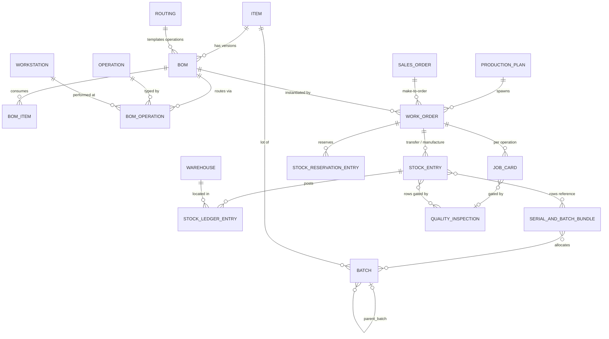
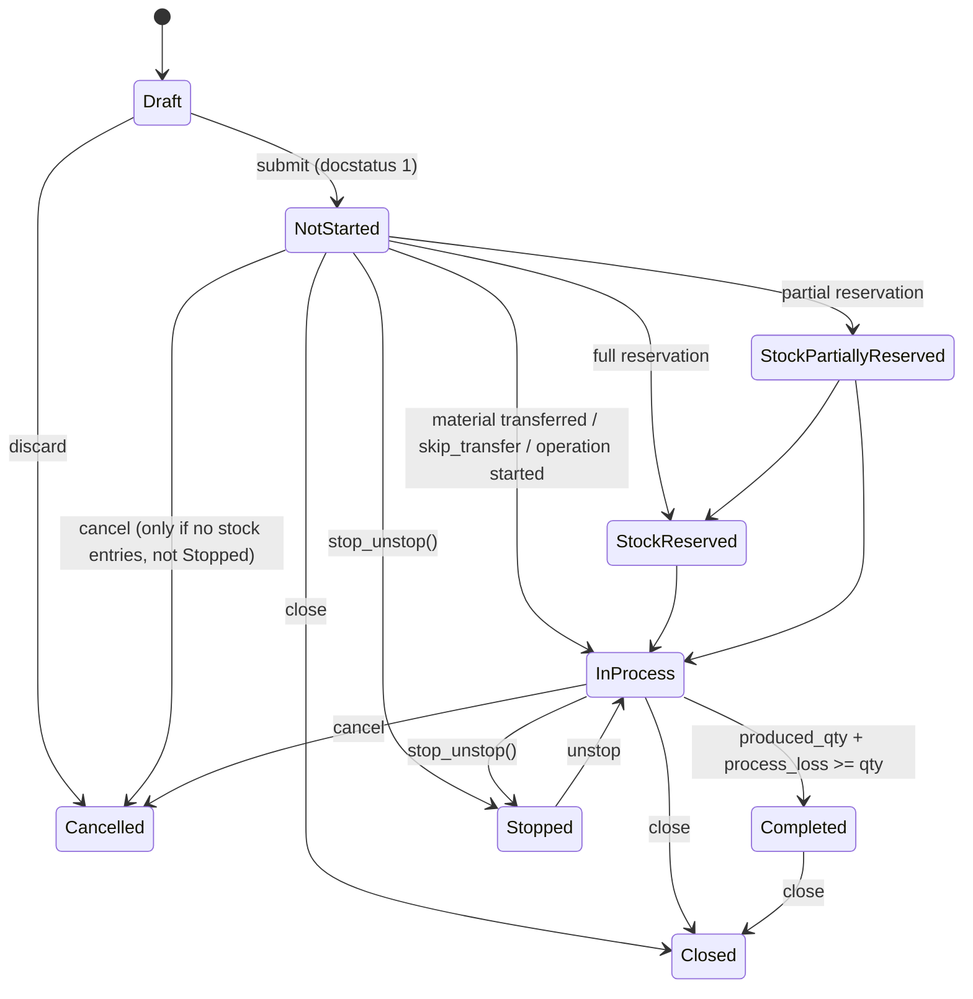
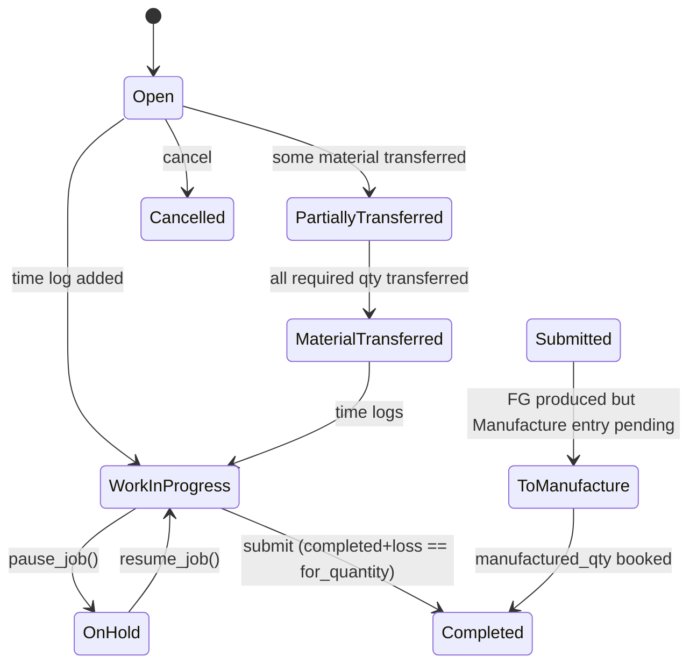
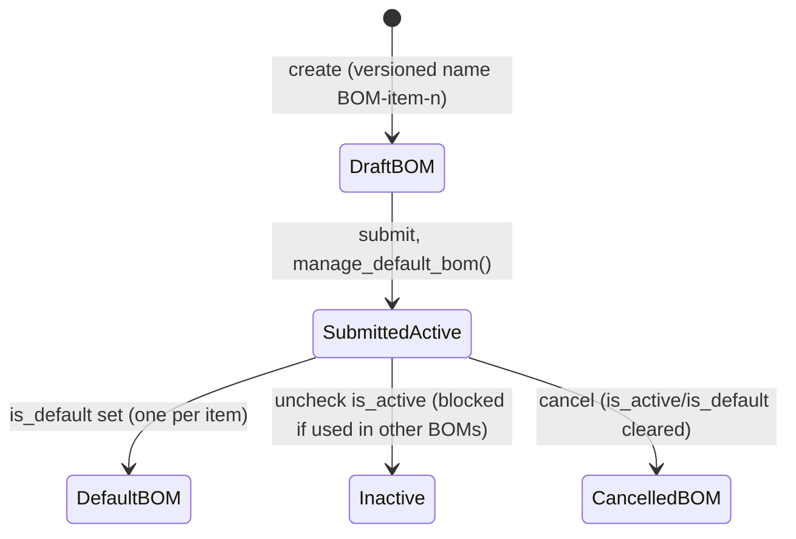
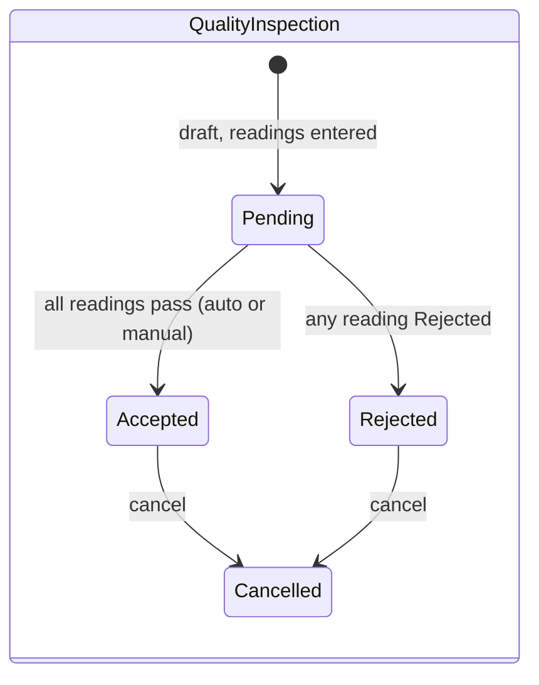

# Application Dossier: ERPNext (Chem_erpnext) — Plant C

## A. Identification

| Attribute | Value |
|---|---|
| Repository | `SachetCognition/Chem_erpnext` |
| Branch / ref | `develop` |
| Commit SHA | `31e7970764e697f55cf1be70566b408bd47005d9` (2026-07-28) |
| Analysis date | 2026-07-28 |
| Framework app | ERPNext (Frappe app `erpnext`, "Open Source ERP", `pyproject.toml`) |
| Modules | 21 modules declared in `erpnext/modules.txt` (Accounts, CRM, Buying, Projects, Selling, Setup, Manufacturing, Stock, Support, Utilities, Assets, Portal, Maintenance, Regional, ERPNext Integrations, Quality Management, Communication, Telephony, Bulk Transaction, Subcontracting, EDI) |
| Size | Python: 2,891 files / ~383k lines; JavaScript: 643 files / ~81k lines; JSON (DocType schemas etc.): 1,167 files / ~341k lines; TypeScript: 40 files / ~3k lines; HTML: 116 files / ~8.7k lines; translations: 36 `.po` files / ~2.34M lines |
| History | 60,397 commits (full upstream ERPNext history retained); latest commit dated 2026-07-28 |

DocType counts by relevant module (directory count of `*/doctype/*`): Manufacturing 49, Stock 80, Quality Management 17, Subcontracting 14, Accounts 192, Selling 21, Buying 20, Maintenance 6.

Scope note: only manufacturing-execution-relevant modules (`erpnext/manufacturing`, `erpnext/stock`, `erpnext/quality_management`, `erpnext/controllers`) are analysed in depth; finance (Accounts/Assets), Buying and Selling are summarised at the boundary only.

## B. Business layer

### Purpose
ERPNext is a full-suite ERP on the Frappe framework; in the Plant C deployment it serves as the plant ERP for manufacturing, quality and stock. Manufacturing execution is document-driven: a **Work Order** (from a **Production Plan** or **Sales Order**) explodes a **BOM**, spawns **Job Cards** per operation, and material movements are booked as **Stock Entries** whose immutable **Stock Ledger Entries** simultaneously drive inventory valuation and (via perpetual inventory) the general ledger (`erpnext/controllers/stock_controller.py`). Confidence: High.

### Personas / roles (shipped permission model)
Roles are shipped inside each DocType JSON's `permissions` block. Roles found across all DocType schemas include: `Manufacturing Manager`, `Manufacturing User`, `Stock Manager`, `Stock User`, `Item Manager`, `Quality Manager`, `Maintenance Manager/User`, `Purchase Manager/User`, `Sales Manager/User`, `Accounts Manager/User`, `System Manager`, plus portal roles (`Customer`, `Employee`) (scan of `erpnext/*/doctype/*/*.json` `permissions[].role`). Confidence: High.

Manufacturing-relevant assignments:
- **Work Order**: `Manufacturing User` (create/submit/cancel), `Stock User` (read) — `erpnext/manufacturing/doctype/work_order/work_order.json` (permissions block). High.
- **BOM**: `Manufacturing Manager` and `Manufacturing User` — `erpnext/manufacturing/doctype/bom/bom.json`. High.
- **Batch**: `Item Manager` — `erpnext/stock/doctype/batch/batch.json`. High.
- **Quality Inspection**: `Quality Manager` only — `erpnext/stock/doctype/quality_inspection/quality_inspection.json`. High.
- **Stock Ledger Entry**: read-only visibility for `Stock User`, `Accounts Manager` — `erpnext/stock/doctype/stock_ledger_entry/stock_ledger_entry.json`. High.

### Business object model

~14 core business objects in the manufacturing/stock/quality scope (relationships from Link/Table fields in the DocType schemas; entity set High, cardinalities Medium):

Evidence: `work_order.json` (links `bom_no`, `production_plan`, `sales_order`), `job_card.json` (`work_order`, `quality_inspection`), `batch.py:104-114` (typed fields `item`, `parent_batch`, `expiry_date`), `stock_entry.py`, `serial_and_batch_bundle.py`. Confidence: High.

### Business consequences of the design
- **Everything is a submittable document** (Frappe `docstatus` 0/1/2). Business state is a combination of docstatus and a derived `status` field recomputed from linked stock entries — statuses are *reflections of postings*, not user-driven workflow gates (`erpnext/manufacturing/doctype/work_order/services/status.py:107-144`). High.
- **The Stock Ledger Entry is the single audit spine**: every material movement, valuation change and (in perpetual inventory) GL effect derives from immutable SLEs; corrections happen via cancel + repost (`erpnext/stock/stock_ledger.py`, `erpnext/stock/doctype/repost_item_valuation/`). High.
- **Batch identity is master data, not a state machine**: a Batch has `disabled` and `expiry_date` but no QA-status field; quarantine must be modelled through warehouses or the (weakly linked) Quality Inspection (`erpnext/stock/doctype/batch/batch.py:97-115`). High.
- **Quality is configurable, not mandatory**: inspection gating strength is a setting (`Stop` vs warn) in Stock Settings (`erpnext/stock/services/quality_inspection_service.py:858-889` via job card; see C). High.

## C. Functional layer

### Capability inventory

| Capability | Depth description | Evidence | Confidence |
|---|---|---|---|
| Production order lifecycle | Work Order with 10 shipped statuses, derived from stock entries, reservations and operation states; stop/close/cancel controls | `work_order.json:124`; `services/status.py:107-191`; `work_order.py:1122-1133` | High |
| Operation execution (Job Cards) | Per-operation Job Card with time logs, pause/resume, employee assignment, process loss, semi-finished-good tracking | `job_card.py:1280-1336` (status), `1371-1397` (pause/resume) | High |
| BOM / recipe & routing | Versioned BOMs (`BOM/<item>/<n>`) with items, operations, scrap, costing; Routing templates; BOM Creator; mass cost update via BOM Update Tool | `bom.py:429-440`, `bom.py:620-637`; `manufacturing/doctype/routing/`, `bom_update_tool/` | High |
| Batch/lot master data | Batch DocType with expiry auto-derivation from item shelf life, `parent_batch`, per-batch valuation flag, naming series | `batch.py:117-143, 179-220`; `batch.py:107` (`parent_batch`) | High |
| Batch selection FEFO/FIFO/LIFO | Global `Pick Serial / Batch Based On` = FIFO/LIFO/Expiry; expiry-ordered auto-allocation in Serial and Batch Bundle | `stock_settings.json:363-370`; `serial_and_batch_bundle.py:3032-3033, 3286-3289` | High |
| Expired batch hard stop | SLE submission throws on consuming expired batch; Pick List blocks picking expired batches | `stock_ledger_entry.py:287-299`; `pick_list.py:286-311` | High |
| Quality inspection engine | Quality Inspection (Incoming/Outgoing/In Process) with per-reading numeric min/max, value match or `safe_eval` acceptance formula; templates per item | `quality_inspection.py:265-336`; `quality_inspection.json:74, 237` | High |
| QI gating of transactions | `QualityInspectionService` blocks submit of PR/PI/DN/SI/Stock Entry rows lacking a submitted, non-rejected QI; severity configurable (Stop vs warn) | `stock/services/quality_inspection_service.py:21-127` | High |
| QI gating of operations | Job Card submit requires QI when BOM + operation flag it; rejected/unsubmitted QI throws or warns per Stock Settings | `job_card.py:843-889` | High |
| Stock reservations | Stock Reservation Entry (8 statuses) against Sales Order/Work Order/Production Plan, incl. serial/batch-level reservation; auto-reserve on WO | `stock_reservation_entry.json:175`; `stock_reservation_entry.py:530-553`; `work_order/services/reservation.py` | High |
| Inventory valuation | FIFO / Moving Average / LIFO / Standard Cost per item; batchwise valuation; repost engine for retroactive corrections | `item.json:387-390`; `stock_ledger.py:1726-1729`; `repost_item_valuation/` | High |
| Planning / MRP | Production Plan (from Sales Orders/Material Requests/forecast) with sub-assembly explosion and material request generation; Master Production Schedule; Sales Forecast; MRP report | `production_plan.py`; `production_plan/services/material_request.py:141`; `manufacturing/doctype/master_production_schedule/` | High |
| Capacity planning | Optional capacity planning: job-card slot search over workstation `production_capacity`; throws `CapacityError` when no slot within plan window | `work_order/services/operations.py:105-130`; `workstation.json` (`production_capacity`) | High |
| Shop-floor UI | Shop Floor and Visual Plant Floor desk pages; Plant Floor DocType; workstation live status (Production/Off/Idle/Problem/Maintenance/Setup) | `manufacturing/page/shop_floor/`, `page/visual_plant_floor/`; `workstation.json:146` | High |
| Warehouse structure | Warehouse as NestedSet tree (group/leaf) per company; warehouse types; Putaway Rules; custom Inventory Dimensions | `warehouse.py:21-53`; `stock/doctype/putaway_rule/`, `inventory_dimension/` | High |
| Traceability reporting | Serial No & Batch Traceability report; batch-wise balance; stock ledger reports | `stock/report/serial_no_and_batch_traceability/` | High |
| Subcontracting | Dedicated Subcontracting module (orders, receipts, inward orders) integrated into Work Order validation | `erpnext/subcontracting/doctype/` (14 doctypes); `work_order.py:364-457` | High |
| Costing hooks | Work Order carries planned/actual operating cost; Stock Entry `Manufacture` computes FG valuation incl. operation cost; perpetual inventory posts GL from SLE | `work_order.py:110-119` (cost fields); `stock_controller.py` | High |
| Boundary: finance/selling/buying | Full Accounts (192 doctypes), Selling, Buying modules exist in-repo; manufacturing touches them via Sales Order qty checks and GL postings only | `modules.txt`; `services/status.py:29-47` | High |

### Core state machines

#### Work Order lifecycle (states High — shipped enum; arrows Medium — inferred from `StatusService.get_status` logic)

Evidence: status enum `\nDraft\nSubmitted\nNot Started\nIn Process\nStock Reserved\nStock Partially Reserved\nCompleted\nStopped\nClosed\nCancelled` at `work_order.json:124` (High). Transition logic: `services/status.py:107-144` (derivation from stock entries), `:182-191` (reservation states), `work_order.py:844-846` (Stopped blocks cancel), `work_order.py:1122-1133` (`stop_unstop`; Closed cannot be stopped/reopened) (arrows Medium — computed, not an explicit transition table). Note: `Submitted` exists in the enum but `get_status` immediately resolves a submitted document to Not Started/In Process/etc.

#### Job Card lifecycle (states High — shipped enum; arrows Medium)

Evidence: enum `Open / Work In Progress / Partially Transferred / Material Transferred / On Hold / Submitted / To Manufacture / Cancelled / Completed` at `job_card.json:274` (High); `set_status`/`set_finished_good_status`/`set_non_semi_fg_status` at `job_card.py:1280-1336`, pause/resume at `job_card.py:1371-1397` (arrows Medium).

#### BOM / recipe lifecycle (states High for flags; arrows Medium)

BOM has no status enum; governance is `docstatus` + `is_active`/`is_default` flags:

Evidence: `bom.py:429-440` (`on_submit`/`on_cancel`), `bom.py:620-637` (`manage_default_bom`), `bom.py:892-913` (`validate_bom_links` blocks deactivation while referenced). There is **no approval workflow, no effectivity dates, no revision states** beyond submit/cancel (searched `bom.py` and `bom.json` for `approve`, `workflow`, `valid_from` — none found). Confidence: High.

#### Batch & Quality Inspection states

Batch has **no lifecycle status field** — only `disabled` (checkbox) and `expiry_date` (`batch.py:97-115`, High). Quality Inspection status enum is `Accepted / Rejected / Cancelled` (`quality_inspection.json:237`, High); it is set automatically from readings (`quality_inspection.py:265-281`) unless `manual_inspection` is set.

(States High; arrows Medium — derived from `inspect_and_set_status`.)

### Key business rules / validations / gating

| Rule | Behaviour | Evidence | Confidence |
|---|---|---|---|
| Over-production cap vs Sales Order | WO submission throws `OverProductionError` beyond SO qty + allowance % | `services/status.py:29-47` | High |
| Over-production cap vs Work Order | Manufactured/transferred qty above plan+allowance throws `StockOverProductionError` | `services/status.py:208-224` | High |
| Stopped WO freezes execution | Job Card submit against a Stopped Work Order throws | `job_card.py:904-910` | High |
| Closed WO is terminal | Closed WO cannot be stopped or re-opened | `work_order.py:1131-1132` | High |
| Completed WO protects postings | Cancelling Material Consumption stock entry against Completed WO throws | `stock_entry.py:422-425` | High |
| Cancel guard | WO with submitted Stock Entries cannot be cancelled | `work_order.py:848-860` | High |
| Job Card completeness | Submit requires time logs, not-on-hold, and completed+loss+pending == for_quantity | `job_card.py:912-959` | High |
| Material transfer gate | Job Card without FG cannot submit until materials transferred to WIP | `job_card.py:891-902` | High |
| QI gate (documents) | Rows flagged inspection-required must carry a submitted, non-Rejected QI at submit; severity `Stop`/warn from Stock Settings | `quality_inspection_service.py:71-127` | High |
| QI gate (operations) | BOM `inspection_required` + operation `quality_inspection_required` gates Job Card submit | `job_card.py:843-889` | High |
| Expired batch consumption | SLE against a batch past `expiry_date` throws "Batch … has expired" (outward directions) | `stock_ledger_entry.py:287-299` | High |
| Expired batch picking | Pick List save throws listing expired batches | `pick_list.py:286-311` | High |
| Batch expiry mandatory | Items with `has_expiry_date` must yield an expiry date (shelf-life derivation or manual) or save throws | `batch.py:194-220` | High |
| Operation sequencing | Work Order operation `sequence_id`s must be contiguous | `work_order.py:340-362` | High |
| Capacity window | With capacity planning on, unschedulable operations throw `CapacityError` | `services/operations.py:118-130` | High |
| Negative stock control | `NegativeStockError` unless allowed in settings (also per-batch flag `allow_negative_stock_for_batch`) | `stock_ledger.py:50-51`; `batch.py:97` | High |
| Company isolation | `Company Restriction` doctype validates every transaction's company against allowed companies (global `doc_events` hook) | `hooks.py:368-384` | High |
| Cross-doc status roll-up | Generic `StatusUpdater` maps child-row fulfilment percentages to parent statuses via declarative `status_map` | `controllers/status_updater.py:16-60` | High |

## D. Technical layer

- **Language/framework**: Python ≥3.14 (`pyproject.toml` `requires-python`), Frappe framework `>=17.0.0-dev,<18.0.0` (`[tool.bench.frappe-dependencies]`), flit build backend, ruff lint (line length 110, target py310). Frontend: server-rendered Frappe Desk + per-DocType JS controllers; some TypeScript (banking bundle). Databases: MariaDB or PostgreSQL via Frappe ORM; Redis for queues/cache (Frappe standard). High.
- **Architecture**: monolithic Frappe app; each DocType = JSON schema + Python controller class + JS form controller in one directory. Shared transaction behaviour in `erpnext/controllers/` (`StockController`, `StatusUpdater`, `AccountsController`). Recent refactors extract service objects (e.g. `work_order/services/{status,operations,required_items,reservation}.py`, `stock/services/quality_inspection_service.py`) wrapped by thin delegating stubs (`work_order.py:1034-1071`). High.
- **Persistence model**: one table per DocType (`tab<DocType>`), child tables as separate DocTypes; document lifecycle via `docstatus` (0 draft / 1 submitted / 2 cancelled); immutable ledgers (Stock Ledger Entry, GL Entry) with cancel-and-repost correction (`repost_item_valuation`); `Bin` as per item/warehouse stock cache. High.
- **Extensibility**: Frappe hooks registry (`erpnext/hooks.py`: `doc_events`, `scheduler_events`, whitelisted overrides); Custom Fields/Property Setters at site level; `patches.txt` sequential migration registry; regional override injection (`erpnext/regional`). High.
- **Test coverage signals**: 515 `test_*.py` files across the app, including manufacturing (`test_work_order.py` ~2,400+ lines) and stock; report smoke tests (`*/report/test_reports.py`). CI: GitHub Actions with `server-tests-mariadb.yml`, `server-tests-postgres.yml`, `linters.yml`, `semantic-commits.yml` (`.github/workflows/`). High.
- **Maintenance activity**: 60,397 commits; sustained upstream activity (~300–1,300 commits/month through 2026-07); local fork delta is minimal (2 commits: a rebrand merge, PR #1). High.

## E. Non-functional snapshot

- **Security model**: Frappe RBAC — per-DocType, per-role permission matrices shipped in DocType JSON (read/write/create/submit/cancel/amend), user-permission row-level restriction, plus company-level isolation via `Company Restriction` validation on every transaction (`hooks.py:368-384`). Server endpoints guarded by `@frappe.whitelist()` and explicit `frappe.has_permission` checks (e.g. `work_order.py:1122-1127`, `job_card.py:1372-1373`). High.
- **Auditability**: `track_changes: 1` on key DocTypes (Work Order, BOM, Batch) produces field-level version history; immutable SLE/GLE ledgers; submit/cancel/amend discipline preserves document history. **No electronic-signature capability found** (searched `e-sign`, `electronic signature` across `erpnext/` — only unrelated HR/CRM matches). High.
- **Scalability signals**: background-queue reposting of valuation (`repost_item_valuation.run_parallel_reposting`, 15-min cron, `hooks.py:468-472`); `Bin` caching; bulk transaction processing module. Single-process framework scaling is delegated to Frappe (workers/Redis). Medium.
- **Technical health/age**: actively maintained upstream codebase on a current Python (≥3.14) with modern tooling (ruff, type-annotated DocType stubs, service-object refactors), but carrying long legacy tails (`deprecation_dumpster.py`, `oldfieldname` schema remnants, 2.3M-line translation corpus). Overall healthy but very large and generic. Medium.

## F. Evidence index

| # | File path | Lines | What it proves | Confidence |
|---|---|---|---|---|
| 1 | `pyproject.toml` | 1–40, 44–50 | App identity, Python ≥3.14, Frappe 17.x dependency, deps | High |
| 2 | `erpnext/modules.txt` | 1–21 | 21 shipped modules | High |
| 3 | `erpnext/manufacturing/doctype/work_order/work_order.json` | 124 | Work Order status enum (10 states) | High |
| 4 | `erpnext/manufacturing/doctype/work_order/services/status.py` | 29–47 | SO over-production gate (`OverProductionError`) | High |
| 5 | `erpnext/manufacturing/doctype/work_order/services/status.py` | 107–144 | Status derivation from docstatus/stock entries | High |
| 6 | `erpnext/manufacturing/doctype/work_order/services/status.py` | 182–191 | Stock Reserved / Partially Reserved derivation | High |
| 7 | `erpnext/manufacturing/doctype/work_order/services/status.py` | 208–224 | `StockOverProductionError` qty cap | High |
| 8 | `erpnext/manufacturing/doctype/work_order/work_order.py` | 340–362 | Operation sequence-id contiguity validation | High |
| 9 | `erpnext/manufacturing/doctype/work_order/work_order.py` | 844–860 | Stopped blocks cancel; submitted stock entries block cancel | High |
| 10 | `erpnext/manufacturing/doctype/work_order/work_order.py` | 1122–1133 | `stop_unstop` permission check; Closed is terminal | High |
| 11 | `erpnext/manufacturing/doctype/work_order/services/operations.py` | 105–130 | Capacity planning slot search, `CapacityError` | High |
| 12 | `erpnext/manufacturing/doctype/job_card/job_card.json` | 274 | Job Card status enum (9 states) | High |
| 13 | `erpnext/manufacturing/doctype/job_card/job_card.py` | 843–889 | QI gate on Job Card submit (Stop vs warn) | High |
| 14 | `erpnext/manufacturing/doctype/job_card/job_card.py` | 891–910 | Material-transfer gate; Stopped WO blocks Job Card | High |
| 15 | `erpnext/manufacturing/doctype/job_card/job_card.py` | 916–959 | On-hold block, time-log requirement, completed-qty equality | High |
| 16 | `erpnext/manufacturing/doctype/job_card/job_card.py` | 1280–1336 | Job Card status computation incl. To Manufacture | High |
| 17 | `erpnext/manufacturing/doctype/job_card/job_card.py` | 1371–1397 | pause_job / resume_job (On Hold) | High |
| 18 | `erpnext/manufacturing/doctype/bom/bom.py` | 429–440 | BOM on_submit/on_cancel; is_active/is_default reset | High |
| 19 | `erpnext/manufacturing/doctype/bom/bom.py` | 620–637 | `manage_default_bom` single-default rule | High |
| 20 | `erpnext/manufacturing/doctype/bom/bom.py` | 892–913 | Active-BOM link validation blocks deactivation | High |
| 21 | `erpnext/manufacturing/doctype/production_plan/production_plan.json` | 302 | Production Plan status enum | High |
| 22 | `erpnext/manufacturing/doctype/production_plan/services/material_request.py` | 141 | `get_items_for_material_requests` (MRP netting) | High |
| 23 | `erpnext/manufacturing/doctype/workstation/workstation.json` | 146 | Workstation live status enum (Production/Off/Idle/Problem/Maintenance/Setup) | High |
| 24 | `erpnext/stock/doctype/batch/batch.py` | 97–115 | Batch fields: disabled, expiry, parent_batch, batchwise valuation | High |
| 25 | `erpnext/stock/doctype/batch/batch.py` | 117–143 | Batch naming: series/hash, mandatory ID | High |
| 26 | `erpnext/stock/doctype/batch/batch.py` | 194–220 | Expiry auto-derivation from shelf life; mandatory expiry throw | High |
| 27 | `erpnext/stock/doctype/batch/batch.py` | 296–301 | `get_batches_by_oldest` sorts by expiry date | High |
| 28 | `erpnext/stock/doctype/stock_ledger_entry/stock_ledger_entry.py` | 287–299 | Expired-batch consumption hard stop | High |
| 29 | `erpnext/stock/doctype/pick_list/pick_list.py` | 286–311 | Pick List expired-batches hard stop | High |
| 30 | `erpnext/stock/doctype/stock_settings/stock_settings.json` | 363–370 | `pick_serial_and_batch_based_on`: FIFO/LIFO/Expiry (default FIFO) | High |
| 31 | `erpnext/stock/doctype/serial_and_batch_bundle/serial_and_batch_bundle.py` | 3032–3033 | FEFO ordering of available batches by expiry | High |
| 32 | `erpnext/stock/doctype/serial_and_batch_bundle/serial_and_batch_bundle.py` | 3286–3289 | Query orderby expiry for `Expiry` strategy | High |
| 33 | `erpnext/stock/doctype/stock_reservation_entry/stock_reservation_entry.json` | 175 | SRE status enum (8 states) | High |
| 34 | `erpnext/stock/doctype/stock_reservation_entry/stock_reservation_entry.py` | 530–553 | SRE status derivation from qtys | High |
| 35 | `erpnext/stock/doctype/quality_inspection/quality_inspection.json` | 74, 237 | Inspection types (Incoming/Outgoing/In Process); status enum Accepted/Rejected/Cancelled | High |
| 36 | `erpnext/stock/doctype/quality_inspection/quality_inspection.py` | 265–336 | Auto accept/reject from readings; min/max; `safe_eval` formula | High |
| 37 | `erpnext/stock/services/quality_inspection_service.py` | 21–64 | Doctype→inspection-flag map; purpose allow-lists | High |
| 38 | `erpnext/stock/services/quality_inspection_service.py` | 71–127 | QI presence/submission/rejection gating on submit | High |
| 39 | `erpnext/stock/doctype/stock_entry/stock_entry.py` | 422–425 | Completed WO blocks consumption-entry cancel | High |
| 40 | `erpnext/stock/doctype/item/item.json` | 387–390 | Valuation methods FIFO/Moving Average/LIFO/Standard Cost | High |
| 41 | `erpnext/stock/stock_ledger.py` | 1726–1729 | FIFO/LIFO queue implementation selection | High |
| 42 | `erpnext/stock/doctype/warehouse/warehouse.py` | 21–53 | Warehouse as NestedSet tree (`parent_warehouse`) | High |
| 43 | `erpnext/controllers/status_updater.py` | 16–60 | Generic declarative `status_map` engine | High |
| 44 | `erpnext/hooks.py` | 368–384 | Global doc_events incl. Company Restriction validation | High |
| 45 | `erpnext/hooks.py` | 468–472 | Cron: BOM cost update resume, parallel valuation reposting | High |
| 46 | `erpnext/locale/de.po` | 24502–24503, 62046–62047 | Shipped German translations of state labels ("In Process", "Work Order") | High |
| 47 | `erpnext/manufacturing/doctype/work_order/work_order.py` | 94–130 | Typed Work Order fields (costs, batch_size, has_batch_no) | High |
| 48 | `erpnext/manufacturing/doctype/work_order/work_order.py` | 1034–1071 | Delegating stubs to service objects (refactor pattern) | High |

Re-read pass performed against the checked-out commit; all line ranges verified.

## G. Capability ratings (for parent merge)

| Capability | Rating | Justification + citation |
|---|---|---|
| Production order lifecycle & state machine | **Rich** | 10-state Work Order with derived transitions, stop/close controls (`work_order.json:124`; `services/status.py:107-191`) |
| Execution gating / hard stops | **Rich** | Stopped-WO block, QI Stop mode, expired-batch throws, over-production errors, transfer gates (`job_card.py:904-910`; `stock_ledger_entry.py:287-299`) |
| Shop-floor execution UI | **Adequate** | Shop Floor + Visual Plant Floor desk pages and workstation live statuses, but desk-based, not operator-terminal grade (`manufacturing/page/shop_floor/`; `workstation.json:146`) |
| BOM/recipe/routing definition | **Rich** | Versioned multi-level BOMs with operations, scrap, costing, Routing templates, BOM Creator/Update Tool (`bom.py`; `manufacturing/doctype/routing/`) |
| Recipe lifecycle governance/approval | **Basic** | Only docstatus submit/cancel + is_active/is_default; no approval workflow, effectivity or revision states (`bom.py:429-440, 620-637`) |
| ISA-88 batch recipes | **Absent** | No procedural recipe/phase/unit-procedure model; searched `erpnext/manufacturing` for `ISA`, `phase`, `recipe` — only weight-based BOM fields |
| Batch/lot master data | **Rich** | Batch with expiry derivation, parent_batch, per-batch valuation, naming series (`batch.py:97-220`) |
| Batch genealogy/traceability (system-of-record) | **Adequate** | Full forward/backward trace reconstructable from SLE + Serial and Batch Bundle + `parent_batch`, plus traceability report; but no first-class genealogy object (`stock/report/serial_no_and_batch_traceability/`; `batch.py:107`) |
| Batch blocking/quarantine | **Basic** | Only `disabled` flag and expiry hard-stop; no QA-status (Released/Quarantined/Blocked) on Batch (`batch.py:101`; `stock_ledger_entry.py:287-299`) |
| Quality inspection engine | **Rich** | Typed inspections, per-reading numeric/value/formula acceptance, templates, transaction gating (`quality_inspection.py:265-336`; `quality_inspection_service.py`) |
| Certificates of analysis | **Absent** | No CoA doctype/print format; searched `erpnext/` for `certificate of analysis`, `coa` — no matches in stock/quality scope |
| Parametric/spec-based QC | **Adequate** | Item QI parameters with min/max and formula criteria per reading; no full spec-versioning (`item_quality_inspection_parameter/`; `quality_inspection.py:284-336`) |
| Warehouse structure (locations/pallets) | **Adequate** | Warehouse tree + warehouse types + putaway rules + inventory dimensions; no pallet/handling-unit object (`warehouse.py:21-53`; `putaway_rule/`) |
| FEFO/FIFO picking | **Rich** | Global FIFO/LIFO/Expiry strategy with expiry-ordered auto-allocation and expired-batch pick blocks (`stock_settings.json:363-370`; `serial_and_batch_bundle.py:3032-3033`) |
| Stock reservations | **Rich** | Stock Reservation Entry incl. serial/batch-level and Work Order auto-reserve, 8-state lifecycle (`stock_reservation_entry.py:530-553`; `work_order/services/reservation.py`) |
| Inventory valuation/costing | **Rich** | FIFO/Moving Average/LIFO/Standard Cost, batchwise valuation, GL-integrated, repost engine (`item.json:387-390`; `stock_ledger.py:1726-1729`) |
| Production planning/MRP | **Rich** | Production Plan with sub-assembly explosion + material requests, Master Production Schedule, Sales Forecast, MRP report (`production_plan/services/material_request.py:141`) |
| Finite capacity scheduling | **Basic** | Slot search against workstation `production_capacity` with CapacityError; no optimising/finite scheduler (`services/operations.py:105-130`) |
| Master data (items/products, work centres, partners) | **Rich** | Item (variants, UOMs, defaults), Workstation/Workstation Type, Customer/Supplier masters (`stock/doctype/item/`; `manufacturing/doctype/workstation/`) |
| Units of measure & conversions | **Rich** | UOM master with whole-number flag, per-item conversion table, stock-UOM integer validation (`uom.json`; `uom_conversion_detail.py:17`; `work_order.py:310`) |
| Hazmat/regulatory data | **Absent** | No hazard/MSDS/UN-number fields; searched `erpnext/` for `hazard`, `dangerous goods`, `msds`, `un number` — no hits (only `customs_tariff_number`, `item.json:678`) |
| SCADA/OPC-UA or device integration | **Absent** | No device-level integration; searched for `OPC`, `SCADA`, `MQTT` in `erpnext/` — no hits |
| External system integration (API/ERP/WMS) | **Adequate** | Frappe REST/RPC on every DocType via `@frappe.whitelist`, Plaid banking sync, EDI code lists; no shipped MES/WMS connectors (`hooks.py`; `erpnext_integrations/doctype/plaid_settings/`) |
| Reporting/analytics | **Rich** | 22 manufacturing reports + ~60 stock reports + dashboards (`erpnext/manufacturing/report/`; `erpnext/stock/report/`; `manufacturing/dashboard_chart/`) |
| Labour/time tracking | **Adequate** | Job Card time logs with employees, pause/resume, enforce-time-logs setting; no full labour/attendance costing in-scope (`job_card_time_log/`; `job_card.py:925-940`) |
| Maintenance management | **Basic** | Maintenance Schedule/Visit doctypes + Downtime Entry; no work-order-based maintenance planning (`erpnext/maintenance/doctype/`; `manufacturing/doctype/downtime_entry/`) |
| Audit trail/e-signatures | **Adequate** | `track_changes` versioning + immutable SLE/GLE + submit/cancel discipline; no e-signature support found (searched `e-sign`, `electronic signature`) (`work_order.json` `track_changes`) |
| Multi-plant support | **Rich** | Multi-company with per-company warehouses/accounts and enforced Company Restriction on all transactions (`hooks.py:368-384`; `company_restriction/`) |
| Localisation/i18n | **Rich** | 36 locale `.po` files (~2.3M lines) incl. full German labels; regional override framework (`erpnext/locale/de.po:24502-24503`; `erpnext/regional/`) |
| Role-based access control | **Rich** | Per-DocType role permission matrices (34 distinct roles), whitelisted endpoints with permission checks (`work_order.json` permissions; `work_order.py:1122-1127`) |
