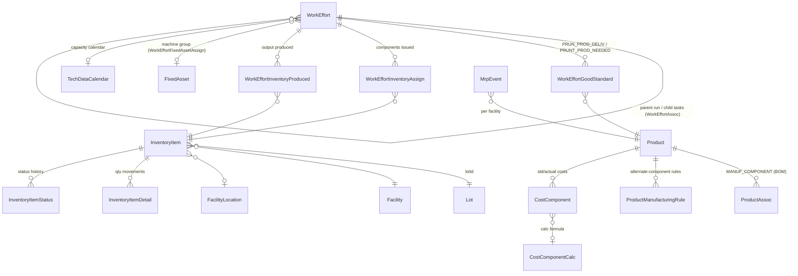
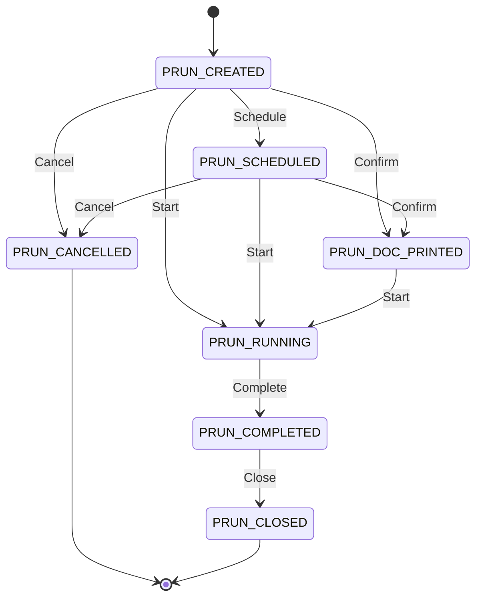
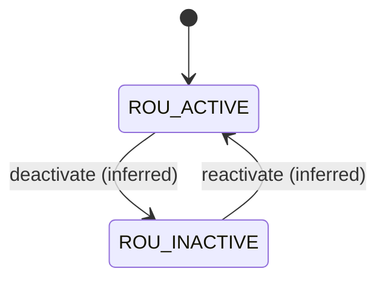
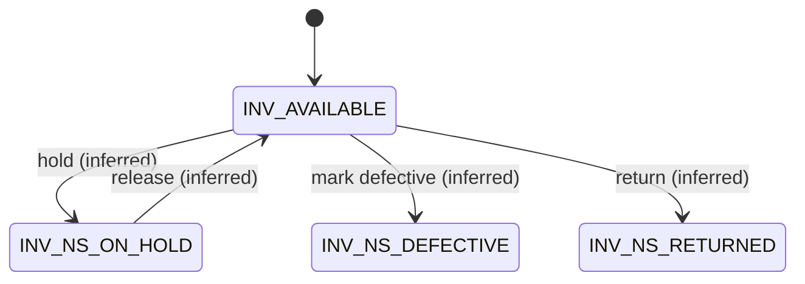

# Application Dossier: Apache OFBiz (VM_ofbiz-framework) — Plant B

## A. Identification

| Item | Value |
|---|---|
| Repository | `SachetCognition/VM_ofbiz-framework` |
| Branch / ref | `trunk` |
| Commit SHA | `ecf2990fd62a16431ad08f124260c309230a32f0` (2026-01-22, "Improved: Update jQuery and jquery-migrate to version 4 (OFBIZ-13347)") |
| Analysis date | 2026-07-28 |
| Declared version | `Trunk` (`VERSION` file) — i.e. an unreleased trunk snapshot of Apache OFBiz, not a tagged release |
| First commit in history | 2006-07-01 (`git log --reverse`) |

**Size stats** (lines, `framework/` + `applications/` + `themes/`, excluding `runtime/` and `node_modules/`; wc-based, Confidence: Medium):

| Language | LOC |
|---|---|
| XML (entity models, service defs, screen/form widgets, seed data) | ~451,900 |
| Java | ~367,300 |
| FreeMarker (FTL) | ~66,800 |
| Groovy | ~59,900 |
| JavaScript | ~56,400 |
| CSS | ~23,300 |

**Module count**: 16 framework components (`framework/`: base, entity, service, security, webapp, widget, webtools, …), 12 application components (`applications/`: accounting, commonext, content, datamodel, humanres, manufacturing, marketing, order, party, product, securityext, workeffort), 8 themes (`themes/`). Confidence: High (directory listing at commit).

Scope note: per assignment, this chapter analyses manufacturing-execution-relevant scope (manufacturing, workeffort, product/facility/inventory, framework engines); accounting and order components are summarised only at boundary level.

## B. Business layer

### Purpose

Apache OFBiz is a generic, metadata-driven ERP framework. In the Plant B context the relevant footprint is its **discrete-manufacturing job-shop module**: production runs built from routings and BOMs, MRP planning, facility/inventory management with optional lot tracking, and standard/actual cost roll-up hooks into the accounting component. It is a framework first and an application second: nearly all business objects are declared in XML entity models (`applications/datamodel/entitydef/*.xml`) and manipulated through a generic service engine, so Plant B's effective functionality is the shipped seed data plus these generic engines. Confidence: High.

### Personas / roles (from the shipped permission model)

OFBiz ships a flat permission model: `SecurityPermission` records grouped into `SecurityGroup`s assigned to `UserLogin`s (`framework/security/entitydef/entitymodel.xml:136-232`, entities `SecurityGroup`, `SecurityGroupPermission`, `SecurityPermission`, `UserLoginSecurityGroup`). The manufacturing component seeds exactly five CRUD-style permissions and grants them only to the `SUPER` group:

- `MANUFACTURING_VIEW`, `MANUFACTURING_CREATE`, `MANUFACTURING_UPDATE`, `MANUFACTURING_DELETE`, `MANUFACTURING_ADMIN` (`applications/manufacturing/data/ManufacturingSecurityPermissionSeedData.xml:23-30`). Confidence: High.

There are **no shipped functional personas** (no "shop-floor operator", "planner", "quality inspector" groups) in the manufacturing seed data — role differentiation is left to the implementer. Party roles (`PartyRole`) exist framework-wide but are not used to gate manufacturing services. Confidence: High (searched `applications/manufacturing/data/` for `SecurityGroup` definitions; only permission grants to `SUPER` exist).

### Business object model

Core manufacturing/inventory objects (entity names as defined in the datamodel component). The central design decision: **a production run is not a dedicated entity — it is a `WorkEffort`** of type `PROD_ORDER_HEADER` with child `WorkEffort` tasks, linked to products via `WorkEffortGoodStandard` typed associations (`applications/datamodel/data/seed/WorkEffortSeedData.xml:63-67`).

Diagram basis: entity definitions in `applications/datamodel/entitydef/workeffort-entitymodel.xml` (WorkEffort :184-260, WorkEffortInventoryAssign :597, WorkEffortInventoryProduced :616), `product-entitymodel.xml` (InventoryItem :1953, InventoryItemDetail :2125, InventoryItemStatus :2222, Lot :2419, Facility :996, FacilityLocation :1281, ProductAssoc :2935, CostComponent :788), `manufacturing-entitymodel.xml` (ProductManufacturingRule :43, TechDataCalendar :80, MrpEvent :166). Confidence: High (entities), Medium (cardinality arrows inferred from relation declarations).

### Business consequences of the design

- **Everything-is-a-WorkEffort**: production runs, tasks, routings and routing tasks all share one table/state framework. This gives uniform scheduling, party assignment and status history for free, but means manufacturing semantics (e.g. "a task belongs to a confirmed run") are enforced in service code, not the schema. Confidence: High.
- **Metadata-driven vocabulary**: statuses, types and transitions are seed data rows (`StatusItem`, `StatusValidChange`), so Plant B could have customised the lifecycle without code changes; conversely, nothing in the schema prevents an implementer from weakening the shipped gating. Confidence: High.
- **Lot tracking is optional**: `InventoryItem.lotId` is nullable and `Lot` carries only id/date/quantity/expiration (`product-entitymodel.xml:2419-2427`). Traceability exists only where operators supply lot ids; there is no mandatory genealogy enforcement. Confidence: High.
- **Quality is not a first-class domain**: there is no QC/inspection entity family in the shipped datamodel (see §G); rejects are recorded as a bare `quantityRejected` number on the task (`workeffort-entitymodel.xml:227`). Confidence: High.

## C. Functional layer

### Capability inventory

| Capability | Depth description | Evidence | Confidence |
|---|---|---|---|
| Production run lifecycle | Full job-shop lifecycle: create run from product+routing+BOM, schedule, confirm ("doc printed"), start, complete, close, cancel; header status cascades to tasks | `ProductionRunServices.changeProductionRunStatus` (`applications/manufacturing/src/main/java/org/apache/ofbiz/manufacturing/jobshopmgt/ProductionRunServices.java:605`), statuses/transitions in `WorkEffortSeedData.xml:160-177` | High |
| Quick status progression | `quickChangeProductionRunStatus` chains the intermediate transitions to reach a target status | `ProductionRunServices.java:3240` | High |
| BOM definition & explosion | Multi-level BOM as `ProductAssoc` type `MANUF_COMPONENT`; tree explosion, low-level-code maintenance, manufacturing-component resolution, alternate-component substitution rules | `BOMTree.java`, `BOMServices.java:124` (`updateLowLevelCode`), `:352` (`getManufacturingComponents`); assoc type `ProductSeedData.xml:81`; rules `manufacturing-entitymodel.xml:43` | High |
| Routing definition | Routings/tasks as `WorkEffort` types `ROUTING`/`ROU_TASK` linked via `ROUTING_COMPONENT` assocs; product→routing binding via `ROU_PROD_TEMPLATE` | `WorkEffortSeedData.xml:52-53`, `:29`, `:63`; `services_routing.xml`, `RoutingServices.java` | High |
| Capacity calendars | `TechDataCalendar` with week/exception-day structures used to compute task start/end across working time | `manufacturing-entitymodel.xml:80-155`; `TechDataServices.java` | High |
| Material issue & backflush | Components issued to tasks (`issueProductionRunTask`), recorded as `WorkEffortInventoryAssign`; optional `lotId` and `failIfItemsAreNotAvailable` hard stop | `ProductionRunServices.java:939`, `services_production_run.xml:219-228`, `workeffort-entitymodel.xml:597` | High |
| Production declaration | `productionRunProduce` / `productionRunTaskProduce` create `InventoryItem`s and `WorkEffortInventoryProduced` links; auto-creates `Lot` when a new lotId is declared (`createLotIfNeeded`) | `ProductionRunServices.java:1725`, `:1798-1806`, `:2100` | High |
| MRP | Single-facility MRP: `initMrpEvents` builds demand/supply `MrpEvent`s from open orders, requirements and QOH; `executeMrp` nets and emits proposed orders | `MrpServices.java:62`, `:618`; `services_mrp.xml:28-47`; `MrpEvent` entity `manufacturing-entitymodel.xml:166` | High |
| Inventory reservations | Order reservations against `InventoryItem`s with pluggable pick strategy: FIFO/LIFO by received date, FIFO/LIFO by expiry (FEFO), greater/lesser unit cost; default FIFO-received | `applications/product/minilang/product/inventory/InventoryReserveServices.xml:48-69` | High |
| Inventory statuses / holds | Serialized and non-serialized status sets incl. On Hold and Defective (`INV_NS_ON_HOLD`, `INV_NS_DEFECTIVE`); status history in `InventoryItemStatus` | `ProductSeedData.xml:536-549`; `product-entitymodel.xml:2222` | High |
| Physical inventory & variance | `PhysicalInventory` + `InventoryItemVariance` with ATP/QOH variance quantities and reason codes | `product-entitymodel.xml:2428-2436` (PhysicalInventory), `:2309-2330` (InventoryItemVariance) | High |
| Costing hooks | Standard cost roll-up via `CostComponent`/`CostComponentCalc` (custom-method formulas); actual task costs booked at task completion via `createProductionRunTaskCosts` | `product-entitymodel.xml:788-830`; `ProductionRunServices.java:996-1050` | High |
| Facility/warehouse structure | Facility hierarchy (parent facility), typed `FacilityLocation` (area/aisle/section/level/position), product default locations | `product-entitymodel.xml:996-1019`, `:1281-1298` | High |
| Maintenance | `FixedAssetMaint` work orders tied to WorkEffort, meter readings, maintenance-per-order views | `accounting-entitymodel.xml:800`, `:1137` | High |
| Labour/time tracking | `TimeEntry`/`Timesheet` entities linked to WorkEffort; task actual setup/run milliseconds captured | `workeffort-entitymodel.xml:42-111` | High |

### Core state machines

#### Production run lifecycle (header)

States: **High** confidence — seeded as `StatusItem`s of type `PRODUCTION_RUN` (`WorkEffortSeedData.xml:160-166`). Arrows: **High** confidence — every arrow below is a seeded `StatusValidChange` row (`WorkEffortSeedData.xml:168-177`), enforced generically in `updateWorkEffort` (`applications/workeffort/src/main/groovy/org/apache/ofbiz/workeffort/workeffort/workeffort/WorkEffortServicesScript.groovy:247-253`) and specifically in `changeProductionRunStatus` (`ProductionRunServices.java:605` ff.).

Production run **tasks** reuse the same `PRUN_*` status ids and are cascaded by the header service (each header transition loops over `productionRun.getProductionRunRoutingTasks()` and updates task status — `ProductionRunServices.java:605-700` region). Confidence: High.

#### Routing (process definition) lifecycle

States: **High** — `ROU_ACTIVE` ("Well defined and usable") and `ROU_INACTIVE` ("Not well defined and unusable"), status type `ROUTING_STATUS` (`WorkEffortSeedData.xml:154-155`). Arrows: **Medium** — no `StatusValidChange` rows are seeded for `ROU_*`; toggling is a plain field update, so the arrows below are inferred usage, not enforced transitions. There is **no approval/versioning workflow** for routings or BOMs.

#### Inventory item status (batch blocking proxy)

States: **High** — non-serialized inventory status type `INV_NON_SER_STTS`: `INV_NS_ON_HOLD`, `INV_NS_DEFECTIVE`, `INV_NS_RETURNED` (`ProductSeedData.xml:547-549`); serialized set includes `INV_AVAILABLE`, `INV_PROMISED`, `INV_ON_HOLD`, `INV_DEFECTIVE` etc. (`:536-546`). Arrows: **Medium** — no `StatusValidChange` rows seeded for `INV_*`; transitions are unconstrained field updates via inventory services.

There is **no batch/quality state machine**: `Lot` has no status field at all (`product-entitymodel.xml:2419-2427`), so blocking happens per inventory item, not per lot. Confidence: High.

### Key business rules / validations / gating

| Rule | Behaviour | Evidence | Confidence |
|---|---|---|---|
| Status-transition whitelist | Any `WorkEffort` status change is rejected unless a matching `StatusValidChange` row exists ("WorkEffortStatusChangeNotValid" error) | `WorkEffortServicesScript.groovy:247-253` | High |
| Hard-coded lifecycle branches | `changeProductionRunStatus` implements each legal `PRUN_*` transition as an explicit branch; unknown transitions fall through to an error | `ProductionRunServices.java:605` ff. | High |
| Status history audit | Every valid transition writes a `WorkEffortStatus` row with timestamp and `setByUserLogin` | `WorkEffortServicesScript.groovy:254-258` | High |
| Component availability hard stop | `issueProductionRunTask` accepts `failIfItemsAreNotAvailable`; when a `lotId` is supplied it is forced to "Y" (cannot issue unavailable lot stock) | `services_production_run.xml:219-228` | High |
| Lot auto-creation on declaration | `productionRunProduce` looks up the declared `Lot`; if missing and `createLotIfNeeded` (default true) it creates one, else errors | `ProductionRunServices.java:1798-1806` | High |
| Reservation pick-order strategy | Reservation order-by is derived from `reserveOrderEnumId` (`INVRO_FIFO_REC` default, `INVRO_FIFO_EXP` = FEFO, LIFO and unit-cost variants) | `InventoryReserveServices.xml:48-69` | High |
| Actual cost booking at task completion | On task completion the service books `CostComponent`s from `ProductCostComponentCalc`/`CostComponentCalc` formulas | `ProductionRunServices.java:996-1050` | High |
| Permission gating | Manufacturing screens/services check `MANUFACTURING_*` permissions via `Security.hasEntityPermission` (`_VIEW`/`_CREATE`/`_UPDATE`/`_DELETE`/`_ADMIN` convention) | `framework/security/src/main/java/org/apache/ofbiz/security/Security.java:89-141`; seed `ManufacturingSecurityPermissionSeedData.xml:23-27` | High |

## D. Technical layer

**Languages / versions** (from manifests, Confidence: High):
- Java 17 (`build.gradle:156-157`, `sourceCompatibility(JavaVersion.VERSION_17)`), built with Gradle.
- Embedded Apache Tomcat 10.1.47 (`dependencies.gradle:63-64`), Apache Derby 10.16.1.1 as default embedded DB (`dependencies.gradle:99`), any JDBC RDBMS supported via entity engine config.
- Groovy for scripted services/screen logic, FreeMarker for templating, XML for entity/service/widget definitions.

**Architecture**: component-based monolith. Each component (`ofbiz-component.xml`) declares entity models, service definitions, seed data, webapps and screen widgets. Three generic engines dominate:
1. **Entity engine** — metadata ORM: entities declared in XML (`applications/datamodel/entitydef/*.xml`), accessed via `Delegator`; DB-agnostic, supports view-entities (SQL-view-like joins declared in XML). Confidence: High.
2. **Service engine** — all business logic is invoked as named services (`servicedef/*.xml`) through a `Dispatcher`; engines include Java, Groovy, simple/minilang, entity-auto (CRUD generated from entity), SOAP client and HTTP (`framework/service/src/main/java/org/apache/ofbiz/service/engine/` — `SOAPClientEngine.java`, `HttpEngine.java`, `EntityAutoEngine.java`). Service ECAs (`secas.xml`) provide event triggers. Confidence: High.
3. **Widget engine** — screens/forms/menus declared in XML (`applications/manufacturing/widget/manufacturing/*.xml`: `JobshopScreens.xml`, `ProductionRunForms.xml`, `BomScreens.xml`, `MrpScreens.xml`, `RoutingScreens.xml`, `CostScreens.xml`, `ReportScreens.xml`) rendered by themes. Confidence: High.

**Persistence model**: relational, one table per XML entity; optimistic-ish generic CRUD; multi-tenant capable via delegator configuration. Status/type vocabularies are data rows, not enums. Confidence: High.

**Extensibility model**: new components can add entities (extend-entity), services, SECAs and screens without touching core; the plugin system (`plugins/` — empty at this commit, populated via `pullAllPluginsSource.sh`) is the standard extension route. Confidence: High.

**Test coverage signals**: XML test-suites per component (~210 `test-case` elements across `applications/*/testdef` and `framework/*/testdef`) plus ~84 `*Test*.java` files. Manufacturing has one suite: `applications/manufacturing/testdef/productionruntests.xml` driving `minilang/test/ProductionRunTests.xml` — thin coverage relative to module size. Confidence: Medium (counts are static, not executed).

**Maintenance / commit activity**: active upstream project — 186 commits since 2025-01-01; latest commit 2026-01-22; history back to 2006-07-01. Repo is a mirror of Apache trunk with no visible Plant-B-specific commits at this SHA. Confidence: High.

## E. Non-functional snapshot

- **Security model**: authentication via `UserLogin`; authorisation via flat permission strings in `SecurityGroupPermission` checked with `hasEntityPermission(entity, action, ...)` incl. `_ADMIN` override convention (`framework/security/src/main/java/org/apache/ofbiz/security/Security.java:89-141`). Webapp-level `base-permission` gating per component. No attribute-/row-level security shipped. Confidence: High.
- **Auditability**: (a) per-field audit via `enable-audit-log="true"` writing to `EntityAuditLog` (`framework/entity/entitydef/entitymodel.xml:39`) — but only 17 fields across the whole applications datamodel carry the flag (e.g. `order-entitymodel.xml:545`), none in manufacturing entities; (b) status history rows (`WorkEffortStatus`, `InventoryItemStatus`) with user + timestamp; (c) `InventoryItemDetail` as an append-only quantity ledger. No electronic-signature construct anywhere (searched `signature|e-sign` under `applications/manufacturing` — no hits). Confidence: High.
- **Scalability signals**: stateless service engine, async/job scheduler (`GenericAsyncEngine`), Tomcat-HA dependency (`tomcat-catalina-ha`, `dependencies.gradle:63`), entity-engine connection pooling and multi-datasource support. Single-process monolith otherwise; MRP is single-threaded per facility run. Confidence: Medium.
- **Technical health / age**: codebase dates to 2006 but is actively modernised (Java 17, Tomcat 10.1, jQuery 4 migration in HEAD commit). Large minilang (XML-scripted) surface remains (e.g. inventory reservation logic) — a deprecated technology upstream is migrating away from; Groovy/Java coexist with it. Overall: old but maintained framework; manufacturing module functionally frozen for years (few manufacturing-specific commits in recent history). Confidence: Medium.

## F. Evidence index

All paths relative to repo root at commit `ecf2990fd62a16431ad08f124260c309230a32f0`. All entries re-read and verified at these lines.

| # | File path | Lines | Proves | Confidence |
|---|---|---|---|---|
| 1 | `VERSION` | 1 | Declared version "Trunk" (unreleased snapshot) | High |
| 2 | `build.gradle` | 156-157 | Java 17 source/target compatibility | High |
| 3 | `dependencies.gradle` | 63-64, 99 | Tomcat 10.1.47, Derby 10.16.1.1 | High |
| 4 | `applications/datamodel/data/seed/WorkEffortSeedData.xml` | 160-166 | Production run status set (`PRUN_CREATED`…`PRUN_CANCELLED`) | High |
| 5 | `applications/datamodel/data/seed/WorkEffortSeedData.xml` | 168-177 | Seeded `StatusValidChange` transition whitelist for `PRUN_*` | High |
| 6 | `applications/datamodel/data/seed/WorkEffortSeedData.xml` | 52-53, 29, 63-67 | Routing/RoutingTask WorkEffort types, `ROUTING_COMPONENT` assoc, `WorkEffortGoodStandard` types (`PRUN_PROD_DELIV`, `PRUNT_PROD_NEEDED`, `ROU_PROD_TEMPLATE`) | High |
| 7 | `applications/datamodel/data/seed/WorkEffortSeedData.xml` | 154-155 | Routing statuses `ROU_ACTIVE`/`ROU_INACTIVE`; no ROU StatusValidChange rows | High |
| 8 | `applications/datamodel/data/seed/WorkEffortSeedData.xml` | 184-186 | `WEGS_*` statuses for WorkEffort-product links | High |
| 9 | `applications/manufacturing/src/main/java/org/apache/ofbiz/manufacturing/jobshopmgt/ProductionRunServices.java` | 605 | `changeProductionRunStatus` service (per-transition branches, task cascade) | High |
| 10 | `applications/manufacturing/src/main/java/org/apache/ofbiz/manufacturing/jobshopmgt/ProductionRunServices.java` | 3240 | `quickChangeProductionRunStatus` chained transitions | High |
| 11 | `applications/manufacturing/src/main/java/org/apache/ofbiz/manufacturing/jobshopmgt/ProductionRunServices.java` | 1725, 1798-1806 | `productionRunProduce`; lot lookup and auto-create (`createLotIfNeeded`) | High |
| 12 | `applications/manufacturing/src/main/java/org/apache/ofbiz/manufacturing/jobshopmgt/ProductionRunServices.java` | 996-1050 | Actual cost booking via `createProductionRunTaskCosts` and `CostComponentCalc` | High |
| 13 | `applications/workeffort/src/main/groovy/org/apache/ofbiz/workeffort/workeffort/workeffort/WorkEffortServicesScript.groovy` | 247-258 | Generic `StatusValidChange` enforcement + `WorkEffortStatus` history write in `updateWorkEffort` | High |
| 14 | `applications/manufacturing/servicedef/services_production_run.xml` | 219-228 | `failIfItemsAreNotAvailable` hard stop; forced when `lotId` supplied | High |
| 15 | `applications/manufacturing/servicedef/services_mrp.xml` | 28-47 | MRP services (`executeMrp`, `initMrpEvents`, `findProductMrpQoh`) | High |
| 16 | `applications/manufacturing/src/main/java/org/apache/ofbiz/manufacturing/mrp/MrpServices.java` | 62, 618 | MRP event initialisation and netting run | High |
| 17 | `applications/manufacturing/src/main/java/org/apache/ofbiz/manufacturing/bom/BOMServices.java` | 124, 352 | Low-level-code maintenance; BOM component resolution | High |
| 18 | `applications/datamodel/entitydef/manufacturing-entitymodel.xml` | 43, 80, 166 | `ProductManufacturingRule`, `TechDataCalendar`, `MrpEvent` entities | High |
| 19 | `applications/datamodel/data/seed/ProductSeedData.xml` | 81 | BOM assoc type `MANUF_COMPONENT` | High |
| 20 | `applications/datamodel/data/seed/ProductSeedData.xml` | 536-549 | Inventory status sets incl. On Hold / Defective (serialized + non-serialized) | High |
| 21 | `applications/datamodel/entitydef/product-entitymodel.xml` | 1953-2010 | `InventoryItem` entity; `lotId` field (1967); FK to `Lot` (2007) | High |
| 22 | `applications/datamodel/entitydef/product-entitymodel.xml` | 2419-2427 | `Lot` entity: only id, creationDate, quantity, expirationDate; no status | High |
| 23 | `applications/datamodel/entitydef/product-entitymodel.xml` | 2125, 2222 | `InventoryItemDetail` ledger; `InventoryItemStatus` history | High |
| 24 | `applications/datamodel/entitydef/product-entitymodel.xml` | 996-1019, 1281-1298 | `Facility` (parent hierarchy), `FacilityLocation` | High |
| 25 | `applications/datamodel/entitydef/product-entitymodel.xml` | 788-830 | `CostComponent` entity, FK to `CostComponentCalc` | High |
| 26 | `applications/datamodel/entitydef/product-entitymodel.xml` | 2935 | `ProductAssoc` entity (BOM carrier) | High |
| 27 | `applications/product/minilang/product/inventory/InventoryReserveServices.xml` | 48-69 | Reservation pick strategies: `INVRO_FIFO_REC` (default), `INVRO_FIFO_EXP` (FEFO), LIFO, unit-cost | High |
| 28 | `applications/datamodel/entitydef/workeffort-entitymodel.xml` | 189, 225-227 | `WorkEffort.currentStatusId`, `quantityToProduce/Produced/Rejected` | High |
| 29 | `applications/datamodel/entitydef/workeffort-entitymodel.xml` | 597, 616 | `WorkEffortInventoryAssign`, `WorkEffortInventoryProduced` (genealogy links) | High |
| 30 | `applications/datamodel/entitydef/workeffort-entitymodel.xml` | 42-111 | `TimeEntry`/`Timesheet` labour tracking | High |
| 31 | `applications/manufacturing/data/ManufacturingSecurityPermissionSeedData.xml` | 23-30 | Five `MANUFACTURING_*` permissions; grant only to `SUPER` group | High |
| 32 | `framework/security/entitydef/entitymodel.xml` | 136-232 | `SecurityGroup`/`SecurityGroupPermission`/`SecurityPermission`/`UserLoginSecurityGroup` model | High |
| 33 | `framework/security/src/main/java/org/apache/ofbiz/security/Security.java` | 89-141 | `hasEntityPermission` incl. `_ADMIN` convention | High |
| 34 | `framework/entity/entitydef/entitymodel.xml` | 39 | `EntityAuditLog` entity (field-level audit) | High |
| 35 | `applications/datamodel/entitydef/order-entitymodel.xml` | 545 | Example `enable-audit-log="true"` field (rare: 17 flags repo-wide) | High |
| 36 | `applications/datamodel/entitydef/accounting-entitymodel.xml` | 630, 800, 1137 | `FixedAsset`, `FixedAssetMaint`, maint-WorkEffort view | High |
| 37 | `framework/common/entitydef/entitymodel.xml` | 507, 548, 569 | `Uom`, `UomConversion`, `UomConversionDated` | High |
| 38 | `applications/manufacturing/testdef/productionruntests.xml` | 20-30 | Sole manufacturing test suite (minilang-driven) | High |
| 39 | `framework/service/src/main/java/org/apache/ofbiz/service/engine/` | dir | Service engines incl. `SOAPClientEngine.java`, `HttpEngine.java`, `EntityAutoEngine.java` | High |
| 40 | `applications/manufacturing/config/ManufacturingUiLabels.xml` | whole file | ~5,100 localized label values across 18 language codes | High |
| 41 | `applications/manufacturing/widget/manufacturing/` | dir | Declarative shop-floor UI screens (`JobshopScreens.xml`, `ProductionRunForms.xml`, `MrpScreens.xml`, `ReportScreens.xml` …) | High |

## G. Capability ratings (for parent merge)

| Capability | Rating | Justification (one line) |
|---|---|---|
| Production order lifecycle & state machine | **Rich** | 7 seeded states with `StatusValidChange` whitelist + per-transition service logic and task cascade (`WorkEffortSeedData.xml:160-177`; `ProductionRunServices.java:605`). |
| Execution gating / hard stops | **Adequate** | Transition whitelist + optional `failIfItemsAreNotAvailable` (forced for lot issues) (`services_production_run.xml:219-228`); no QC-gated or e-sign-gated steps. |
| Shop-floor execution UI | **Adequate** | Full declarative jobshop screens (start/issue/declare/complete) (`applications/manufacturing/widget/manufacturing/JobshopScreens.xml`, `ProductionRunForms.xml`); desktop web forms, no operator-terminal ergonomics. |
| BOM/recipe/routing definition | **Rich** | Multi-level BOM (`MANUF_COMPONENT`, `ProductSeedData.xml:81`) with low-level codes and substitution rules (`BOMServices.java:124`; `manufacturing-entitymodel.xml:43`), routings as WorkEffort templates (`WorkEffortSeedData.xml:52-53`). |
| Recipe lifecycle governance / approval | **Basic** | Only a two-state active/inactive flag on routings with no enforced transitions or approval workflow (`WorkEffortSeedData.xml:154-155`). |
| ISA-88 batch recipes | **Absent** | No recipe/phase/procedure model; searched `recipe|isa-88|isa88` in `applications/manufacturing` and datamodel entitydefs — no hits. |
| Batch/lot master data | **Basic** | `Lot` entity has only id/creationDate/quantity/expirationDate, no status, vendor batch, or QC fields (`product-entitymodel.xml:2419-2427`). |
| Batch genealogy / traceability (system-of-record) | **Basic** | Consumed/produced inventory linked to tasks (`WorkEffortInventoryAssign`/`Produced`, `workeffort-entitymodel.xml:597,616`) and optional `lotId` on `InventoryItem` (:1967), but lot use is optional so genealogy is not guaranteed complete. |
| Batch blocking / quarantine | **Basic** | Item-level On-Hold/Defective statuses exist (`ProductSeedData.xml:547-549`) but no lot-level state, no seeded transition control, no release workflow. |
| Quality inspection engine | **Absent** | No inspection plan/result entities; searched `quality|inspection` in `applications/datamodel/entitydef/product-entitymodel.xml` and manufacturing component — only `quantityRejected` field (`workeffort-entitymodel.xml:227`). |
| Certificates of analysis | **Absent** | Searched `certificate of analysis|certificateOfAnalysis|CoA` across `applications/` — no hits. |
| Parametric / spec-based QC | **Absent** | No specification/test-parameter entities in the datamodel; no code evidence found (same searches as above). |
| Warehouse structure (locations/pallets) | **Adequate** | Facility hierarchy + typed `FacilityLocation` (area/aisle/section/level/position) (`product-entitymodel.xml:996-1298`); no pallet/handling-unit (container entity exists but unused in manufacturing flows). |
| FEFO/FIFO picking | **Adequate** | Reservation strategies FIFO/LIFO by receipt or expiry incl. `INVRO_FIFO_EXP` = FEFO (`InventoryReserveServices.xml:48-69`); applies to order reservations, not directed putaway/picking. |
| Stock reservations | **Rich** | `OrderItemShipGrpInvRes` reservation flow with strategy, ATP/QOH split and `InventoryItemDetail` ledger (`InventoryReserveServices.xml`; `product-entitymodel.xml:2125`). |
| Inventory valuation / costing | **Adequate** | `CostComponent`/`CostComponentCalc` standard-cost model plus actual task-cost booking (`product-entitymodel.xml:788-830`; `ProductionRunServices.java:996-1050`); unit costs on items; no perpetual FIFO-layer valuation engine in scope. |
| Production planning / MRP | **Adequate** | Working single-facility MRP netting engine producing proposed orders (`MrpServices.java:62,618`); infinite capacity, no optimisation. |
| Finite capacity scheduling | **Basic** | `TechDataCalendar` working-time calendars drive task start/end computation (`manufacturing-entitymodel.xml:80-155`; `TechDataServices.java`), but no capacity levelling or sequencing engine. |
| Master data (items/products, work centres, partners) | **Rich** | Full `Product` model, work centres as `FixedAsset` machine groups (`services_routing.xml:32`; `accounting-entitymodel.xml:630`), unified `Party` model. |
| Units of measure & conversions | **Rich** | `Uom`, `UomConversion`, dated conversions (`framework/common/entitydef/entitymodel.xml:507-569`). |
| Hazmat / regulatory data | **Absent** | Searched `hazmat|hazardous|unNumber|msds` in `applications/datamodel/entitydef/*.xml` — no hits. |
| SCADA/OPC-UA or device integration | **Absent** | Searched `opc|scada|mqtt|modbus` across `framework/` and `applications/` — only incidental substring matches in label files, no integration code. |
| External system integration (API/ERP/WMS) | **Adequate** | Service engine exposes SOAP/HTTP client engines and export flags (`framework/service/src/main/java/org/apache/ofbiz/service/engine/SOAPClientEngine.java`, `HttpEngine.java`); no manufacturing service is marked `export="true"` at this commit (grep count = 0), REST lives in plugins not present here. |
| Reporting / analytics | **Basic** | Declarative report screens (`applications/manufacturing/widget/manufacturing/ReportScreens.xml`) and FTL print-outs; no analytics/warehouse layer in this repo (BIRT is a plugin, absent). |
| Labour / time tracking | **Adequate** | `TimeEntry`/`Timesheet` linked to WorkEffort tasks (`workeffort-entitymodel.xml:42-111`). |
| Maintenance management | **Adequate** | `FixedAssetMaint` work orders, meters, WorkEffort-linked maintenance views (`accounting-entitymodel.xml:800-1140`). |
| Audit trail / e-signatures | **Basic** | Status history + `EntityAuditLog` exist (`framework/entity/entitydef/entitymodel.xml:39`) but only 17 audited fields repo-wide and none in manufacturing; no e-signature support (searched `signature|e-sign` in `applications/manufacturing`). |
| Multi-plant support | **Adequate** | `Facility` hierarchy with parent links and per-facility inventory/MRP (`product-entitymodel.xml:996-1019`; `MrpServices.java:618` facility parameter); no inter-plant orchestration. |
| Localisation / i18n | **Rich** | ~5,100 localized values in 18 languages for manufacturing alone (`applications/manufacturing/config/ManufacturingUiLabels.xml`). |
| Role-based access control | **Basic** | Real group/permission model (`framework/security/entitydef/entitymodel.xml:136-232`) but manufacturing ships only 5 CRUD permissions granted solely to `SUPER` — no functional roles (`ManufacturingSecurityPermissionSeedData.xml:23-30`). |
