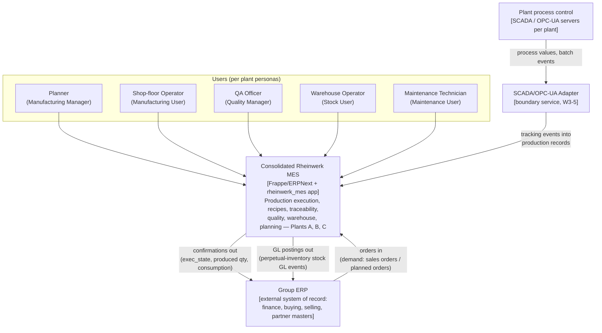
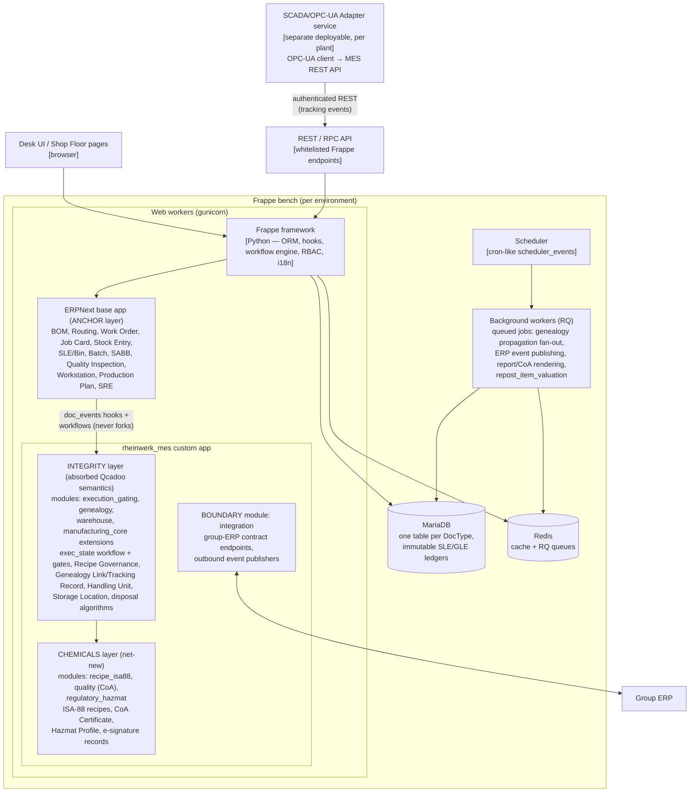
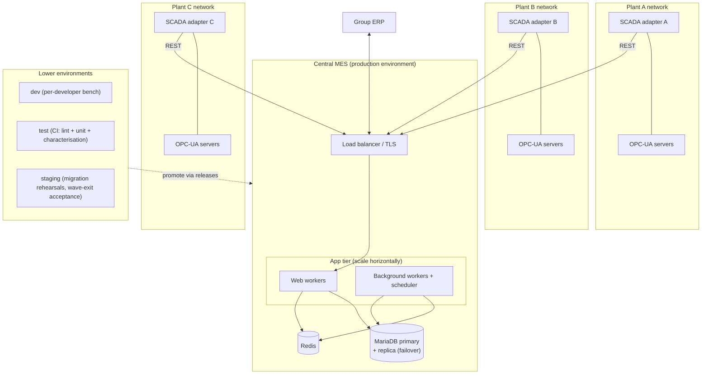

# High-Level Design — Consolidated Rheinwerk MES (Stage 3)

**Scope:** the TO-BE system only — the consolidated MES built as the `rheinwerk_mes` Frappe app on the ERPNext base (ADR-001), with the group ERP across an interface boundary (ADR-002). Inputs: `ARCHITECTURE.md`, `CONSOLIDATION.md`, ADR-001…010, the dossier (`docs/dossier/production-systems-dossier.md`, Parts 4–7), the target capability model (`docs/target-model/target-capability-model.md`, T1–T30), the canonical model (`docs/canonical-model/README.md`, CDM-01…08) and the wave backlogs (`docs/waves/`).

Companion document: `docs/design/LLD.md` (low-level design of the integrity + chemicals layers).

---

## 1. System context (C4 level 1)

One consolidated MES serves all three plants. The group ERP is the only finance/commercial system of record — the interface contract is **orders in, confirmations out, GL postings out** (ADR-002). SCADA/OPC-UA connectivity is a white-space rebuild (dossier §6.3; T23) delivered as an adapter service in W3 (W3-5). Legacy systems (Qcadoo Plant A, OFBiz Plant B, legacy ERPNext instance Plant C) appear only as *migration sources*, retired in W4 — they are not runtime context.

**Personas.** The target role set unifies the three shipped models evidenced in the dossier: ERPNext's per-DocType roles (Manufacturing Manager/User, Stock Manager/User, Quality Manager, Item Manager — dossier ch. 3.2 §B) carry over as the base; Qcadoo's 151 per-transition roles (ch. 3.1 §E, `security.properties:25`) are expressed as workflow-state-level permissions (implication 7, T30 — see §7.1); OFBiz contributed no functional personas (ch. 3.3 §B: only five CRUD permissions granted to `SUPER`), so Plant B personas are assigned onto the unified role set at cutover.

---

## 2. Container / component view (C4 levels 2–3)

The runtime is a standard Frappe bench topology (dossier ch. 3.2 §D: MariaDB/PostgreSQL via Frappe ORM, Redis for queues/cache) hosting two apps: the ERPNext base (anchor) and `rheinwerk_mes`. The custom app is organised in the three layers fixed by `ARCHITECTURE.md` — anchor extensions never fork anchor DocTypes; absorbed semantics land as hooks, workflows and custom DocTypes.

Component notes:

- **Anchor (ERPNext as shipped).** The DocTypes listed in `ARCHITECTURE.md` §Layering-1. Anchor hard stops are kept and verified, not re-implemented (W1-3): over-production errors (`services/status.py:29-47`, `:208-224`), stopped-WO freeze (`job_card.py:904-910`), closed-terminal (`work_order.py:1131-1132`), expired-batch throw (`stock_ledger_entry.py:287-299`).
- **Integrity layer.** Re-implementation of Qcadoo semantics under characterisation-test parity (ADR-001 consequence; implication 1). Hosted in the app modules already scaffolded in `rheinwerk_mes/modules.txt`: `execution_gating`, `genealogy`, `warehouse`, plus governance parts of `manufacturing_core`.
- **Chemicals layer.** White-space rebuilds (dossier §6.3): `recipe_isa88`, CoA in `quality`, `regulatory_hazmat`. All six white-space items are net-new (implication 8).
- **Boundary module (`integration`).** Group-ERP contract and the SCADA adapter's MES-side endpoints. No finance/buying/selling logic in this repo (ADR-002; `ARCHITECTURE.md` §Layering-4).

---

## 3. Layer responsibilities — target capability map (T1–T30)

Home assignments are taken verbatim from `docs/target-model/target-capability-model.md`; the module column maps to `CONSOLIDATION.md` "Lands in module" and `rheinwerk_mes/modules.txt`.

| Cap | Capability | Home layer | Module | Wave |
|---|---|---|---|---|
| T1 | Production order lifecycle (role-gated state machine) | Integrity | execution_gating | W1 |
| T2 | Execution gating / hard stops (union of Qcadoo gates + anchor stops) | Integrity (+ Anchor stops kept) | execution_gating | W1 |
| T3 | Shop-floor execution & recording (Job Cards, time logs) | Anchor | manufacturing_core | W1 |
| T4 | Labour & shift tracking | Anchor | manufacturing_core | W1 (wage groups: Retire? Q1) |
| T5 | BOM & routing definition | Anchor | manufacturing_core | W0 |
| T6 | Recipe lifecycle governance (approval, immutability, in-use locks) | Integrity | manufacturing_core | W1 |
| T7 | ISA-88 batch recipe management | Chemicals | recipe_isa88 | W2 |
| T8 | Batch/lot master data (unified batch object, CDM-01) | Integrity | genealogy | W2 |
| T9 | Batch genealogy (system-of-record) | Integrity | genealogy | W2 |
| T10 | Batch QA state & quarantine (blocking + propagation + picking exclusion) | Integrity | genealogy + warehouse | W2 |
| T11 | Quality inspection engine | Anchor | quality | W2 |
| T12 | Certificate of Analysis generation | Chemicals | quality | W2 |
| T13 | E-signatures on compliance-critical transitions | Chemicals | quality (scope Q2) | W2/W3 |
| T14 | Warehouse structure incl. pallets/handling units & storage locations | Integrity | warehouse | W1/W2 |
| T15 | FEFO/FIFO picking & disposal algorithms | Integrity (delta over anchor FIFO/LIFO/Expiry) | warehouse | W1 |
| T16 | Stock reservations (order- and document-level) | Anchor + Integrity | warehouse | W1 |
| T17 | Inventory valuation & costing | Boundary (GL postings out); valuation stays for stock integrity | integration | W3 |
| T18 | Production planning / MRP | Anchor (demand signal = Boundary input) | manufacturing_core | W3 |
| T19 | Finite-capacity scheduling (line schedules, changeover norms) | Integrity (optimiser = buy decision Q3) | manufacturing_core | W3 |
| T20 | Item/product, work-centre master data (partner masters: Boundary, Q4) | Anchor | manufacturing_core | W0 |
| T21 | UoM & conversions | Anchor | manufacturing_core | W0 |
| T22 | Hazmat / regulatory master data | Chemicals | regulatory_hazmat | W2/W3 |
| T23 | SCADA / OPC-UA / device connectivity | Chemicals (adapter service) | integration | W3 |
| T24 | External integration (group ERP) | Boundary | integration | W3 |
| T25 | Reporting & analytics | Anchor | (all) | W1–W3 |
| T26 | Maintenance management (CMMS) | Integrity | manufacturing_core (scope Q6) | W3 |
| T27 | Audit trail & versioning | Anchor (`track_changes` + immutable ledgers; e-sign = T13) | — | W0 |
| T28 | Multi-plant operation | Anchor (multi-company + Company Restriction) | — | W0 |
| T29 | Localisation (de + en mandatory) | Anchor | — | W0 |
| T30 | RBAC incl. workflow-state-level permissions | Anchor + Integrity | execution_gating | W0/W1 |

Retire-only capabilities R1–R5 (finance/buying/selling as books of record, OFBiz non-manufacturing suite, Qcadoo customer plugins and per-language dumps) are not carried (target model §Retire-only; ADR-002).

---

## 4. Key architectural decisions

| # | Decision | ADR | Design consequence in this HLD |
|---|---|---|---|
| 1 | Frappe/ERPNext anchor; absorb Qcadoo semantics; retire OFBiz | ADR-001 | Three-layer app structure (§2); characterisation tests as parity contract (§9) |
| 2 | One MES app; finance/buying/selling across an interface | ADR-002 | Context boundary (§1); integration contracts (§5) |
| 3 | Canonical Batch = identity + QA state + expiry + genealogy | ADR-003 | Batch workflow + Genealogy Link (LLD §2.1, §5) |
| 4 | Work Order + integrity `exec_state`; "status" banned unqualified | ADR-004 | exec_state workflow reconciled with derived status by hooks (LLD §2.2, §3) |
| 5 | Anchor ledger (SLE+Bin+SABB) is the only quantity truth | ADR-005 | Handling Unit / Storage Location as referencing DocTypes only (LLD §2.3) |
| 6 | BOM/Routing split kept; governed via `Recipe Governance` | ADR-006 | gov_state workflow + validators + in-use locks (LLD §2.4, §3) |
| 7 | Anchor Stock Entry purposes are the canonical movement model | ADR-007 | Qcadoo document types map to purposes; no parallel document engine (LLD §2.5) |
| 8 | Anchor Stock Reservation Entry canonical + draft-reservation flag | ADR-008 | "Draft makes reservation" hooks (LLD §2.6) |
| 9 | Anchor Quality Inspection canonical; acceptance drives Batch qa_state | ADR-009 | QI → qa_state hook; CoA generated from accepted QIs (LLD §2.7, §7) |
| 10 | Anchor Workstation canonical + production_line/division links | ADR-010 | Work-centre extension fields (LLD §2.8) |

---

## 5. Integration architecture

### 5.1 Group-ERP interface (T24; ADR-002; W3-3)

Three contracts, all versioned fixtures tested in W3 (ADR-002 consequence). Transport: authenticated REST + signed webhook events (Frappe whitelisted endpoints, token-based service account per direction). The MES never posts finance documents; the group ERP never writes MES execution state.

| Contract | Direction | Trigger | Payload (canonical vocabulary — ADR-004 bans unqualified "status") |
|---|---|---|---|
| **Order intake** | ERP → MES | Sales/planned order created or changed in group ERP | `external_order_ref`, plant/company, item, qty, UoM, requested dates → creates/updates a demand input to Production Plan (T18). Legacy precedent: Qcadoo `externalNumber`/`externalSynchronized` fields (`OrderFields.java:48,88`); surviving consumers frozen per W3-7. |
| **Confirmation** | MES → ERP | `exec_state` transitions of CDM-02 (Accepted, In Progress, Completed/Interrupted/Abandoned/Declined) and production declarations | `external_order_ref`, `exec_state`, produced qty + batch ids, consumption lines, timestamps. Emitted from workflow hooks via the background queue (at-least-once, idempotency key = event UUID). |
| **GL posting events** | MES → ERP | Submitted stock transactions with GL effect (perpetual inventory, T17) | Debit/credit lines mapped to group-ERP accounts (W3-4; dossier ch. 3.2 `stock_controller.py`, `item.json:387-390`). MES valuation stays authoritative for stock integrity; ERP books the postings. |

### 5.2 SCADA / OPC-UA adapter (T23; W3-5)

Net-new (absent in all three sources — dossier §6.3). A per-plant adapter service, deployed next to the plant network, subscribes to OPC-UA nodes/batch events and translates them into MES REST calls (production declaration drafts, process-value attachments to Batch/production records). The adapter is stateless apart from a delivery journal (replay on outage); all business validation stays in MES hooks so gating (T2) cannot be bypassed by machine-originated events.

### 5.3 Authentication

- **Humans:** Frappe session auth; SSO via OAuth2/OIDC against the group IdP (no legacy SSO existed — dossier ch. 3.1 §E found none in Qcadoo). Roles per §7.1.
- **Systems:** token-based API keys per integration account (group ERP, each plant adapter), least-privilege role profiles; outbound events signed (shared-secret HMAC) and idempotent.

---

## 6. Deployment view

One **central MES deployment** serves all plants; plant isolation is logical, via the anchor's multi-company model with Company Restriction validating every transaction's company (dossier ch. 3.2 `hooks.py:368-384`; T28). Rationale: the anchor is multi-company by design, a single deployment avoids re-creating Qcadoo's single-plant-schema limitation (ch. 3.1 §E: single-schema monolith), and cross-plant traceability (genealogy across inter-plant transfers) requires one database. Only the SCADA adapters are per-plant deployables (plant-network locality).

- **Multi-company isolation:** one Company per plant; Company Restriction hook on every transaction (anchor, adopted as-is); warehouse trees, naming series (`BATCH-{plant}-{#}`, CDM-01) and workflow role assignments are company-scoped.
- **Environments:** dev → test (CI runs the characterisation harness of W0-6 as the regression floor) → staging (per-plant migration rehearsals and wave-exit acceptance, W4 runbooks) → production. Wave cutovers are per plant per journey (W4-1).

---

## 7. Cross-cutting concerns

### 7.1 RBAC + workflow-state permissions (T30; implication 7)

Base: anchor per-DocType role matrices (dossier ch. 3.2 §B). Delta: Qcadoo's per-transition granularity ("may accept documents but not corrections" — implication 7) is expressed with Frappe **Workflow** definitions where every transition names an `allowed` role (LLD §2 workflow tables). Target roles extend the anchor set with transition-scoped roles (e.g. `MES Order Approver`, `MES QA Disposition`, `MES Recipe Approver`), replacing Qcadoo's 151-role explosion with per-workflow-transition assignment. Plant scoping via company-level user permissions.

### 7.2 Audit trail & e-signatures (T27, T13)

- Every governed DocType runs with `track_changes` (Frappe Version documents); stock and GL effects live in immutable ledgers with cancel-and-repost correction (dossier ch. 3.2 §C/§D) — jointly matching Qcadoo's `*StateChange` audit rows (ch. 3.1 §E).
- Canonical workflows additionally persist explicit state-history child tables with user/timestamp/reason (CDM-02 `state_history`; CDM-01 blocking reasons) because Qcadoo audit carried worker/shift context (`orderStateChange.xml:36-47`).
- **E-signature (T13)** is net-new (no legacy precedent — dossier §6.3): a `Signature Record` (chemicals layer) capturing signer, meaning-of-signature, credential re-authentication and document hash, attached to compliance-critical transitions. Which transitions legally require it is open question Q2 — the design ships the mechanism in W2, the scope list follows Q2 sign-off (W2-10).

### 7.3 Internationalisation (T29)

German + English mandatory. All custom DocType labels/messages translatable via Frappe `.po`/`translate` machinery (anchor ships full German — dossier ch. 3.2 §A: 36 locales). Qcadoo's per-language DB dumps (R5) are superseded; no per-locale schema variance is permitted.

### 7.4 Observability

- Application: Frappe error logs + Sentry-style aggregation; slow-query and background-job monitoring (RQ queue depth — genealogy propagation and ERP event publishing run queued, §2).
- Business: interface delivery journals (§5.1 idempotency keys) surfaced as reconciliation reports; migration reconciliation reports per warehouse (ADR-005 consequence).
- The characterisation harness (W0-6) runs in CI on every change to gating/genealogy code — parity regressions are build failures.

---

## 8. Non-functional requirements

Grounded in what the dossier evidenced; where the dossier is silent, values are programme targets flagged **(target)** requiring business sign-off.

| NFR | Requirement | Grounding |
|---|---|---|
| Availability | 99.5% during plant operating hours **(target)**; shop-floor execution (T3) and gating (T2) are the critical path | Legacy gives no SLA evidence; Qcadoo scaling was single-DB-bound (dossier ch. 3.1 §E) |
| RPO | ≤ 15 min **(target)** — DB replica + point-in-time recovery | Stock/GL truth is the immutable SLE stream (ch. 3.2 §B consequences); losing ledger tail = re-declaration, not corruption |
| RTO | ≤ 4 h **(target)** — replica promotion + stateless app tier | §6 topology |
| Auditability | 100% of governed state changes carry user/timestamp/reason; immutable ledgers for stock/GL; e-sign per Q2 scope | Dossier ch. 3.1 §E (`*StateChange` rows), ch. 3.2 §C (SLE spine); T27/T13 |
| Traceability | Full forward + backward trace as system-of-record objects, incl. blocked-batch propagation — demonstrable multi-level (W2-9 exit) | `ARCHITECTURE.md` non-negotiables; implication 3 |
| Data volume / scalability | Operational tables must stay performant without Qcadoo-style PL/pgSQL archiving; ledger-based model + background reposting absorb volume; known pressure signal: Qcadoo built `arch_*` archiving machinery (`mes_db_en.sql:292-648`) specifically for data-volume relief | Dossier ch. 3.1 §E (scalability), §D (archiving) |
| Concurrency | Plant A-scale document/reservation churn ("draft makes reservation" mutating availability — `ReservationsService.java:81-247`) must not serialise on row locks: reservations use the anchor SRE model (per-entry rows), availability reads via Bin cache | Dossier ch. 3.1 §C.3; ADR-008 |
| Interface latency | Confirmations/GL events published ≤ 1 min after commit (queued, at-least-once) **(target)** | §5.1 |
| Localisation | de + en full coverage at every wave exit | T29 |
| Security | Least-privilege roles incl. per-transition (T30); no plant may see another plant's data (Company Restriction) | Implication 7; ch. 3.2 `hooks.py:368-384` |

---

## 9. Verification approach (summary)

Characterisation tests encode legacy behaviour (Qcadoo gates, validators, picking order — W0-6) as executable parity contracts; every absorbed rule in the LLD cites its characterisation reference. Intentional divergences (e.g. estate-wide expiry hard stop, W1-9) are documented per gate (W1-10). Wave-exit acceptance tests per `docs/waves/*.md` exit criteria. Full strategy: LLD §9.
