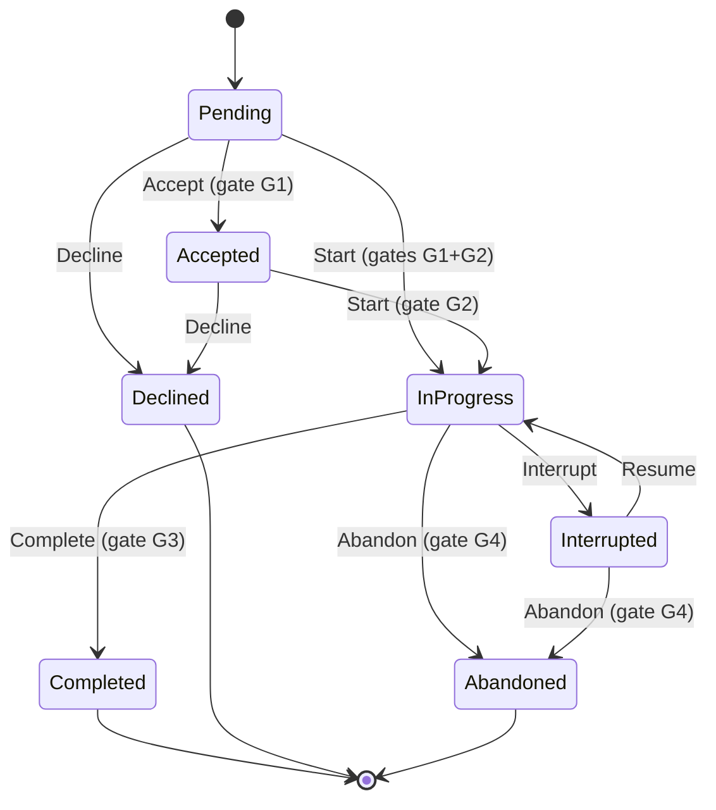
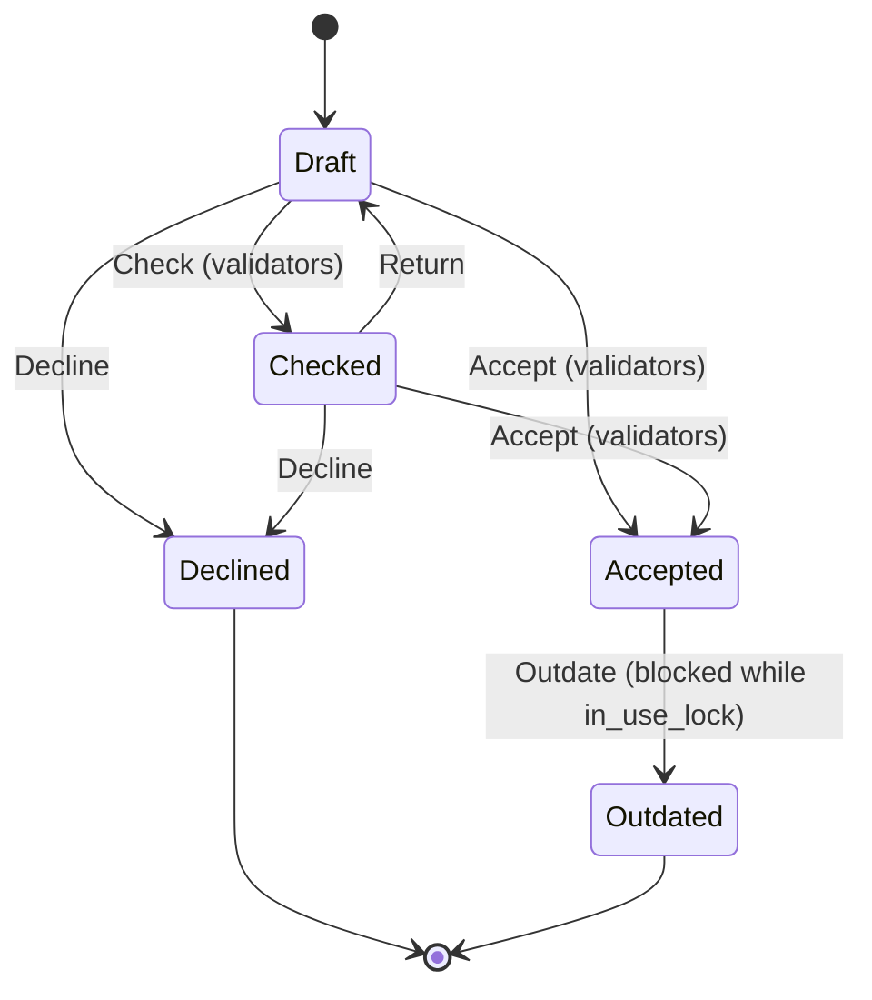
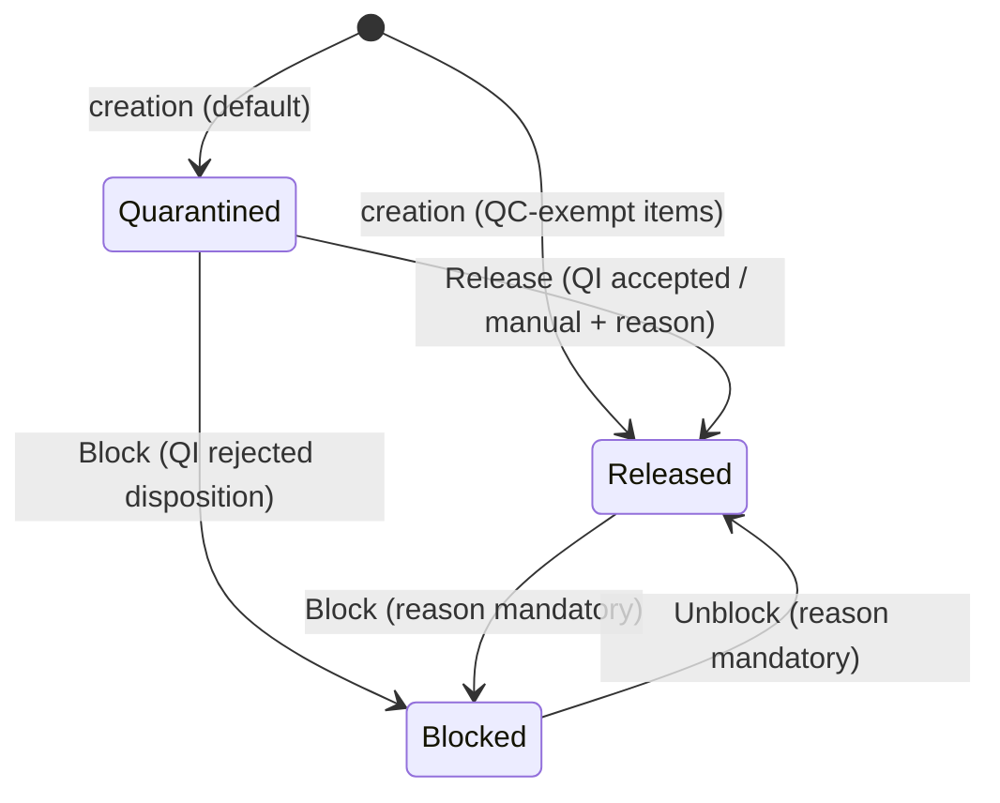
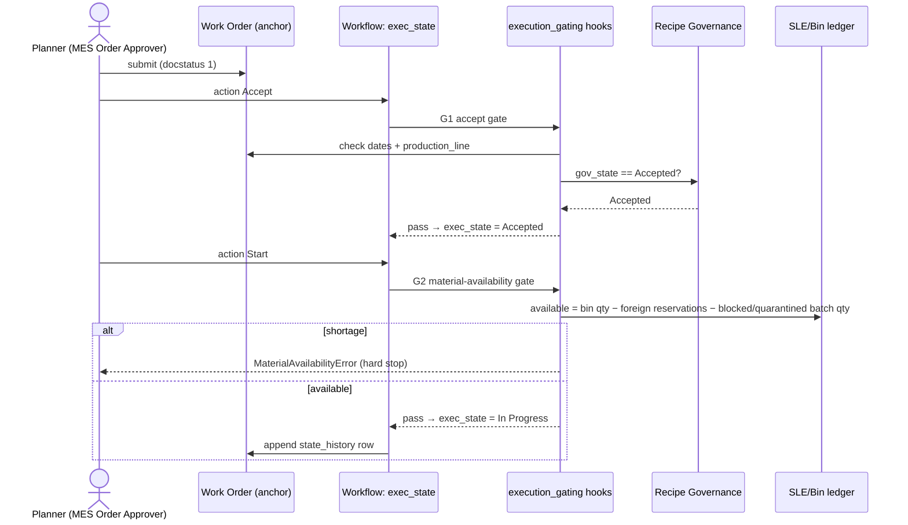
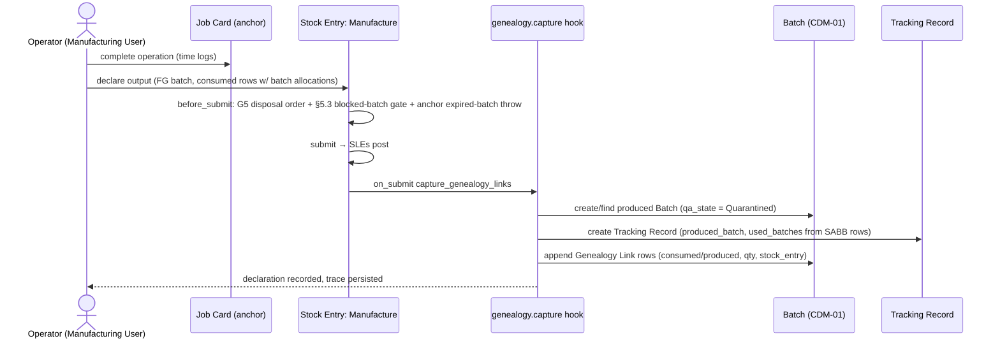
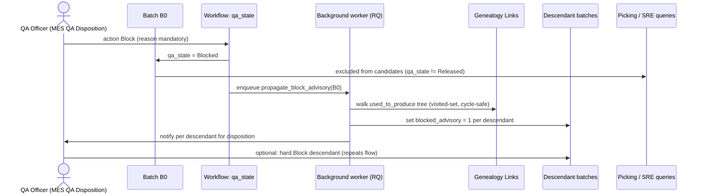
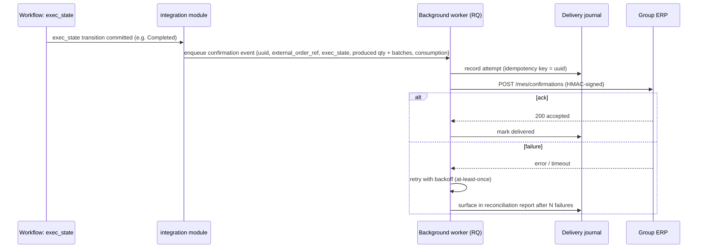

# Low-Level Design — Integrity + Chemicals Layers (Stage 3)

**Scope:** the net-new/absorbed work of the consolidated MES — the integrity layer (absorbed Qcadoo semantics) and the chemicals layer (white-space rebuilds), per `ARCHITECTURE.md` layering. Anchor DocTypes are used as-is and **never forked**; everything below lands as custom DocTypes, custom fields, workflows and `doc_events` hooks in the `rheinwerk_mes` app (ADR-001; wave rule 2 in `docs/waves/README.md`).

Conventions: Frappe fieldtypes (`Data`, `Link`, `Select`, `Table`, `Date`, `Datetime`, `Float`, `Check`, `Small Text`, `Attach`); workflows are Frappe Workflow definitions with `workflow_state_field` on the governed DocType; hooks are registered in `rheinwerk_mes/hooks.py` `doc_events`. Evidence citations refer to `docs/dossier/production-systems-dossier.md` (dossier), `docs/canonical-model/README.md` (CDM), `docs/adr/` (ADR).

---

## 1. Hook registry overview (`rheinwerk_mes/hooks.py`)

```python
doc_events = {
    "Work Order": {
        "validate":       "rheinwerk_mes.execution_gating.work_order.validate_dates_and_recipe",
        "on_submit":      "rheinwerk_mes.execution_gating.work_order.sync_exec_state_on_submit",
        "on_update_after_submit": "rheinwerk_mes.execution_gating.work_order.reconcile_exec_state",
        "before_cancel":  "rheinwerk_mes.execution_gating.work_order.block_cancel_in_progress",
    },
    "Stock Entry": {
        "before_submit": [
            "rheinwerk_mes.execution_gating.stock_entry.material_availability_gate",
            "rheinwerk_mes.genealogy.picking.blocked_batch_gate",
            "rheinwerk_mes.warehouse.disposal.enforce_disposal_order",
        ],
        "on_submit":     "rheinwerk_mes.genealogy.capture.capture_genealogy_links",
        "before_save":   "rheinwerk_mes.warehouse.reservations.draft_makes_reservation",
        "on_trash":      "rheinwerk_mes.warehouse.reservations.release_draft_reservations",
        "on_cancel":     "rheinwerk_mes.warehouse.reservations.release_draft_reservations",
    },
    "Job Card":  { "before_submit": "rheinwerk_mes.execution_gating.job_card.exec_state_gate" },
    "BOM":       { "on_update_after_submit": "rheinwerk_mes.manufacturing_core.recipe_governance.block_accepted_bom_edit" },
    "Quality Inspection": {
        "on_submit": "rheinwerk_mes.quality.qa_state.drive_batch_qa_state",
        "on_cancel": "rheinwerk_mes.quality.qa_state.revert_batch_qa_state",
    },
    "Batch":     { "validate": "rheinwerk_mes.genealogy.batch.require_expiry_for_shelf_life_items" },
    "Stock Reservation Entry": { "validate": "rheinwerk_mes.warehouse.reservations.tag_draft_origin" },
    "Pick List": { "validate": "rheinwerk_mes.genealogy.picking.exclude_blocked_batches" },
}
```

Rationale for the hook points is given per gate in §4.

---

## 2. Canonical entity designs (CDM-01…08)

### 2.1 CDM-01 Batch (ADR-003)

**Storage base:** anchor `Batch` DocType, extended via Custom Fields + one child DocType — never forked (CDM conventions). Canonical spec: CDM §CDM-01.

Custom fields on anchor `Batch`:

| fieldname | fieldtype | options / notes |
|---|---|---|
| `qa_state` | Select | `Quarantined\nReleased\nBlocked` — workflow-state field; **not** a boolean (CDM-01) |
| `qa_state_reason` | Small Text | mandatory on Blocked/unblock transitions (CDM-01 lifecycle) |
| `genealogy_incomplete` | Check | set by migration for identity-only batches (ADR-003 consequence) |
| `blocked_advisory` | Check | set by propagation when an ancestor batch is Blocked (§5.2) |
| `hazmat_profile` | Link | `Hazmat Profile` (chemicals layer, T22) |
| `genealogy_links` | Table | `Genealogy Link` (child DocType, §5.1) |
| `legacy_refs` | Table | `Legacy Reference` (child: `system` Select `Qcadoo\nERPNext\nOFBiz`, `ref` Data) |

Anchor fields used as-is: `item`, `expiry_date`, `manufacturing_date`, `supplier_batch_id` (→ canonical `supplier_batch_no`), `parent_batch` (split/repack lineage, distinct from genealogy — CDM-01), naming series `BATCH-{plant}-{#}`.

**Workflow `Batch QA State`** (`workflow_state_field = qa_state`; states/transitions from CDM-01 lifecycle; Qcadoo precedent TRACKED⇄BLOCKED `BatchState.java:31-44` extended with Quarantined per implication 2):

| From | To | Action | Allowed role | Condition |
|---|---|---|---|---|
| (creation) | Quarantined | — | system | default; Released directly where item is QC-exempt (CDM-01) |
| Quarantined | Released | Release | `MES QA Disposition` | driven by QI acceptance hook (§2.7); manual release requires reason |
| Released | Blocked | Block | `MES QA Disposition` | `qa_state_reason` mandatory |
| Blocked | Released | Unblock | `MES QA Disposition` | `qa_state_reason` mandatory (re-enterable — CDM-01) |
| Quarantined | Blocked | Block | `MES QA Disposition` | rejection disposition (ADR-009) |

**doc_events:** `Batch.validate` — expiry mandatory for shelf-life items (anchor already throws, `batch.py:194-220`; hook adds the plant-policy override decided in W1-9). Blocking side-effects run in the workflow transition handler (§5.2), not on save.

**Server-side validations:** qa_state transitions only via workflow (no direct field write — enforced by `workflow_state_field`); reason mandatory on Block/Unblock; `expiry_date >= manufacturing_date`; a Blocked batch cannot be set `disabled` silently (disabled ≠ Blocked; the anchor flag maps to Blocked only at migration — CDM-01 mapping).

### 2.2 CDM-02 Production Order (ADR-004)

**Storage base:** anchor `Work Order` + custom fields; user-owned `exec_state` reconciled with the anchor's posting-derived `status` by hooks — the unqualified word "status" is banned from canonical interfaces (ADR-004).

| fieldname | fieldtype | options / notes |
|---|---|---|
| `exec_state` | Select | `Pending\nAccepted\nIn Progress\nCompleted\nInterrupted\nAbandoned\nDeclined` — workflow-state field |
| `production_line` | Link | `Production Line` (CDM-08 grouping) |
| `master_order` | Link | `Master Order` (sales aggregation; Qcadoo `MasterOrder`, dossier ch. 3.1 §C.1) |
| `recipe_governance` | Link | `Recipe Governance` (gate: only Accepted — §4 G1) |
| `state_history` | Table | `Exec State Change` (child: `from_state`, `to_state` Select; `user` Link User; `timestamp` Datetime; `reason` Small Text) — carries Qcadoo's worker/timestamp audit (`orderStateChange.xml:36-47`) |
| `shortfall_reason` | Small Text | required when completing below ordered qty (CDM-02 semantics) |

**Workflow `Production Order Execution`** (transitions = Qcadoo `OrderState.java:31-81` `canChangeTo` sets, renamed per CDM-02):

| From | To | Action | Allowed role |
|---|---|---|---|
| Pending | Accepted | Accept | `MES Order Approver` |
| Pending | In Progress | Start | `MES Order Approver` |
| Pending | Declined | Decline | `MES Order Approver` |
| Accepted | In Progress | Start | `Manufacturing User` |
| Accepted | Declined | Decline | `MES Order Approver` |
| In Progress | Completed | Complete | `Manufacturing User` |
| In Progress | Interrupted | Interrupt | `Manufacturing User` |
| In Progress | Abandoned | Abandon | `MES Order Approver` |
| Interrupted | In Progress | Resume | `Manufacturing User` |
| Interrupted | Abandoned | Abandon | `MES Order Approver` |

Completed / Declined / Abandoned are terminal (`OrderState.java:54-81` — illegal jumps rejected; characterisation test CH-ORD-01).

**Reconciliation hooks (both directions):**
- Accept requires anchor submit (docstatus 1) — accepting a draft Work Order is rejected (CDM-02 semantics).
- Anchor `status` becoming `Completed` (produced ≥ qty, `services/status.py:107-144`) does **not** auto-complete `exec_state`; completing `exec_state` requires produced ≥ ordered **or** an explicit `shortfall_reason` — reconciling the divergence "completion automatic (ERPNext) vs doneQuantity>0 gate (Qcadoo)" (dossier §5.4 row 1) in favour of the user-owned gate.
- Anchor hard stops stay untouched (W1-3): Stopped-WO freeze, Closed-terminal, over-production (dossier ch. 3.2 §C rules).

### 2.3 CDM-03 Stock Record (ADR-005)

No new quantity store: SLE + Bin + Serial and Batch Bundle is the only truth. Two integrity DocTypes add physical fidelity (Qcadoo `ResourceFields.java:32-90` precedent):

**DocType `Storage Location`** (tree, below the anchor Warehouse):

| fieldname | fieldtype | options |
|---|---|---|
| `location_code` | Data | unique per warehouse |
| `warehouse` | Link | Warehouse |
| `parent_storage_location` | Link | Storage Location (`is_tree = 1`) |
| `location_type` | Select | `Zone\nRack\nBin\nQuarantine` |
| `disabled` | Check | |

**DocType `Handling Unit`** (pallet/load unit):

| fieldname | fieldtype | options |
|---|---|---|
| `hu_id` | naming series `HU-{plant}-{#}` | |
| `hu_type` | Select | `Pallet\nContainer\nDrum\nIBC` |
| `current_storage_location` | Link | Storage Location |
| `contents` | Table | `Handling Unit Content` (child: `item` Link Item, `batch` Link Batch, `qty` Float, `uom` Link UOM) |
| `status` | Select | `Active\nShipped\nDissolved` |

**Validations:** HU contents are *references* — reconciliation report asserts Σ(HU content per item/batch/warehouse) ≤ Bin qty; never a parallel quantity store (ADR-005; CDM-03 mismatch note). Quarantine locations (W2-8) are `location_type = Quarantine`; putaway of Quarantined/Blocked batches outside quarantine locations is warned (policy, not stock-truth).

### 2.4 CDM-04 Recipe (ADR-006)

Anchor `BOM` + `Routing` kept split; governance over the *pair* via a new DocType.

**DocType `Recipe Governance`:**

| fieldname | fieldtype | options |
|---|---|---|
| `bom` | Link | BOM (unique — one governance record per BOM version) |
| `routing` | Link | Routing (the selected routing governed together with the BOM — CDM-04 mismatch note) |
| `gov_state` | Select | `Draft\nChecked\nAccepted\nOutdated\nDeclined` — workflow-state field |
| `validator_results` | Table | `Recipe Validator Result` (child: `validator` Data, `passed` Check, `message` Small Text, `run_at` Datetime) |
| `in_use_lock` | Check | set while any non-terminal CDM-02 order references the BOM |
| `predecessor` | Link | Recipe Governance (version chain; predecessor → Outdated on accept) |

**Workflow `Recipe Governance`** (Qcadoo `TechnologyState.java:33-66`, 5 states incl. checked→draft return):

| From | To | Action | Allowed role | Gate |
|---|---|---|---|---|
| Draft | Checked | Check | `Manufacturing User` | structural validators pass |
| Draft | Accepted | Accept | `MES Recipe Approver` | validators pass |
| Draft | Declined | Decline | `MES Recipe Approver` | |
| Checked | Draft | Return | `Manufacturing User` | |
| Checked | Accepted | Accept | `MES Recipe Approver` | validators pass |
| Checked | Declined | Decline | `MES Recipe Approver` | |
| Accepted | Outdated | Outdate | `MES Recipe Approver` | blocked while `in_use_lock` (not used in active order — `TechnologyValidationService.java:707`) |

**Structural validators** (re-implementation of the Qcadoo acceptance battery, `TechnologyValidationService.java:91-707`; characterisation CH-REC-01…): BOM tree present and exploded without cycles; root operation produces the BOM item; every operation has input components; UoM consistency across levels; scrap/waste flags declared; routing operations all resolvable to Workstations; output declaration present.

**Immutability:** `BOM.on_update_after_submit` hook rejects edits to a BOM whose governance is Accepted — change = new BOM version + new governance record, predecessor → Outdated (ADR-006 consequence; divergence dossier §5.4 row 3 resolved to Qcadoo strictness). Migration backfills active ERPNext default BOMs as Accepted (ADR-006).

### 2.5 CDM-05 Stock Movement (ADR-007)

Anchor `Stock Entry` purposes canonical; no new DocType. Custom field `legacy_document_no` (Data) preserves Qcadoo document numbering (ADR-007 consequence). Mapping fixed by CDM-05: Receipt→Material Receipt, Release→Material Issue, Transfer/internal in-out pairs→Material Transfer. Acceptance semantics carried by §2.6 + submit hooks — no parallel document engine.

### 2.6 CDM-06 Reservation (ADR-008)

Anchor `Stock Reservation Entry` canonical. Custom fields: `draft_reservation` (Check) + `source_document` (Dynamic Link) replicating Qcadoo "draft makes reservation" (`ReservationsService.java:81-247`):

- `Stock Entry.before_save` (draft): create/refresh SREs per row (batch-capable, anchor-native `stock_reservation_entry.py:530-553`), flagged `draft_reservation = 1`.
- `Stock Entry.on_trash` / `on_cancel` of the draft: release those SREs.
- Submit converts draft reservations into consumption (SRE delivered as the SLEs post).

OFBiz `OrderItemShipGrpInvRes` deliberately not carried — sales-order reservations live across the ERP boundary (ADR-008 ✕).

### 2.7 CDM-07 Quality Result (ADR-009)

Anchor `Quality Inspection` canonical, as shipped (typed, parametric readings, template-driven — dossier ch. 3.2 `quality_inspection.py:265-336`). Integrity hook `Quality Inspection.on_submit`:

```python
def drive_batch_qa_state(qi, method):
    if not qi.batch_no:
        return
    batch = frappe.get_doc("Batch", qi.batch_no)
    if qi.status == "Accepted" and batch.qa_state == "Quarantined":
        apply_workflow_transition(batch, "Release", reason=f"QI {qi.name} accepted")
    elif qi.status == "Rejected":
        route_to_qa_disposition(batch, qi)   # QA chooses Blocked or rework (ADR-009)
```

QI transaction/operation gating strength stays the anchor's Stock Settings severity (`quality_inspection_service.py:21-127`; `job_card.py:843-889`); the target sets it to `Stop` (union-of-gates principle, T2). CoA generation from accepted QIs: §7.1.

### 2.8 CDM-08 Work Centre (ADR-010)

Anchor `Workstation` (+ `Workstation Type`) with custom fields `production_line` (Link `Production Line`) and `division` (Link `Division`). New thin master DocTypes `Production Line` (`line_code` Data, `company` Link, `workstations` read-only listing) and `Division` (tree: `division_name`, `parent_division`, `company`) — grouping for W3 finite-capacity scheduling (ADR-010 consequence). Asset accounting stays in the group ERP (mismatch resolution, CDM-08).

---

## 3. State machine diagrams

### 3.1 Production order `exec_state` (CDM-02; source: `OrderState.java:31-81`)



### 3.2 Recipe `gov_state` (CDM-04; source: `TechnologyState.java:33-66`)



### 3.3 Batch `qa_state` (CDM-01; source: `BatchState.java:31-44` TRACKED⇄BLOCKED, extended with Quarantined per implication 2)



---

## 4. Gating logic — W1 backlog gates

Each gate: hook point, pseudocode, characterisation reference (the parity contract per W0-6 / wave rule 1). Gates G1–G4 implement W1-1/W1-2; G5–G7 implement W1-5/W1-6; anchor stops (W1-3) are adopted, not re-implemented.

### G1 — Accept gate (W1-2): dates + line + accepted recipe

Hook point: workflow transition handler for `Pending → Accepted` (Frappe workflow `condition` + server-side re-check in `on_update_after_submit`). Anchor submit is a precondition (§2.2).

```text
on transition Accept(work_order):
    assert work_order.docstatus == 1                      # anchor submit precedes acceptance
    assert work_order.planned_start_date and work_order.planned_end_date
    assert work_order.planned_end_date > work_order.planned_start_date   # OrderStateService.java:47-59
    assert work_order.production_line
    gov = work_order.recipe_governance
    assert gov and gov.gov_state == "Accepted"            # orders reference Accepted recipes only (ADR-006)
    append state_history(Pending→Accepted, user, now, reason=None)
```

Characterisation reference: order cannot be ACCEPTED without dateFrom, dateTo, production line and technology — `OrderStateValidationService.java:44-47` (dossier ch. 3.1 §C.3); date-range consistency — `OrderStateService.java:47-59`. Tests: `tests/characterisation` CH-ORD-02 (missing fields rejected), CH-ORD-03 (dateTo ≤ dateFrom rejected).

### G2 — Material-availability gate on release/start (W1-2)

Hook point: workflow transition `→ In Progress` **and** `Stock Entry.before_submit` for Material Transfer for Manufacture entries (the posting that physically releases material). Double placement mirrors Qcadoo, which checked availability in the order-start listener (`OrderStatesListenerServicePFTD.java:580`).

```text
check_material_availability(work_order):                  # shared by both hook points
    for row in required_items(work_order):
        available = bin_qty(row.item, row.source_warehouse)
                    - reserved_qty_other_orders(row.item, row.source_warehouse)
        available -= qty_in_blocked_or_quarantined_batches(row.item, row.source_warehouse)  # §5.3
        if available < row.required_qty:
            throw MaterialAvailabilityError(row.item, available, row.required_qty)   # hard stop

on transition Start(work_order):
    check_material_availability(work_order)
    append state_history(→ In Progress)                    # history only on the workflow transition

before_submit(stock_entry of WO transfer):
    check_material_availability(stock_entry.work_order)    # re-check at posting; no state change
```

Characterisation reference: material availability & resource reservations checked when order starts — `OrderStatesListenerServicePFTD.java:129,134,580,633` (dossier ch. 3.1 §C.3). Divergence note vs anchor (availability not blocking in ERPNext — dossier §5.4 row 4): target adopts the **hard** gate; recorded per W1-10. Tests: CH-ORD-04.

### G3 — Complete gate (W1-2): recorded output required

Hook point: workflow transition `In Progress → Completed`.

```text
on transition Complete(work_order):
    assert work_order.produced_qty > 0                    # doneQuantity = 0 blocks completion
    if work_order.produced_qty < work_order.qty:
        assert work_order.shortfall_reason                # explicit shortfall (CDM-02)
    assert exists submitted Manufacture Stock Entry for work_order   # completion needs final recorded output
    append state_history(→ Completed)
```

Characterisation reference: order cannot be COMPLETED with doneQuantity = 0 (or missing dates/doneQuantity) — `OrderStateValidationService.java:54-63`. Anchor side: over-production above allowance still throws (`services/status.py:208-224`, kept per W1-3). Tests: CH-ORD-05.

### G4 — Decline/abandon cleanup (W1-2, W1-6)

Hook point: workflow transitions `→ Declined` / `→ Abandoned`.

```text
on transition Decline/Abandon(work_order):
    release_sres(work_order)                              # clear order reservations
    cancel_draft_transfer_entries(work_order)             # draft documents lose their reservations
    append state_history(..., reason=mandatory)
```

Characterisation reference: reservations cleared on decline/abandon — `OrderStatesListenerServicePFTD.java:633` (dossier ch. 3.1 §C.3). Tests: CH-ORD-06.

### G5 — Disposal-algorithm picking order (W1-5)

Hook point: `Stock Entry.before_submit` (and Pick List batch suggestion): outbound batch/HU selection ordered per warehouse setting.

Custom field on `Warehouse`: `disposal_algorithm` (Select `FIFO\nLIFO\nFEFO\nLEFO`; anchor already ships FIFO/LIFO/Expiry globally — `stock_settings.json:363-370`; the absorbed delta is per-warehouse selection + LEFO, per the refined disposition in `docs/target-model/capability-disposition-map.md`).

```text
candidate_batches = batches with qty > 0 in source_warehouse, qa_state = Released, not expired
order by:
    FIFO: batch.manufacturing_date asc      LIFO: desc
    FEFO: batch.expiry_date asc             LEFO: desc
```

Characterisation reference: outbound picking honours warehouse disposal algorithm — `WarehouseAlgorithm.java:26-27`, `ResourceManagementServiceImpl.java:1015-1027` (dossier ch. 3.1 §C.3). Tests: CH-WH-01 (ordering parity per algorithm).

### G6 — Draft makes reservation (W1-6)

Hook point: `Stock Entry.before_save` (docstatus 0) / `on_trash` / `on_cancel` — §2.6 design.

```text
before_save(draft stock_entry):
    for row in stock_entry.items where source_warehouse:
        upsert SRE(item=row.item, warehouse=row.source_warehouse, qty=row.qty,
                   batch allocation per G5 order, draft_reservation=1,
                   source_document=stock_entry)
on_trash / on_cancel:
    delete/cancel SREs where source_document == stock_entry and draft_reservation == 1
```

Characterisation reference: draft warehouse documents reserve stock; reservations mutate available quantity — `ReservationsService.java:81-247`, `ResourceFields.java:34-36`; anchor SRE base `stock_reservation_entry.py:530-553` (dossier ch. 3.1/3.2). Tests: CH-WH-02 (draft reserves, delete releases).

### G7 — Expiry enforcement (W1-9 decision)

Hook point: anchor already throws on expired outward SLEs (`stock_ledger_entry.py:287-299`) and expired picking (`pick_list.py:286-311`) — adopted as the default (**Hard Stop**). The W1-9 decision (hard stop vs FEFO-advisory estate-wide) is carried by a per-company `expiry_enforcement` Select (`Hard Stop\nFEFO Advisory`). Implementation note: the throw lives inside anchor SLE submission, so a `doc_events` hook cannot downgrade it — if the business signs off FEFO-Advisory for a transition period, the relaxation is implemented at the *entry* documents (Stock Entry/Pick List `before_submit` converting the pre-check to a warning **plus** a site-level `override_doctype_class` on Stock Ledger Entry, Frappe's sanctioned extension point — a configuration override, not a fork). Default recommendation stays Hard Stop (union-of-gates, T2). Characterisation delta recorded per W1-10 (divergence: only ERPNext enforced expiry — dossier §5.4 row 2). Tests: CH-WH-03 (both policy values).

---

## 5. Genealogy / quarantine design (W2-1…W2-3)

### 5.1 Data model

**Child DocType `Genealogy Link`** (rows in `Batch.genealogy_links` — CDM-01 field spec):

| fieldname | fieldtype | options |
|---|---|---|
| `direction` | Select | `consumed\nproduced` |
| `batch` | Link | Batch (the counterparty lot) |
| `production_order` | Link | Work Order |
| `qty` | Float | |
| `uom` | Link | UOM |
| `stock_entry` | Link | Stock Entry (posting evidence) |

**DocType `Tracking Record`** (system-of-record header per declaration — Qcadoo `TrackingRecordFields.java:31-49` producedBatch/usedBatches; W2-1):

| fieldname | fieldtype | options |
|---|---|---|
| `production_order` | Link | Work Order |
| `produced_batch` | Link | Batch |
| `used_batches` | Table | `Genealogy Link` |
| `stock_entry` | Link | Stock Entry (Manufacture) |
| `record_state` | Select | `Draft\nAccepted\nCorrected` (Qcadoo `TrackingRecordState.java:31-64`) |

Genealogy is written at posting time (capture hook §6.2) — a first-class object model, not a derived report (`ARCHITECTURE.md` non-negotiables; dossier §6.2: ERPNext trace is derived, not first-class).

**Ownership note (Frappe constraint):** child-table rows belong to exactly one parent document, so `Genealogy Link` rows cannot be shared between `Tracking Record.used_batches` and `Batch.genealogy_links`. The **Tracking Record is the write-side source of truth**; the capture hook mirrors each link into the affected Batches' `genealogy_links` tables (one `produced` row on each consumed batch, `consumed` rows on the produced batch) as maintained projections for per-batch browsing. Mirror consistency is asserted by CH-GEN-02 fixtures; corrections (`record_state = Corrected`) rewrite the mirrors transactionally.

Tree browsing: `produced_from(batch)` walks `consumed` links upward, `used_to_produce(batch)` walks `produced` links downward (Qcadoo `AdvancedGenealogyTreeViewListeners.java:71-73` directions).

### 5.2 Blocking propagation algorithm (implication 3: absorb + extend)

Qcadoo blocked batches and excluded resources from picking (`ResourceCriteriaModifiers.java:59,70`) but did **not** propagate through genealogy automatically — propagation is the deliberate extension (implication 3; T10). Design: blocking a batch hard-blocks that batch's stock and sets an **advisory flag** on all descendants (CDM-01 lifecycle: "propagates an advisory flag down genealogy").

```text
on transition Block(batch, reason):
    batch.qa_state = Blocked                    # hard: picking exclusion §5.3
    enqueue propagate_block_advisory(batch)     # background worker (fan-out may be large)

def propagate_block_advisory(root):
    visited = {root}
    frontier = descendants(root)                # batches with a Genealogy Link consumed=root
    while frontier:
        b = frontier.pop()
        if b in visited: continue
        visited.add(b)
        if not b.blocked_advisory:
            b.blocked_advisory = True           # advisory, not hard block
            notify_qa(b, root, reason)          # QA disposition per descendant
        frontier |= descendants(b)

on transition Unblock(root):
    for b in descendants(root):
        if no other Blocked ancestor of b:      # recompute against remaining blocked ancestors
            b.blocked_advisory = False
```

Cycle-safe (visited set); idempotent (flag check); at-least-once queue semantics acceptable because the operation is monotone per root.

### 5.3 Picking-exclusion query changes (W2-3)

Everywhere outbound candidates are computed (G2 availability, G5 ordering, Pick List, SRE auto-allocation), the batch filter becomes:

```sql
AND batch.qa_state = 'Released'          -- excludes Quarantined AND Blocked
AND (batch.expiry_date IS NULL OR batch.expiry_date >= CURRENT_DATE)  -- per G7 policy
```

`blocked_advisory = 1` batches remain pickable but surface a warning requiring `MES QA Disposition` override (advisory semantics, §5.2). Characterisation reference: resources blocked for QC excluded from available-resource lookups — `ResourceCriteriaModifiers.java:59,70`; batch must be unblocked before further use — `BatchState.java:31-44` (dossier ch. 3.1 §C.3). Tests: CH-GEN-01 (exclusion), CH-GEN-02 (advisory propagation — extension, marked as intentional beyond-parity behaviour per W1-10 convention).

---

## 6. Sequence diagrams

### 6.1 Order release with gating (G1+G2)



### 6.2 Production declaration with genealogy capture



(Genealogy read from the posted Serial and Batch Bundle allocations — the same joins the anchor's derived trace used, `serial_and_batch_bundle.py`, dossier ch. 3.2 — but persisted as first-class objects at write time.)

### 6.3 Batch blocking propagation



### 6.4 Group-ERP confirmation flow



---

## 7. Chemicals-layer DocType sketches (fields only — W2 scope)

### 7.1 CoA (T12; W2-5 — white space, dossier §6.3)

**DocType `CoA Certificate`** (generated from accepted Quality Inspections per batch — ADR-009):

| fieldname | fieldtype | options |
|---|---|---|
| `batch` | Link | Batch |
| `item` | Link | Item |
| `quality_inspections` | Table MultiSelect | Quality Inspection (accepted only) |
| `readings_snapshot` | Table | `CoA Reading` (child: `parameter` Data, `specification` Data, `min_value`/`max_value` Float, `measured_value` Data, `verdict` Select `Pass\nFail`) |
| `approved_by` | Link | User (signatory) |
| `signature_record` | Link | Signature Record (T13, per Q2 scope) |
| `issued_on` | Date | |
| `certificate_no` | naming series `COA-{plant}-{#}` | |
| `pdf_artifact` | Attach | rendered print format |
| `coa_state` | Select | `Draft\nIssued\nWithdrawn` |

### 7.2 ISA-88 recipes (T7; W2-6 — white space)

Layered **over** BOM/Routing (procedural view referencing the governed material/equipment view; scaling operates on BOM qty factors):

**DocType `Master Recipe`:** `recipe_code` (Data), `item` (Link Item), `recipe_governance` (Link Recipe Governance — reuses CDM-04 approval), `base_batch_size` (Float), `uom` (Link UOM), `unit_procedures` (Table `Unit Procedure Ref`).

**DocType `Unit Procedure`:** `procedure_code` (Data), `equipment_requirement` (Link Workstation Type), `sequence` (Int), `phases` (Table `Phase Ref`).

**DocType `Recipe Phase`:** `phase_code` (Data), `phase_type` (Select `Charge\nMix\nReact\nHeat\nCool\nTransfer\nSample\nDischarge`), `parameters` (Table `Phase Parameter` — child: `parameter` Data, `target_value` Float, `min_value` Float, `max_value` Float, `uom` Link UOM), `materials` (Table `Phase Material` — child: `item` Link, `qty_per_base_batch` Float, `uom` Link), `sequence` (Int).

**DocType `Control Recipe`** (per order): `master_recipe` (Link), `production_order` (Link Work Order), `scaled_batch_size` (Float), `scale_factor` (Float, computed), `scaled_phases` (Table — snapshot with scaled quantities).

### 7.3 Hazmat / regulatory (T22; W2-7 — white space)

**DocType `Hazmat Profile`:** `un_number` (Data), `proper_shipping_name` (Data), `hazard_class` (Select `1..9` subclasses), `packing_group` (Select `I\nII\nIII`), `storage_class` (Data — e.g. TRGS 510), `sds_reference` (Attach/Data), `ghs_pictograms` (Table MultiSelect), `adr_data` (Section: transport fields — completed W3-6). Linked from Item and Batch (CDM-01 `hazmat_profile`).

### 7.4 Signature Record (T13; W2-10 — scope pending Q2)

**DocType `Signature Record`:** `signed_doctype`/`signed_docname` (Dynamic Link), `transition` (Data), `signer` (Link User), `meaning` (Select `Authored\nReviewed\nApproved\nReleased`), `credential_verified_at` (Datetime — re-authentication), `document_hash` (Data), `signed_at` (Datetime).

---

## 8. Migration mappers (CDM-01/02/03 per source)

Extract-transform rules; loaders write through canonical validations (migration is a data-model migration, not a copy — implication 4). All legacy identifiers land in `legacy_refs`.

### 8.1 Plant A — Qcadoo (PostgreSQL schema extract, W0-5; incl. `arch_*` shadow tables for genealogy backfill, W4-4 — `mes_db_en.sql:292-648`)

| Target | Read | Transform |
|---|---|---|
| **CDM-01 Batch** | `advancedgenealogy_batch` (+`BatchFields`: number, product, supplier, parent/children), `materialflowresources_resource.batch` strings (+ `expirationDate`, `blockedForQualityControl`), batch state-change history | Merge the dual model (ADR-003): conventionally-linked pairs (matching batch number ↔ resource string per product) collapse into one Batch; unmatched resource strings → identity-only Batches flagged `genealogy_incomplete`. State map: `TRACKED`→Released, `BLOCKED`→Blocked (`BatchState.java:31-44`); `blockedForQualityControl`→Quarantined. Expiry: lot-level → batch-level, **earliest wins, conflicts reported** (CDM-01 mapping). Genealogy: `TrackingRecord` used/produced trees → Tracking Record + Genealogy Link rows (incl. `arch_*` records) |
| **CDM-02 Production Order** | `orders_order` (state, dates, production line, technology, doneQuantity), `orders_orderstatechange` audit rows | `Order.state` = `exec_state` verbatim (pending/accepted/inProgress/completed/interrupted/abandoned/declined → canonical vocabulary); state-change rows → `state_history` (worker→user, dateAndTime→timestamp); technology ref → Recipe Governance link (§8.1 CDM-04 import preserves `TechnologyState` as `gov_state`, per ADR-006); open orders only migrate live — closed orders as history |
| **CDM-03 Stock Record** | `materialflowresources_resource` rows (qty, price, expiry, pallet, storage location — `ResourceFields.java:32-90`), warehouse algorithm settings | **Decompose each Resource row** (ADR-005): qty → opening-balance SLE + SABB allocation per Batch/warehouse; pallet → Handling Unit + content row; storage location → Storage Location assignment; price → valuation rate on the opening SLE. Per-warehouse reconciliation report proves Σ(resources) = Σ(SLE/Bin) per item/batch (ADR-005 consequence). Warehouse `disposal_algorithm` set from Qcadoo per-warehouse enum (`WarehouseAlgorithm.java:26-27`). Open draft-document reservations recreated as flagged SREs (ADR-008 consequence) |

### 8.2 Plant B — OFBiz (entity XML / Derby exports, W0-5; trace-boundary per implication 9)

| Target | Read | Transform |
|---|---|---|
| **CDM-01 Batch** | `Lot` (lotId, creationDate, quantity, expirationDate — `product-entitymodel.xml:2419-2427`), `InventoryItem.lotId` (nullable — `:1967`) | `Lot.lotId` → Batch (`legacy_refs.system=OFBiz`); `qa_state` default Released (∅ source state — ADR-003 mapping) with the **trace-boundary date recorded** per plant (implication 9); expiry = `Lot.expirationDate`. Genealogy backfill only where lotId present on `WorkEffortInventoryAssign`/`WorkEffortInventoryProduced` joins (`workeffort-entitymodel.xml:597,616`); everything else is explicitly outside the trace boundary — no fabricated links |
| **CDM-02 Production Order** | `WorkEffort` type `PROD_ORDER_HEADER` + `currentStatusId` (`WorkEffortSeedData.xml:63-67, 160-177`), `WorkEffortStatus` history | **Open runs only** (ADR-004: fixed status table at migration): `PRUN_CREATED/PRUN_SCHEDULED`→Pending, `PRUN_DOC_PRINTED`→Accepted, `PRUN_RUNNING`→In Progress, `PRUN_COMPLETED/PRUN_CLOSED`→Completed, `PRUN_CANCELLED`→Abandoned. Status history → `state_history`. Closed runs migrate as reference history, not workflow documents |
| **CDM-03 Stock Record** | `InventoryItem` (+`InventoryItemDetail` ledger, `Facility`/`FacilityLocation`) | Opening-balance SLEs per facility/item/lot (CDM-03 mapping); FacilityLocation (area/aisle/section/level/position) → Storage Location codes; no pallet objects exist (∅ Handling Unit); `INV_NS_ON_HOLD`/`INV_NS_DEFECTIVE` item statuses → the affected lot's Batch set Blocked with migration reason (nearest semantic — item-level state has no lot-level equivalent, dossier ch. 3.3 §C: "no batch/quality state machine"); `OrderItemShipGrpInvRes` ✕ not carried (ADR-008) |

### 8.3 Plant C — legacy ERPNext instance (DocType export, W0-5)

| Target | Read | Transform |
|---|---|---|
| **CDM-01 Batch** | `Batch` (batch_id, item, expiry_date, parent_batch, supplier_batch_id, disabled — `batch.py:97-115`), open Quality Inspections | Direct carry (= mapping, CDM-01): `disabled`→Blocked; else Released; **Quarantined backfilled from open QIs** (CDM-01 mapping row); genealogy ≈ derived once from SLE + Serial and Batch Bundle joins → persisted Genealogy Links (one-time derivation into the system-of-record model) |
| **CDM-02 Production Order** | `Work Order` (status enum `work_order.json:124`, produced_qty, stock entries) | Anchor document carries over natively; `exec_state` seeded from derived status: Not Started→Pending; Stock (Partially) Reserved→Accepted; In Process→In Progress; Completed→Completed; Stopped→Interrupted; Closed→Completed (terminal); Cancelled→Abandoned. Derived `status` remains the anchor reflection (ADR-004 — no data loss, two truths reconciled by hooks going forward) |
| **CDM-03 Stock Record** | SLE / Bin / Serial and Batch Bundle | **As-is** (= mapping, CDM-03); no HU/Storage Location backfill (Plant C had none — anchor lacks pallet objects, dossier ch. 3.2 §G cap 14); locations optionally seeded later from physical stocktake |

Semantic-mismatch handling in all three mappers follows the canonical-model mismatch notes verbatim (CDM-01 "four meanings of batch", CDM-02 "status" renaming, CDM-03 single-truth constraint).

---

## 9. Testing strategy

### 9.1 Characterisation tests as parity contracts (W0-6; ADR-001 consequence; wave rule 1)

Located in `tests/characterisation`. Each absorbed rule gets an executable contract encoding the **legacy reference behaviour** with its dossier evidence; the re-implementation must pass the same contract:

| Suite | Encodes | Legacy reference (dossier) |
|---|---|---|
| CH-ORD-01 | exec_state legal-transition matrix (illegal jumps rejected) | `OrderState.java:31-81` |
| CH-ORD-02/03 | accept gate fields; date-range consistency | `OrderStateValidationService.java:44-47`; `OrderStateService.java:47-59` |
| CH-ORD-04 | material-availability hard stop at start | `OrderStatesListenerServicePFTD.java:580` |
| CH-ORD-05 | complete requires recorded output > 0 | `OrderStateValidationService.java:54-63` |
| CH-ORD-06 | reservations cleared on decline/abandon | `OrderStatesListenerServicePFTD.java:633` |
| CH-REC-01… | recipe-acceptance validator battery (tree, cycles, units, in-components, waste, in-use lock) | `TechnologyValidationService.java:91-707`; `TechnologyState.java:33-66` |
| CH-GEN-01 | blocked/quarantined batches excluded from picking | `ResourceCriteriaModifiers.java:59,70`; `BatchState.java:31-44` |
| CH-GEN-02 | genealogy tree forward/backward walk | `TrackingRecordFields.java:31-49`; `AdvancedGenealogyTreeViewListeners.java:71-73` |
| CH-WH-01 | FIFO/LIFO/FEFO/LEFO ordering parity | `WarehouseAlgorithm.java:26-27`; `ResourceManagementServiceImpl.java:1015-1027` |
| CH-WH-02 | draft-makes-reservation lifecycle | `ReservationsService.java:81-247` |
| CH-WH-03 | expiry policy (both W1-9 values) | anchor `stock_ledger_entry.py:287-299` vs Qcadoo FEFO-advisory (§5.4) |

Intentional divergences (harder availability gate, estate-wide expiry decision, blocking propagation extension) are documented per gate with a parity-or-divergence verdict (W1-10 exit criterion); divergences carry business sign-off references.

### 9.2 Anchor-stop verification (W1-3)

Thin tests assert the adopted anchor behaviours still hold under our hooks (no accidental bypass): over-production throw, stopped-WO freeze, closed-terminal, expired-batch throw (dossier ch. 3.2 §C rules table). These run against the anchor with `rheinwerk_mes` installed.

### 9.3 Acceptance tests per wave exit (`tests/acceptance`)

| Wave | Acceptance (from `docs/waves/*.md` exit criteria) |
|---|---|
| W0 | Canonical entities live; master data from all three sources round-trips through the migration tooling; characterisation harness green in CI (regression floor) |
| W1 | Planner + operator journeys pass end to end (plan/release/execute with gates G1–G7); behaviour-vs-characterisation choices documented (W1-10) |
| W2 | Multi-level forward + backward trace demo incl. blocked-batch propagation (W2-9); CoA generated from accepted inspections; recipe scaling functional (Control Recipe from Master Recipe) |
| W3 | Planning journey complete (Production Plan → orders); group-ERP contracts pass fixture tests (order intake / confirmation / GL events — §6.4); SCADA adapter event ingestion demonstrated |
| W4 | Per-plant reconciliation reports (stock sum-equivalence per ADR-005; genealogy backfill counts vs trace-boundary register); persona sign-off packs |

Migration mappers (§8) additionally ship **round-trip fixtures** per source (W0-5) and per-warehouse reconciliation reports proving sum equivalence (ADR-005 consequence).

---

## 10. Input inconsistencies noted

1. `CONSOLIDATION.md` places recipe lifecycle governance in module `manufacturing_core` while `docs/waves/W1-production-core.md` (W1-4) and this LLD treat it as integrity-layer behaviour — consistent in substance (integrity layer, W1), but the module table doesn't name a dedicated governance module; this LLD follows `CONSOLIDATION.md` (module `manufacturing_core`).
2. CDM-02 lists transition `Pending → In Progress` implicitly via Qcadoo's `OrderState.java` (pending→inProgress exists in the dossier diagram) but the CDM-02 field spec's Select summary (`Pending → Accepted → In Progress …`) reads linearly; this LLD follows the dossier's explicit transition set (pending→inProgress allowed).
3. The target capability model marks hazmat completing in W3 (T22 "W2/W3") while `CONSOLIDATION.md` says "W2/W3" and W2-7 says "completes in W3" — consistent, but the split point (master data W2, shipping/ADR W3-6) is only fixed in the wave files; this LLD adopts that split (§7.3).
