# Production Systems Landscape — Reverse Engineering & Fit-Gap Dossier

**Programme:** Rheinwerk Chemie GmbH production-systems rationalisation ("one-app" MES consolidation)
**Version:** 1.0 — 2026-07-28
**Analysed refs (all citations valid only at these commits):**

| System | Repository | Ref | Commit |
|---|---|---|---|
| Qcadoo MES (Plant A) | `SachetCognition/Chem_mes` | `master` | `81d6bb59392d782200fc0ca96c1dce046be26954` |
| ERPNext (Plant C) | `SachetCognition/Chem_erpnext` | `develop` | `31e7970764e697f55cf1be70566b408bd47005d9` |
| Apache OFBiz (Plant B) | `SachetCognition/VM_ofbiz-framework` | `trunk` | `ecf2990fd62a16431ad08f124260c309230a32f0` |

---

## 1. Executive summary

Rheinwerk Chemie runs three overlapping production systems: a feature-deep but ageing Qcadoo-based MES at Plant A, a broad and healthy ERPNext instance at Plant C, and a generic Apache OFBiz ERP at Plant B whose manufacturing module has been functionally frozen for years. This dossier reverse-engineers all three from source at pinned commits, documents each on its own terms, rates them against a 30-capability MES model, and recommends a golden source per capability area for the consolidation.

**Headline findings:**

- **All three ship a real production-order state machine**, but of three different species: Qcadoo encodes transitions in Java enums enforced by AOP listeners; ERPNext *derives* status from posted stock documents; OFBiz drives transitions from seed-data whitelist rows. Reconciling "state as workflow" vs "state as posting reflection" is the single largest behavioural decision of the consolidation.
- **Qcadoo is the depth leader for execution semantics**: governed 5-state recipe (technology) approval with ~20 structural validators, a system-of-record batch genealogy object model with reversible batch blocking, and lot-level warehouse fidelity (pallets, storage locations, FIFO/LIFO/FEFO/LEFO, draft-document reservations). It is also the riskiest platform: Java 8, Spring-XML era, untyped entities, 245k LOC of SQL dumps, snapshot dependencies.
- **ERPNext is the breadth and health leader**: the only system with a genuine quality-inspection engine (typed inspections, parametric readings, formula acceptance, transaction gating), the strongest planning/MRP and costing/valuation stack, modern CI and tests, and a metadata extension model designed for absorption of foreign semantics.
- **OFBiz wins no capability outright.** Its manufacturing module is Adequate at best, quality is Absent (a bare `quantityRejected` field), lot tracking is optional, and RBAC ships only 5 CRUD permissions. Its value to the programme is reference material and data-migration source only.
- **White space (absent in all three, must be built or bought):** ISA-88 procedural batch recipes, Certificates of Analysis, hazmat/regulatory master data, SCADA/OPC-UA connectivity, and electronic signatures (21 CFR Part 11-style).
- **Golden sources by area:** ERPNext for quality engine, planning/MRP, costing/valuation, master data, warehouse tree and platform substrate; Qcadoo for order-lifecycle semantics, execution gating, recipe governance, batch genealogy/blocking and warehouse physical fidelity (as re-implemented semantics, not code); nothing from OFBiz.

These findings are consistent with — and provide the evidence base for — the dispositions already recorded in `CONSOLIDATION.md` and `docs/adr/ADR-001-target-stack.md` of this repository. This dossier records constraints and implications only; it deliberately contains **no target architecture and no migration plan**.

---

## 2. Method and evidence approach

### 2.1 Process

1. Each repository was cloned and pinned to the commit in the table above; all line-number citations are valid **only at those commits**.
2. Per repository: a structural survey (manifests, module structure, entity/schema definitions, service layer, UI, configuration, tests, CI, localisation files), followed by targeted deep-reads of business-critical code paths — state enums and the listener/validator services that enforce transitions, master-data structures, gating rules, integrations, security model, costing.
3. One application dossier per repo (Part 3), written strictly in each application's own vocabulary, with no cross-references; all comparison lives in Parts 4–6.
4. A neutral 30-capability model (Part 4) rated Rich / Adequate / Basic / Absent per application, then cross-application comparison (Part 5) and fit-gap with golden-source recommendations (Part 6).

### 2.2 Evidence rules

- Every material claim carries a file-path citation (plus class/function/entity/service name where useful) and a confidence label **High / Medium / Low**.
- A capability with no code evidence is rated **Absent**, never assumed from product category or reputation; every Absent rating states what was searched and where.
- **Basic ≠ Absent**: a capability with a real model but little depth (e.g. quality flags without an inspection engine) is Basic.
- Where a state *set* is directly evidenced but transition arrows are inferred from service logic rather than an explicit transition table, diagrams are labelled accordingly (states High, arrows Medium).
- All diagrams are Mermaid and were validated to render with `@mermaid-js/mermaid-cli`. Each application chapter carries its own evidence index (re-verified against the working clones); Part 8.3 indexes the evidence used in the comparison parts.

### 2.3 Limitations

- Static source analysis only: no running instances of Plant A/B/C were inspected, so configuration-level behaviour (enabled plugins, settings such as ERPNext's inspection-severity or Qcadoo warehouse algorithms per warehouse) is assessed as *shipped capability*, not *operated behaviour*.
- Two of the three repos are forks that retain full upstream history; plant-specific deltas are minimal at the analysed commits (rebrand commits only). Findings therefore describe the platforms as deployed baselines.
- OFBiz `plugins/` directory is empty at the analysed commit; optional plugins (REST, BIRT) are assessed as absent because they are not in the estate's source.

---

## 3. Application dossiers

Each application is documented on its own terms; all comparison lives in Parts 4–6.

### 3.1 Application Dossier: Qcadoo MES (Chem_mes) — Plant A

#### A. Identification

| Item | Value |
|---|---|
| Repository | `SachetCognition/Chem_mes` |
| Ref / branch | `master` |
| Commit SHA | `81d6bb59392d782200fc0ca96c1dce046be26954` |
| Analysis date | 2026-07-28 |
| Application | Qcadoo MES, fork of the open-source qcadoo/mes (AGPLv3), version `1.5-SNAPSHOT`, "buildVersionForUser" `3.1.16` (`pom.xml`) |
| Modules | 1 WAR assembly module (`mes-application`) + 56 plugin modules under `mes-plugins/` (55 plugins + aggregator `pom.xml`) |

LOC by language (cloc at the analysed commit):

| Language | Files | Code LOC | Note |
|---|---:|---:|---|
| SQL (PL/pgSQL schema dumps) | 8 | 245,122 | `mes-application/src/main/resources/schema/` (mes/wms/aps × en/pl/fr/cn variants) |
| Java | 3,162 | 196,280 | plugin business logic |
| XML | 1,294 | 90,998 | Qcadoo model/view/plugin descriptors |
| JavaScript | 47 | 26,284 | jqGrid/Angular-style UI extensions |
| CSS | 17 | 19,640 | |
| JSP | 51 | 5,624 | dashboards, document positions grid, etc. |
| Maven POM | 58 | 2,740 | |
| **Total** | 4,642 | **587,603** | |

Confidence: High (direct manifest and cloc measurement).

#### B. Business layer

##### B.1 Purpose

A plugin-modular Manufacturing Execution System covering: production order management and scheduling, technology (BOM + routing) definition with approval lifecycle, batch tracking and genealogy, granular warehouse resource management (lots, pallets, storage locations, FIFO/LIFO/FEFO/LEFO disposal), production execution recording ("production tracking"), procurement deliveries, maintenance (CMMS), and cost calculation. Vocabulary of the shipped product (localisation files in en/pl/fr/de/cn) is the Qcadoo dialect: *Order*, *Technology*, *Technology Operation Component (TOC)*, *Master Order*, *Resource*, *Document*, *Batch*, *Tracking Record*, *Production Tracking*, *Delivery*. Confidence: High (module inventory in §A; locale files, e.g. `mes-plugins/mes-plugins-orders/src/main/resources/orders/locales/orders_en.properties`).

##### B.2 Personas / roles (from the shipped security model)

The security model is Spring-Security-based with a shipped role hierarchy `ROLE_SUPERADMIN > ROLE_ADMIN > ROLE_USER` (`mes-application/src/main/resources/security.properties:25`) plus **151 distinct fine-grained roles** declared via `<security:role identifier="ROLE_…"/>` across the plugins' `qcadoo-plugin.xml` descriptors (count from grep across `mes-plugins/*/src/main/resources/qcadoo-plugin.xml`). Roles are attached to menu items/views (`add_view_item(... auth_role ...)` PL/pgSQL helper, `mes-application/src/main/resources/schema/mes_db_en.sql:227`). Confidence: High.

Representative personas implied by the role groups:

| Persona | Evidence roles (citations) |
|---|---|
| Master-data / product manager | `ROLE_PRODUCTS`, `ROLE_PRODUCT_FAMILIES`, `ROLE_PRODUCT_COSTS`, `ROLE_COMPANY_STRUCTURE` (`mes-plugins/mes-plugins-basic/src/main/resources/qcadoo-plugin.xml:79-84`) |
| Production planner / supervisor | order/planning/kanban roles: `ROLE_DASHBOARD_KANBAN`, `ROLE_DASHBOARD_KANBAN_CREATE_ORDERS`, `ROLE_DASHBOARD_KANBAN_GOTO_ORDER_EDIT` (grep across plugin descriptors) |
| Warehouse operator | `ROLE_DOCUMENTS_STATES_ACCEPT`, `ROLE_DOCUMENT_POSITIONS`, `ROLE_DOCUMENTS_CORRECTIONS_MIN_STATES` |
| Buyer / procurement | `ROLE_DELIVERIES`, `ROLE_DELIVERIES_EDIT`, `ROLE_DELIVERIES_PRICE`, `ROLE_DELIVERIES_STATES_ACCEPT/APPROVE/DECLINE` |
| Quality/genealogy officer | `ROLE_ADVANCED_GENEALOGY`, `ROLE_BATCHES`, `ROLE_GENEALOGY` |
| Maintenance technician / planner | `ROLE_EVENTS_*` family (ADD_FAILURE, ADD_ISSUE, PLAN, START, STOP, ACCEPT, CLOSE, REVOKE), `ROLE_CMMS_SCHEDULER_*` |
| System administrator | `ROLE_SUPERADMIN`, `ROLE_ADMIN`, `ROLE_ARCHIVING`, `ROLE_CLEAN_EXTERNAL_NUMBER` |

Confidence: High for role identifiers, Medium for the persona mapping (inferred from role naming, not documented job descriptions).

##### B.3 Business object model

Core objects (entity XML models per plugin, `*/src/main/resources/*/model/*.xml`):

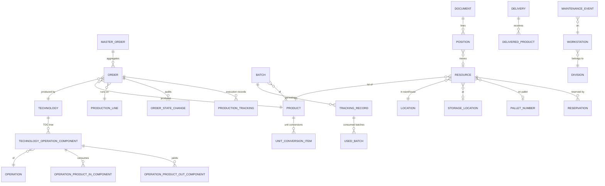

Evidence: order/orderStateChange/schedule models (`mes-plugins/mes-plugins-orders/src/main/resources/orders/model/`), TOC structure (`mes-plugins/mes-plugins-technologies/src/main/java/com/qcadoo/mes/technologies/constants/TechnologyOperationComponentFields.java:34-58` — `OPERATION`, `PARENT`, `CHILDREN`, `OPERATION_PRODUCT_IN_COMPONENTS`, `OPERATION_PRODUCT_OUT_COMPONENTS`), batch/tracking record (`mes-plugins/mes-plugins-advanced-genealogy/.../constants/BatchFields.java:32-58`, `TrackingRecordFields.java:31-49`), resource/document/reservation/storageLocation/palletNumber models (`mes-plugins/mes-plugins-material-flow-resources/src/main/resources/materialFlowResources/model/` — `resource.xml`, `document.xml`, `position.xml`, `reservation.xml`, `storageLocation.xml`, `palletBalance.xml`), product conversions (`mes-plugins/mes-plugins-basic/src/main/resources/basic/model/product.xml:55`), division/factory/subassembly (`mes-plugins/mes-plugins-basic/src/main/resources/basic/model/division.xml`, `factory.xml`). Confidence: High for entities and named relations; Medium for cardinalities (read from model XML `belongsTo`/`hasMany` but not exhaustively verified per relation).

##### B.4 Business consequences of the design

- **Warehouse truth is lot-level.** Stock is a set of `Resource` rows, each a concrete lot with `batch`, `expirationDate`, `productionDate`, `price`, `storageLocation`, `palletNumber`, `qualityRating`, `blockedForQualityControl`, `reservedQuantity`, `availableQuantity` (`ResourceFields.java:32-90`). All stock movements are `Document`s (Receipt/Internal In/Out/Release/Transfer) whose acceptance consumes/creates resources — physical fidelity is enforceable, but every movement demands a document. Confidence: High.
- **Governed recipes.** Orders must reference a `Technology`; technologies pass a validation battery before acceptance and become immutable/outdated rather than edited in place (§C.2/C.3). This creates real change control on the BOM/routing but no versioned e-signature workflow. Confidence: High.
- **Genealogy is opt-in and parallel to WMS.** Batch/TrackingRecord genealogy (advanced-genealogy plugin) is a separate object model from warehouse `Resource.batch`; consistency between the two is by convention, so traceability quality depends on operating discipline. Confidence: Medium (model separation is High; operational consequence inferred).
- **Extensible-by-plugin monolith.** All 55 plugins deploy into one WAR/one PostgreSQL schema; cross-plugin behaviour is wired via AOP state-listeners (e.g. warehouse documents generated from order state changes in `product-flow-thru-division`). Functional breadth is high, but coupling is at the database and event level. Confidence: High.

#### C. Functional layer

##### C.1 Capability inventory

| Capability | Depth description | Evidence | Confidence |
|---|---|---|---|
| Production order lifecycle | 7-state machine with per-state allowed transitions encoded in enum; state-change audit entity with worker/shift/timestamps; reason-type dictionaries for date corrections & deviations | `orders/states/constants/OrderState.java:31-81`; `orders/model/orderStateChange.xml:36-47`; `orders/model/reasonTypeOfChangingOrderState.xml` | High |
| Master (sales) orders | `MasterOrder` aggregates production orders; own 4-state status | `masterOrders/constants/MasterOrderState.java:30-32` | High |
| Technology (BOM+routing) | Hierarchical TOC tree; each node = operation with input/output product components; per-order copies (`orderTechnologicalProcess`) | `technologies/constants/TechnologyOperationComponentFields.java:34-58`; `orders/model/orderTechnologicalProcess.xml` | High |
| Technology approval governance | 5-state lifecycle (draft/checked/accepted/declined/outdated) + ~20 validation checks executed as state-change listeners (tree set, cycles, units match, in-components present, waste marking, not-used-in-active-order) | `technologies/states/constants/TechnologyState.java:33-66`; `technologies/states/listener/TechnologyValidationService.java:91-707` | High |
| Batch master data & genealogy | `Batch` (number, product, supplier, parent/children tree) + `TrackingRecord` linking produced batch to used batches; producedFrom / usedToProduce tree browsing; genealogy PDF report | `advancedGenealogy/constants/BatchFields.java:32-58`; `TrackingRecordFields.java:31-49`; `tree/AdvancedGenealogyTreeViewListeners.java:71-73`; `print/AdvancedGenealogyPdfService.java` | High |
| Batch blocking / quarantine | Batch state machine TRACKED⇄BLOCKED; warehouse resources carry `blockedForQualityControl` and are filtered out of issue candidate lists | `advancedGenealogy/states/constants/BatchState.java:31-44`; `materialFlowResources/criteriaModifiers/ResourceCriteriaModifiers.java:59,70` | High |
| Warehouse / material flow resources | Lot-level `Resource` with expiry, price, pallet, storage location; documents (5 types, draft→accepted) create/consume resources atomically; repacking, stocktaking with own state machines | `materialFlowResources/constants/DocumentType.java:31-35`; `DocumentState.java:33`; `service/ResourceManagementServiceImpl.java`; `states/constants/RepackingState.java`, `StocktakingState.java` | High |
| FIFO/LIFO/FEFO/LEFO picking | Warehouse-level disposal algorithm enum; outbound resource selection ordered by time or expiration date accordingly | `materialFlowResources/constants/WarehouseAlgorithm.java:26-27`; `service/ResourceManagementServiceImpl.java:1015-1027,1207-1220` | High |
| Stock reservations | Reservations created/updated/deleted from draft document positions ("draft makes reservation"); order-level resource reservations validated at state change | `materialFlowResources/service/ReservationsService.java:81-247`; `productFlowThruDivision/states/OrderStatesListenerServicePFTD.java:129,633` | High |
| Production execution recording | `ProductionTracking` records (5-state machine) capturing quantities, labor & machine time, waste; per-shift reporting (production-per-shift plugin) | `productionCounting/states/constants/ProductionTrackingState.java:31-66`; plugin `mes-plugins-production-per-shift` | High |
| Automatic warehouse postings from execution | Order/production-tracking state listeners create & accept inbound/outbound documents, clear reservations, check material availability | `productFlowThruDivision/states/OrderStatesListenerServicePFTD.java:129-633`; `ProductionTrackingListenerServicePFTD.java` | High |
| Planning & scheduling | Order & production-line schedules with DRAFT/APPROVED/REJECTED states; realization-time calculation (TJ/TPZ time norms); Gantt views (gantt-for-operation / gantt-for-shifts plugins); line changeover norms | `orders/states/constants/ScheduleState.java:8-24`; `productionScheduling/OrderRealizationTimeServiceImpl.java`; plugins `mes-plugins-gantt-for-*`, `mes-plugins-line-changeover-norms` | High |
| Material requirements / coverage | Demand-vs-stock coverage analysis per order and globally (order-supplies, material-requirement-coverage-for-order plugins) | `orderSupplies/OrderSuppliesServiceImpl.java`; `materialRequirementCoverageForOrder/MaterialRequirementCoverageForOrderServiceImpl.java` | High |
| Procurement deliveries | Delivery lifecycle draft→prepared→duringCorrection→approved→accepted→received with declines; min-state-driven ordering (deliveries-min-state, warehouse-minimal-state plugins) | `deliveries/states/constants/DeliveryState.java:31-73` | High |
| Costing | Cost norms for products/operations/materials; order cost calculation; average labor cost per order; production balance | plugins `mes-plugins-cost-calculation`, `mes-plugins-cost-norms-for-*`, `mes-plugins-avg-labor-cost-calc-for-order`; `ResourceFields.PRICE` (`ResourceFields.java:46`) | High |
| Maintenance (CMMS) | Maintenance events (failure/issue) with 7-state lifecycle incl. accept/close/revoke and role-gated actions; planned events; machine parts | `cmmsMachineParts/states/constants/MaintenanceEventState.java:33-86`; `ROLE_EVENTS_*` roles | High |
| Labour & shifts | Staff, shifts, assignment-to-shift with own workflow, wage groups | plugins `mes-plugins-assignment-to-shift`, `mes-plugins-wage-groups`; `basic` staff/shift models | High |
| Quality data (thin) | `qualityRating` + `blockedForQualityControl` on resources; `qualityCard` reference on technology; generic attribute framework (product/resource attribute values, before/after correction) | `ResourceFields.java:84-86`; `technologies/constants/TechnologyFields.java` (qualityCard); `basic/constants/AttributeFields.java`, `materialFlowResources` `resourceAttributeValue.xml` | High (presence), depth assessed in §G |
| Reporting | PDF/XLSX generation services throughout (genealogy report, work plans, production balance, delivery reports, CMMS reports) | `advancedGenealogy/print/TrackingRecordPdfView.java`; plugin `mes-plugins-work-plans`; `cmmsMachineParts/reports/*ReportController.java` | High |
| External integration hooks | `externalNumber`/`externalSynchronized` fields on orders/batches; read-only JSON REST endpoints (operations, technologies, materials, workstations); transactional e-mail (Mandrill/Sendinblue) | `orders/constants/OrderFields.java:48,88`; `technologies/controller/TechnologyApiController.java:40-72`; `emailNotifications/.../MandrillServiceImpl.java` | High (presence) |
| Archiving | PL/pgSQL archive machinery moving closed orders + connected tables to shadow `arch_*` tables | `mes-application/src/main/resources/schema/mes_db_en.sql:292-648` (`archive`, `archive_connected_orders`, `generate_arch_tables`) | High |

##### C.2 Core state machines

All transition sets below are taken directly from `canChangeTo` implementations in the state enums — **states High, arrows High** (explicitly encoded, not inferred), except where noted.

**Production order lifecycle** (`orders/states/constants/OrderState.java:31-81`):

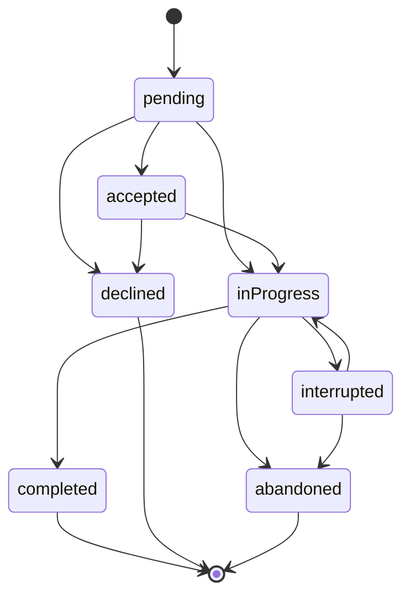

**Technology (recipe/BOM) lifecycle** (`technologies/states/constants/TechnologyState.java:33-66`):

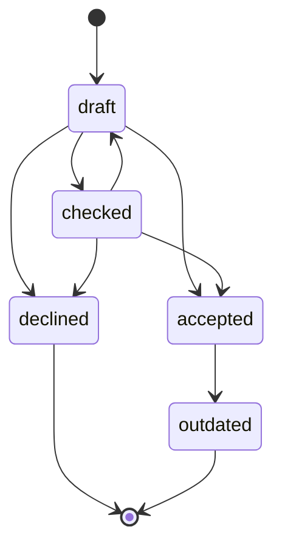

**Batch state (blocking/quarantine)** (`advancedGenealogy/states/constants/BatchState.java:31-44`):

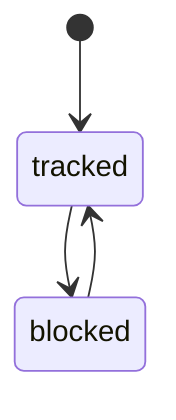

**Genealogy tracking record** (`advancedGenealogy/states/constants/TrackingRecordState.java:31-64`):

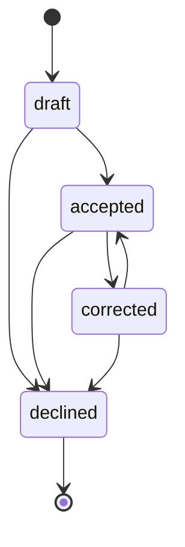

**Production tracking record** (`productionCounting/states/constants/ProductionTrackingState.java:31-66`):

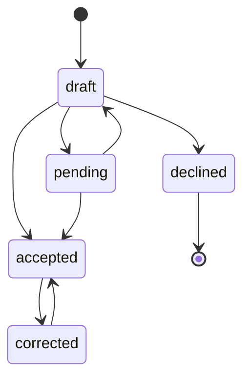

**Warehouse document** (`materialFlowResources/constants/DocumentState.java:33` — two states; acceptance is one-way in `DocumentStateChangeService`):

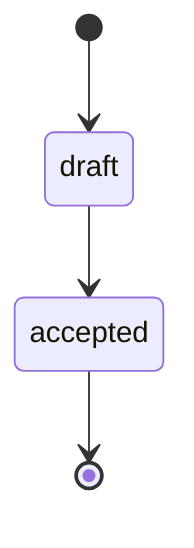

(States High; the irreversibility of `accepted` is Medium — enforced by service logic, not an enum.)

**Delivery lifecycle** (`deliveries/states/constants/DeliveryState.java:31-73`):

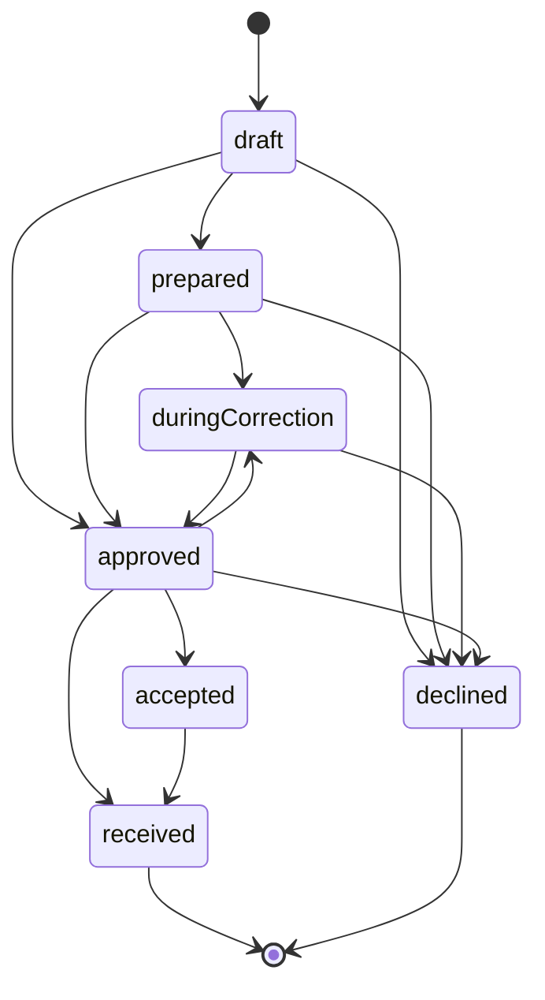

##### C.3 Key business rules / validations / gating

| Rule | Where enforced | Evidence | Confidence |
|---|---|---|---|
| Order cannot be ACCEPTED without dateFrom, dateTo, production line and technology | order state-change listener | `orders/states/OrderStateValidationService.java:44-47` | High |
| Order cannot be COMPLETED with doneQuantity = 0 (or missing dates/doneQuantity) | order state-change listener | `OrderStateValidationService.java:54-63` | High |
| Order date range must be consistent (dateTo after dateFrom) at state change | `OrderStateService.checkOrderDates` | `orders/states/OrderStateService.java:47-59` | High |
| Illegal state jumps rejected (e.g. completed → anything) | `canChangeTo` per state enum | `OrderState.java:54-81` | High |
| Technology acceptance gated by ~20 structural checks: tree present, root produces technology product, every operation has in-components, no cycles, units match, waste flags correct, sub-operation products used, not used in active order | technology state-change listeners (AOP aspect `TechnologyValidationAspect`) | `technologies/states/listener/TechnologyValidationService.java:91,146,189,232,240,255,296,311,546,618,678,707` | High |
| Material availability & resource reservations checked when order starts; inbound documents auto-accepted; reservations cleared on decline/abandon | order state listeners in product-flow-thru-division | `productFlowThruDivision/states/OrderStatesListenerServicePFTD.java:129,134,580,633` | High |
| Outbound picking honours warehouse disposal algorithm (FIFO by time asc, LIFO desc, FEFO by expiry asc, LEFO desc) | resource selection for document positions | `ResourceManagementServiceImpl.java:1015-1027` | High |
| Resources blocked for quality control are excluded from available-resource lookups | criteria modifiers on resource grids/lookups | `ResourceCriteriaModifiers.java:59,70` | High |
| Draft warehouse documents reserve stock; reservations mutate `availableQuantity` on resources | reservations service | `ReservationsService.java:81-247`; `ResourceFields.java:34-36` | High |
| Batch must be unblocked (TRACKED) before further use; blocking is reversible | batch state machine + listeners | `BatchState.java:31-44`; `advancedGenealogy/states/listener/BatchBasicStateListenerService.java` | High |
| Order numbers / resource numbers / document numbers generated by DB triggers (sequence-per-day patterns) | PL/pgSQL triggers | `mes_db_en.sql:1044` (`generate_and_set_document_number_trigger`), `:1140-1183` (`generate_and_set_resource_number`) | High |

#### D. Technical layer

- **Language/frameworks:** Java 8 (root `pom.xml` targets 1.8; plugin framework `com.qcadoo` 1.5-SNAPSHOT, `qcadoo-super-pom` 0.0.1), Spring (classic XML/annotation, not Spring Boot), AspectJ compile-time weaving for state-change listeners (`*/states/aop/*Aspect.java`), Hibernate-based Qcadoo model API (entities defined in XML `model/*.xml`, accessed as untyped `Entity`), PostgreSQL with heavy PL/pgSQL (90 functions in `mes_db_en.sql`), Tomcat WAR deployment (`mes-application`, `-Ptomcat` profile). UI: server-defined Qcadoo views (XML) + jqGrid/JavaScript + JSP dashboards. Confidence: High.
- **Architecture:** monolithic WAR composed of 55 OSGi-like Qcadoo plugins; each plugin ships `qcadoo-plugin.xml` (models, views, menus, roles), model XML, hooks (model lifecycle), listeners (view events), and state-change services registered through a shared `mes-plugins-states` framework (`StateEnum`, `StateChangeContext`, describers, AOP aspects). Cross-plugin extension via plugin dependency + AOP (e.g. `product-flow-thru-division` decorating order states). Confidence: High.
- **Persistence:** single PostgreSQL schema; full DDL shipped as 8 locale/product-variant SQL dumps (~2.4 MB each, `mes-application/src/main/resources/schema/`); DB triggers generate business numbers; archiving to `arch_*` shadow tables in PL/pgSQL (`mes_db_en.sql:292-648`). Locale-specific dumps mean shipped dictionary data is baked per language. Confidence: High.
- **Extensibility model:** new behaviour = new plugin; field additions via `model.xml` extensions + `f_add_col` PL/pgSQL helpers (`mes_db_en.sql:755-943`); UI via view XML + criteria modifiers; feature toggles via plugin presence checks (e.g. `PluginUtils.isEnabled("ziepiwowarski")` in `OrderStateValidationService.java:60` — a customer-specific toggle left in core code). Confidence: High.
- **Test signals:** 210 `*Test.java` files under `mes-plugins/*/src/test` (unit tests, Mockito-style), no integration/e2e suite or CI pipeline definition found in the repo (searched for `.github/workflows`, `Jenkinsfile`, `.travis.yml` — none present). Confidence: High.
- **Commit activity:** history spans 2012→2026 (upstream qcadoo history retained): 2,407 commits in 2012 declining to 340 (2025) and 154 (2026 YTD incl. fork rebranding merges). Active but decelerating maintenance. Confidence: High (git log by year).

#### E. Non-functional snapshot

- **Security:** Spring Security with 3-tier hierarchy + 151 granular roles bound to menu items/views and specific state-change buttons (e.g. `ROLE_DELIVERIES_STATES_ACCEPT`, `ROLE_EVENTS_ACCEPT`) — genuinely fine-grained RBAC (`security.properties:25`; plugin descriptors). No SSO/OAuth/LDAP configuration found in the repo. Confidence: High for what exists; Medium for absence of SSO (config could live outside repo).
- **Auditability:** every governed entity has a companion `*StateChange` entity storing target state, `dateAndTime`, `worker`, `shift` and phase (`orders/model/orderStateChange.xml:36-47`; equivalents for technology, batch, tracking record, document, delivery, schedule). Resource corrections keep before/after attribute values (`resourceAttributeValueBeforeCorrection.xml` / `...AfterCorrection.xml`). No electronic-signature (21 CFR Part 11-style) mechanism found (searched "signature", "esign"). Confidence: High.
- **Scalability:** single-schema monolith; heavy PL/pgSQL and DB triggers concentrate load in PostgreSQL; archiving machinery exists specifically to keep operational tables small (`mes_db_en.sql:292` `archive(_rows)`), which signals known data-volume pressure. Horizontal scaling limited to Tomcat replicas against one DB. Confidence: Medium (inferred from architecture).
- **Technical health / age:** Java 8 + Spring XML era stack (framework 1.5-SNAPSHOT dependency resolved from `nexus.qcadoo.org`), untyped `Entity` data access, 245k LOC of SQL dumps as schema management, customer-name feature toggles in core logic — a mature, feature-rich but ageing codebase with meaningful upgrade risk (snapshot dependency on a third-party Nexus). Confidence: High.

#### F. Evidence index

| # | File path (repo-relative) | Lines | Proves | Confidence |
|---|---|---|---|---|
| 1 | `pom.xml` | 14-15, 44-46 | Fork of qcadoo/mes, version 1.5-SNAPSHOT, buildVersionForUser 3.1.16, qcadoo framework deps | High |
| 2 | `mes-plugins/mes-plugins-orders/src/main/java/com/qcadoo/mes/orders/states/constants/OrderState.java` | 31-81 | 7 order states + explicit allowed transitions | High |
| 3 | `mes-plugins/mes-plugins-orders/src/main/java/com/qcadoo/mes/orders/states/OrderStateValidationService.java` | 44-63 | Required fields per target state; doneQuantity>0 gate on complete | High |
| 4 | `mes-plugins/mes-plugins-orders/src/main/java/com/qcadoo/mes/orders/states/OrderStateService.java` | 47-59 | Order date-range validation at state change | High |
| 5 | `mes-plugins/mes-plugins-orders/src/main/java/com/qcadoo/mes/orders/constants/OrderFields.java` | 48, 88 | `externalNumber` / `externalSynchronized` ERP hooks on orders | High |
| 6 | `mes-plugins/mes-plugins-orders/src/main/resources/orders/model/orderStateChange.xml` | 36-47 | State-change audit: dateAndTime, worker, shift | High |
| 7 | `mes-plugins/mes-plugins-orders/src/main/java/com/qcadoo/mes/orders/states/constants/ScheduleState.java` | 8-24 | Schedule DRAFT/APPROVED/REJECTED states + transitions | High |
| 8 | `mes-plugins/mes-plugins-technologies/src/main/java/com/qcadoo/mes/technologies/states/constants/TechnologyState.java` | 33-66 | 5 technology states + transitions incl. checked→draft | High |
| 9 | `mes-plugins/mes-plugins-technologies/src/main/java/com/qcadoo/mes/technologies/states/listener/TechnologyValidationService.java` | 91, 146, 189, 232, 240, 255, 296, 311, 546, 618, 678, 707 | Acceptance gating checks (quantities, waste, in-components, active-order lock, cycles, units, tree set) | High |
| 10 | `mes-plugins/mes-plugins-technologies/src/main/java/com/qcadoo/mes/technologies/constants/TechnologyOperationComponentFields.java` | 34-58 | TOC tree structure (operation, parent, children, in/out product components) | High |
| 11 | `mes-plugins/mes-plugins-technologies/src/main/java/com/qcadoo/mes/technologies/controller/TechnologyApiController.java` | 40-72 | Read-only JSON REST endpoints (operations, technologies, materials, workstations) | High |
| 12 | `mes-plugins/mes-plugins-advanced-genealogy/src/main/java/com/qcadoo/mes/advancedGenealogy/states/constants/BatchState.java` | 31-44 | Batch TRACKED⇄BLOCKED state machine | High |
| 13 | `mes-plugins/mes-plugins-advanced-genealogy/src/main/java/com/qcadoo/mes/advancedGenealogy/states/constants/TrackingRecordState.java` | 31-64 | Tracking record draft/accepted/declined/corrected states + transitions | High |
| 14 | `mes-plugins/mes-plugins-advanced-genealogy/src/main/java/com/qcadoo/mes/advancedGenealogy/constants/BatchFields.java` | 32-58 | Batch master data: number, product, supplier, tracking records, parent/children, externalNumber | High |
| 15 | `mes-plugins/mes-plugins-advanced-genealogy/src/main/java/com/qcadoo/mes/advancedGenealogy/constants/TrackingRecordFields.java` | 31-49 | Genealogy link: producedBatch, usedBatchesSimple, genealogyTree | High |
| 16 | `mes-plugins/mes-plugins-advanced-genealogy/src/main/java/com/qcadoo/mes/advancedGenealogy/tree/AdvancedGenealogyTreeViewListeners.java` | 71-73 | producedFrom / usedToProduce genealogy tree directions | High |
| 17 | `mes-plugins/mes-plugins-material-flow-resources/src/main/java/com/qcadoo/mes/materialFlowResources/constants/ResourceFields.java` | 32-90 | Resource lot model: batch, expiry, price, pallet, storage location, qualityRating, blockedForQualityControl, reservations | High |
| 18 | `mes-plugins/mes-plugins-material-flow-resources/src/main/java/com/qcadoo/mes/materialFlowResources/constants/WarehouseAlgorithm.java` | 26-27 | FIFO/LIFO/FEFO/LEFO disposal enum | High |
| 19 | `mes-plugins/mes-plugins-material-flow-resources/src/main/java/com/qcadoo/mes/materialFlowResources/service/ResourceManagementServiceImpl.java` | 1015-1027, 1207-1220 | Picking order by time/expiry per algorithm | High |
| 20 | `mes-plugins/mes-plugins-material-flow-resources/src/main/java/com/qcadoo/mes/materialFlowResources/constants/DocumentType.java` | 31-35 | 5 document types (receipt, internal in/out, release, transfer) | High |
| 21 | `mes-plugins/mes-plugins-material-flow-resources/src/main/java/com/qcadoo/mes/materialFlowResources/constants/DocumentState.java` | 33 | Document draft/accepted states | High |
| 22 | `mes-plugins/mes-plugins-material-flow-resources/src/main/java/com/qcadoo/mes/materialFlowResources/service/ReservationsService.java` | 81-247 | Reservations created/updated/deleted from draft document positions | High |
| 23 | `mes-plugins/mes-plugins-material-flow-resources/src/main/java/com/qcadoo/mes/materialFlowResources/criteriaModifiers/ResourceCriteriaModifiers.java` | 59, 70 | QC-blocked resources excluded from lookups | High |
| 24 | `mes-plugins/mes-plugins-material-flow-resources/src/main/resources/materialFlowResources/model/storageLocation.xml` | 37-54 | Storage location pallet capacity / place / high-storage flags | High |
| 25 | `mes-plugins/mes-plugins-production-counting/src/main/java/com/qcadoo/mes/productionCounting/states/constants/ProductionTrackingState.java` | 31-66 | Production tracking 5-state machine | High |
| 26 | `mes-plugins/mes-plugins-product-flow-thru-division/src/main/java/com/qcadoo/mes/productFlowThruDivision/states/OrderStatesListenerServicePFTD.java` | 86, 129, 134, 580, 633 | Order-state-driven document creation, reservation clearing, material availability check | High |
| 27 | `mes-plugins/mes-plugins-deliveries/src/main/java/com/qcadoo/mes/deliveries/states/constants/DeliveryState.java` | 31-73 | Delivery 7-state lifecycle + transitions | High |
| 28 | `mes-plugins/mes-plugins-master-orders/src/main/java/com/qcadoo/mes/masterOrders/constants/MasterOrderState.java` | 30-32 | Master order NEW/IN_EXECUTION/COMPLETED/DECLINED | High |
| 29 | `mes-plugins/mes-plugins-cmms-machine-parts/src/main/java/com/qcadoo/mes/cmmsMachineParts/states/constants/MaintenanceEventState.java` | 33-86 | Maintenance event 7-state lifecycle | High |
| 30 | `mes-application/src/main/resources/security.properties` | 25 | Role hierarchy SUPERADMIN > ADMIN > USER | High |
| 31 | `mes-plugins/mes-plugins-basic/src/main/resources/qcadoo-plugin.xml` | 79-84 | Sample granular roles (ROLE_PRODUCTS, ROLE_COMPANY_STRUCTURE, …) | High |
| 32 | `mes-application/src/main/resources/schema/mes_db_en.sql` | 227, 292-648, 1044, 1140-1183 | Role/menu SQL helpers, archive machinery, number-generation triggers (90 PL/pgSQL functions total) | High |
| 33 | `mes-plugins/mes-plugins-basic/src/main/resources/basic/model/product.xml` | 55 | Unit conversion items per product | High |
| 34 | `mes-plugins/mes-plugins-orders/src/main/resources/orders/locales/` | (dir) | Shipped locales: en, pl, fr, de, cn | High |

#### G. Capability ratings (for parent merge)

| Capability | Rating | Justification |
|---|---|---|
| Production order lifecycle & state machine | **Rich** | 7 states with encoded transitions, audit entities, reason dictionaries, correction flows (`OrderState.java:31-81`) |
| Execution gating / hard stops | **Adequate** | State-change validation blocks accept/complete on missing data and checks material availability, but gates are field/stock-level, not spec/QC-result-level (`OrderStateValidationService.java:44-63`; `OrderStatesListenerServicePFTD.java:580`) |
| Shop-floor execution UI | **Adequate** | Kanban dashboard with role-gated order actions, operational tasks, production tracking terminals in web UI (`ROLE_DASHBOARD_KANBAN*` roles; `orders/model/operationalTask.xml`); no dedicated ruggedised terminal app |
| BOM/recipe/routing definition | **Rich** | Hierarchical TOC tree with per-operation input/output products, time norms, per-order copies (`TechnologyOperationComponentFields.java:34-58`) |
| Recipe lifecycle governance/approval | **Rich** | 5-state lifecycle + ~20 structural acceptance validators incl. active-order lock and cycle detection (`TechnologyState.java:33-66`; `TechnologyValidationService.java:91-707`) |
| ISA-88 batch recipes | **Absent** | Searched `ISA-88`, `isa88`, `phase recipe` across Java/XML — no hits; technologies are discrete-manufacturing routings, not procedural batch recipes |
| Batch/lot master data | **Rich** | Dedicated Batch entity (number uniqueness policies, supplier, attachments) + lot-level warehouse resources (`BatchFields.java:32-58`; `ResourceFields.java:48`) |
| Batch genealogy/traceability (system-of-record) | **Rich** | TrackingRecord produced-batch ↔ used-batches model, bidirectional tree browsing, PDF genealogy report (`TrackingRecordFields.java:31-49`; `AdvancedGenealogyTreeViewListeners.java:71-73`) |
| Batch blocking/quarantine | **Adequate** | Reversible TRACKED⇄BLOCKED batch state + QC-blocked resources excluded from picking; no disposition workflow (release/reject/rework reasons) (`BatchState.java:31-44`; `ResourceCriteriaModifiers.java:59,70`) |
| Quality inspection engine | **Basic** | `qualityRating`/`blockedForQualityControl` on resources and `qualityCard` on technology exist, but searched `inspection` across Java — no inspection plan/lot/result engine (`ResourceFields.java:84-86`) |
| Certificates of analysis | **Absent** | Searched `certificate` (case-insensitive) across Java — no hits |
| Parametric/spec-based QC | **Basic** | Generic attribute framework (typed attribute values on products/resources, before/after correction history) but no spec limits or pass/fail evaluation (`basic/constants/AttributeFields.java`; `resourceAttributeValue.xml`) |
| Warehouse structure (locations/pallets) | **Rich** | Locations, storage locations with capacity/high-bay flags, pallet numbers, pallet balances, load units (`storageLocation.xml:37-54`; `palletBalance.xml`; `LoadUnitsTransferService.java`) |
| FEFO/FIFO picking | **Rich** | Four algorithms (FIFO/LIFO/FEFO/LEFO) per warehouse, applied in resource selection incl. stocktaking (`WarehouseAlgorithm.java:26-27`; `ResourceManagementServiceImpl.java:1015-1027`) |
| Stock reservations | **Rich** | Draft-document reservations mutating available quantity, order-level resource reservations with validation listeners (`ReservationsService.java:81-247`; `OrderStatesListenerServicePFTD.java:633`) |
| Inventory valuation/costing | **Adequate** | Price per resource lot, cost norms (product/operation/material), order cost calculation and production balance; no ledger/accounting integration (`ResourceFields.java:46`; plugins `mes-plugins-cost-*`) |
| Production planning / MRP | **Adequate** | Stock-vs-demand coverage per order and globally, min-state-driven delivery proposals; no full MRP netting/pegging engine (`orderSupplies/OrderSuppliesServiceImpl.java`; plugin `mes-plugins-warehouse-minimal-state`) |
| Finite capacity scheduling | **Adequate** | Production-line schedules with states, realization-time calculation from TJ/TPZ norms, changeover norms, Gantt views; no constraint-based optimiser (`ScheduleState.java:8-24`; `OrderRealizationTimeServiceImpl.java`) |
| Master data (items/products, work centres, partners) | **Rich** | basic plugin: products/families, companies, staff, shifts, workstations, divisions, factories, subassemblies (`basic/model/` — `division.xml`, `factory.xml`, `subassembly.xml`) |
| Units of measure & conversions | **Adequate** | Per-product unit conversion items + additional-unit quantity on resources (`product.xml:55`; `ResourceFields.java:62-64`) |
| Hazmat/regulatory data | **Absent** | Searched `hazard`, `ADR`, `dangerous` in `basic/constants/ProductFields.java` and plugin models — no hits |
| SCADA/OPC-UA or device integration | **Absent** | Searched `opc`, `scada`, `mqtt`, `modbus` (case-insensitive) across Java — no device-protocol integration (only incidental substring matches in unrelated identifiers) |
| External system integration (API/ERP/WMS) | **Basic** | `externalNumber`/`externalSynchronized` ERP-sync fields and a handful of read-only JSON endpoints; no ESB/queue/webhook framework (`OrderFields.java:48,88`; `TechnologyApiController.java:40-72`) |
| Reporting/analytics | **Adequate** | Extensive operational PDF/XLSX reports (genealogy, work plans, production balance, CMMS, deliveries); no BI/analytics layer (`AdvancedGenealogyPdfService.java`; `mes-plugins-work-plans`) |
| Labour/time tracking | **Adequate** | Staff/shift assignment workflow, wage groups, labor time captured on production tracking (plugins `mes-plugins-assignment-to-shift`, `mes-plugins-wage-groups`, `mes-plugins-avg-labor-cost-calc-for-order`) |
| Maintenance management | **Rich** | CMMS: failure/issue events with 7-state role-gated lifecycle, planned events, machine parts, sourcing costs, reports (`MaintenanceEventState.java:33-86`; `cmmsMachineParts/reports/`) |
| Audit trail / e-signatures | **Adequate** | Per-entity `*StateChange` audit rows (worker/shift/timestamp) and resource correction history; no e-signature/Part-11 mechanism (searched `signature`) (`orderStateChange.xml:36-47`) |
| Multi-plant support | **Basic** | Factory/division/company-structure entities exist, but one schema, one deployment, no plant-scoped security partitioning found (`basic/model/factory.xml`, `division.xml`) |
| Localisation / i18n | **Rich** | Full locale property files in en/pl/fr/de/cn per plugin + per-language DB dumps (`orders/locales/`; `mes-application/src/main/resources/schema/`) |
| Role-based access control | **Rich** | 151 granular roles incl. per-state-transition roles, hierarchy, role-bound menu/view wiring (`security.properties:25`; plugin descriptors; `mes_db_en.sql:227`) |

---

### 3.2 Application Dossier: ERPNext (Chem_erpnext) — Plant C

#### A. Identification

| Attribute | Value |
|---|---|
| Repository | `SachetCognition/Chem_erpnext` |
| Branch / ref | `develop` |
| Commit SHA | `31e7970764e697f55cf1be70566b408bd47005d9` (2026-07-28) |
| Analysis date | 2026-07-28 |
| Framework app | ERPNext (Frappe app `erpnext`, "Open Source ERP", `pyproject.toml`) |
| Modules | 21 modules declared in `erpnext/modules.txt` (Accounts, CRM, Buying, Projects, Selling, Setup, Manufacturing, Stock, Support, Utilities, Assets, Portal, Maintenance, Regional, ERPNext Integrations, Quality Management, Communication, Telephony, Bulk Transaction, Subcontracting, EDI) |
| Size | Python: 2,891 files / ~383k lines; JavaScript: 643 files / ~81k lines; JSON (DocType schemas etc.): 1,167 files / ~341k lines; TypeScript: 40 files / ~3k lines; HTML: 116 files / ~8.7k lines; translations: 36 `.po` files / ~2.34M lines |
| History | 60,397 commits (full upstream ERPNext history retained); latest commit dated 2026-07-28 |

DocType counts by relevant module (directory count of `*/doctype/*`): Manufacturing 49, Stock 80, Quality Management 17, Subcontracting 14, Accounts 192, Selling 21, Buying 20, Maintenance 6.

Scope note: only manufacturing-execution-relevant modules (`erpnext/manufacturing`, `erpnext/stock`, `erpnext/quality_management`, `erpnext/controllers`) are analysed in depth; finance (Accounts/Assets), Buying and Selling are summarised at the boundary only.

#### B. Business layer

##### Purpose
ERPNext is a full-suite ERP on the Frappe framework; in the Plant C deployment it serves as the plant ERP for manufacturing, quality and stock. Manufacturing execution is document-driven: a **Work Order** (from a **Production Plan** or **Sales Order**) explodes a **BOM**, spawns **Job Cards** per operation, and material movements are booked as **Stock Entries** whose immutable **Stock Ledger Entries** simultaneously drive inventory valuation and (via perpetual inventory) the general ledger (`erpnext/controllers/stock_controller.py`). Confidence: High.

##### Personas / roles (shipped permission model)
Roles are shipped inside each DocType JSON's `permissions` block. Roles found across all DocType schemas include: `Manufacturing Manager`, `Manufacturing User`, `Stock Manager`, `Stock User`, `Item Manager`, `Quality Manager`, `Maintenance Manager/User`, `Purchase Manager/User`, `Sales Manager/User`, `Accounts Manager/User`, `System Manager`, plus portal roles (`Customer`, `Employee`) (scan of `erpnext/*/doctype/*/*.json` `permissions[].role`). Confidence: High.

Manufacturing-relevant assignments:
- **Work Order**: `Manufacturing User` (create/submit/cancel), `Stock User` (read) — `erpnext/manufacturing/doctype/work_order/work_order.json` (permissions block). High.
- **BOM**: `Manufacturing Manager` and `Manufacturing User` — `erpnext/manufacturing/doctype/bom/bom.json`. High.
- **Batch**: `Item Manager` — `erpnext/stock/doctype/batch/batch.json`. High.
- **Quality Inspection**: `Quality Manager` only — `erpnext/stock/doctype/quality_inspection/quality_inspection.json`. High.
- **Stock Ledger Entry**: read-only visibility for `Stock User`, `Accounts Manager` — `erpnext/stock/doctype/stock_ledger_entry/stock_ledger_entry.json`. High.

##### Business object model

~14 core business objects in the manufacturing/stock/quality scope (relationships from Link/Table fields in the DocType schemas; entity set High, cardinalities Medium):

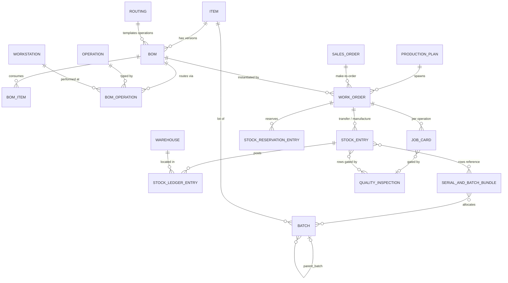

Evidence: `work_order.json` (links `bom_no`, `production_plan`, `sales_order`), `job_card.json` (`work_order`, `quality_inspection`), `batch.py:104-114` (typed fields `item`, `parent_batch`, `expiry_date`), `stock_entry.py`, `serial_and_batch_bundle.py`. Confidence: High.

##### Business consequences of the design
- **Everything is a submittable document** (Frappe `docstatus` 0/1/2). Business state is a combination of docstatus and a derived `status` field recomputed from linked stock entries — statuses are *reflections of postings*, not user-driven workflow gates (`erpnext/manufacturing/doctype/work_order/services/status.py:107-144`). High.
- **The Stock Ledger Entry is the single audit spine**: every material movement, valuation change and (in perpetual inventory) GL effect derives from immutable SLEs; corrections happen via cancel + repost (`erpnext/stock/stock_ledger.py`, `erpnext/stock/doctype/repost_item_valuation/`). High.
- **Batch identity is master data, not a state machine**: a Batch has `disabled` and `expiry_date` but no QA-status field; quarantine must be modelled through warehouses or the (weakly linked) Quality Inspection (`erpnext/stock/doctype/batch/batch.py:97-115`). High.
- **Quality is configurable, not mandatory**: inspection gating strength is a setting (`Stop` vs warn) in Stock Settings (`erpnext/stock/services/quality_inspection_service.py:858-889` via job card; see C). High.

#### C. Functional layer

##### Capability inventory

| Capability | Depth description | Evidence | Confidence |
|---|---|---|---|
| Production order lifecycle | Work Order with 10 shipped statuses, derived from stock entries, reservations and operation states; stop/close/cancel controls | `work_order.json:124`; `services/status.py:107-191`; `work_order.py:1122-1133` | High |
| Operation execution (Job Cards) | Per-operation Job Card with time logs, pause/resume, employee assignment, process loss, semi-finished-good tracking | `job_card.py:1280-1336` (status), `1371-1397` (pause/resume) | High |
| BOM / recipe & routing | Versioned BOMs (`BOM/<item>/<n>`) with items, operations, scrap, costing; Routing templates; BOM Creator; mass cost update via BOM Update Tool | `bom.py:429-440`, `bom.py:620-637`; `manufacturing/doctype/routing/`, `bom_update_tool/` | High |
| Batch/lot master data | Batch DocType with expiry auto-derivation from item shelf life, `parent_batch`, per-batch valuation flag, naming series | `batch.py:117-143, 179-220`; `batch.py:107` (`parent_batch`) | High |
| Batch selection FEFO/FIFO/LIFO | Global `Pick Serial / Batch Based On` = FIFO/LIFO/Expiry; expiry-ordered auto-allocation in Serial and Batch Bundle | `stock_settings.json:363-370`; `serial_and_batch_bundle.py:3032-3033, 3286-3289` | High |
| Expired batch hard stop | SLE submission throws on consuming expired batch; Pick List blocks picking expired batches | `stock_ledger_entry.py:287-299`; `pick_list.py:286-311` | High |
| Quality inspection engine | Quality Inspection (Incoming/Outgoing/In Process) with per-reading numeric min/max, value match or `safe_eval` acceptance formula; templates per item | `quality_inspection.py:265-336`; `quality_inspection.json:74, 237` | High |
| QI gating of transactions | `QualityInspectionService` blocks submit of PR/PI/DN/SI/Stock Entry rows lacking a submitted, non-rejected QI; severity configurable (Stop vs warn) | `stock/services/quality_inspection_service.py:21-127` | High |
| QI gating of operations | Job Card submit requires QI when BOM + operation flag it; rejected/unsubmitted QI throws or warns per Stock Settings | `job_card.py:843-889` | High |
| Stock reservations | Stock Reservation Entry (8 statuses) against Sales Order/Work Order/Production Plan, incl. serial/batch-level reservation; auto-reserve on WO | `stock_reservation_entry.json:175`; `stock_reservation_entry.py:530-553`; `work_order/services/reservation.py` | High |
| Inventory valuation | FIFO / Moving Average / LIFO / Standard Cost per item; batchwise valuation; repost engine for retroactive corrections | `item.json:387-390`; `stock_ledger.py:1726-1729`; `repost_item_valuation/` | High |
| Planning / MRP | Production Plan (from Sales Orders/Material Requests/forecast) with sub-assembly explosion and material request generation; Master Production Schedule; Sales Forecast; MRP report | `production_plan.py`; `production_plan/services/material_request.py:141`; `manufacturing/doctype/master_production_schedule/` | High |
| Capacity planning | Optional capacity planning: job-card slot search over workstation `production_capacity`; throws `CapacityError` when no slot within plan window | `work_order/services/operations.py:105-130`; `workstation.json` (`production_capacity`) | High |
| Shop-floor UI | Shop Floor and Visual Plant Floor desk pages; Plant Floor DocType; workstation live status (Production/Off/Idle/Problem/Maintenance/Setup) | `manufacturing/page/shop_floor/`, `page/visual_plant_floor/`; `workstation.json:146` | High |
| Warehouse structure | Warehouse as NestedSet tree (group/leaf) per company; warehouse types; Putaway Rules; custom Inventory Dimensions | `warehouse.py:21-53`; `stock/doctype/putaway_rule/`, `inventory_dimension/` | High |
| Traceability reporting | Serial No & Batch Traceability report; batch-wise balance; stock ledger reports | `stock/report/serial_no_and_batch_traceability/` | High |
| Subcontracting | Dedicated Subcontracting module (orders, receipts, inward orders) integrated into Work Order validation | `erpnext/subcontracting/doctype/` (14 doctypes); `work_order.py:364-457` | High |
| Costing hooks | Work Order carries planned/actual operating cost; Stock Entry `Manufacture` computes FG valuation incl. operation cost; perpetual inventory posts GL from SLE | `work_order.py:110-119` (cost fields); `stock_controller.py` | High |
| Boundary: finance/selling/buying | Full Accounts (192 doctypes), Selling, Buying modules exist in-repo; manufacturing touches them via Sales Order qty checks and GL postings only | `modules.txt`; `services/status.py:29-47` | High |

##### Core state machines

###### Work Order lifecycle (states High — shipped enum; arrows Medium — inferred from `StatusService.get_status` logic)

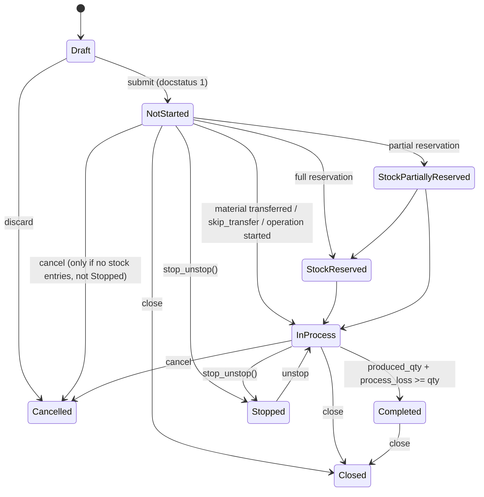

Evidence: status enum `\nDraft\nSubmitted\nNot Started\nIn Process\nStock Reserved\nStock Partially Reserved\nCompleted\nStopped\nClosed\nCancelled` at `work_order.json:124` (High). Transition logic: `services/status.py:107-144` (derivation from stock entries), `:182-191` (reservation states), `work_order.py:844-846` (Stopped blocks cancel), `work_order.py:1122-1133` (`stop_unstop`; Closed cannot be stopped/reopened) (arrows Medium — computed, not an explicit transition table). Note: `Submitted` exists in the enum but `get_status` immediately resolves a submitted document to Not Started/In Process/etc.

###### Job Card lifecycle (states High — shipped enum; arrows Medium)

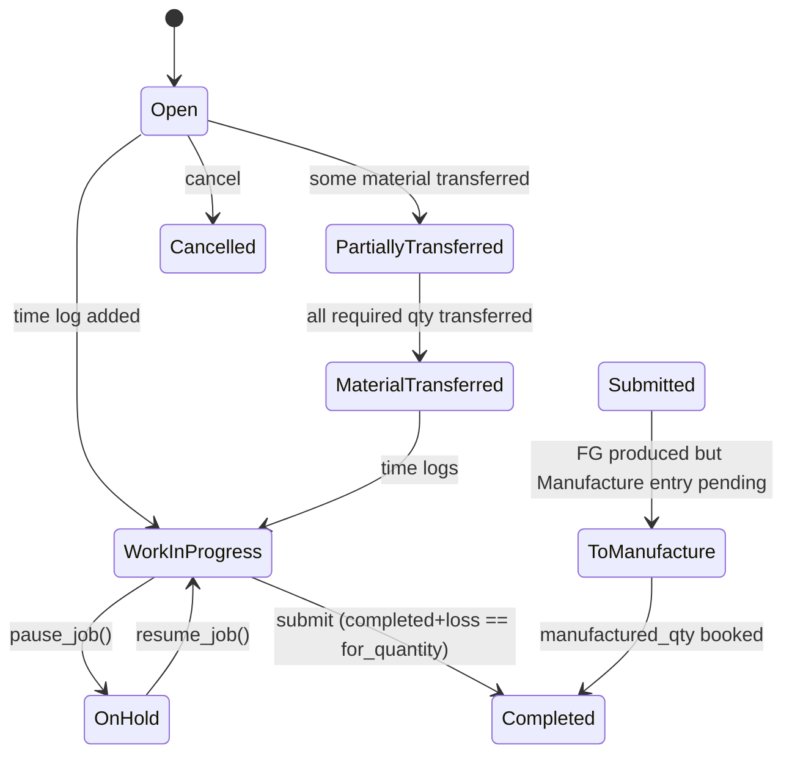

Evidence: enum `Open / Work In Progress / Partially Transferred / Material Transferred / On Hold / Submitted / To Manufacture / Cancelled / Completed` at `job_card.json:274` (High); `set_status`/`set_finished_good_status`/`set_non_semi_fg_status` at `job_card.py:1280-1336`, pause/resume at `job_card.py:1371-1397` (arrows Medium).

###### BOM / recipe lifecycle (states High for flags; arrows Medium)

BOM has no status enum; governance is `docstatus` + `is_active`/`is_default` flags:

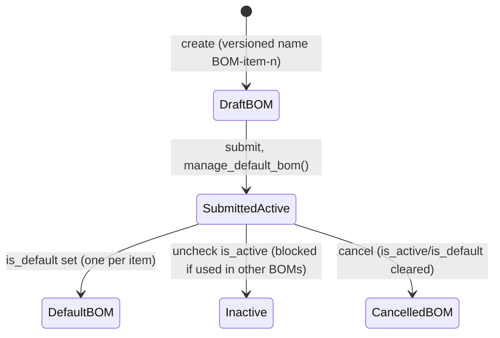

Evidence: `bom.py:429-440` (`on_submit`/`on_cancel`), `bom.py:620-637` (`manage_default_bom`), `bom.py:892-913` (`validate_bom_links` blocks deactivation while referenced). There is **no approval workflow, no effectivity dates, no revision states** beyond submit/cancel (searched `bom.py` and `bom.json` for `approve`, `workflow`, `valid_from` — none found). Confidence: High.

###### Batch & Quality Inspection states

Batch has **no lifecycle status field** — only `disabled` (checkbox) and `expiry_date` (`batch.py:97-115`, High). Quality Inspection status enum is `Accepted / Rejected / Cancelled` (`quality_inspection.json:237`, High); it is set automatically from readings (`quality_inspection.py:265-281`) unless `manual_inspection` is set.

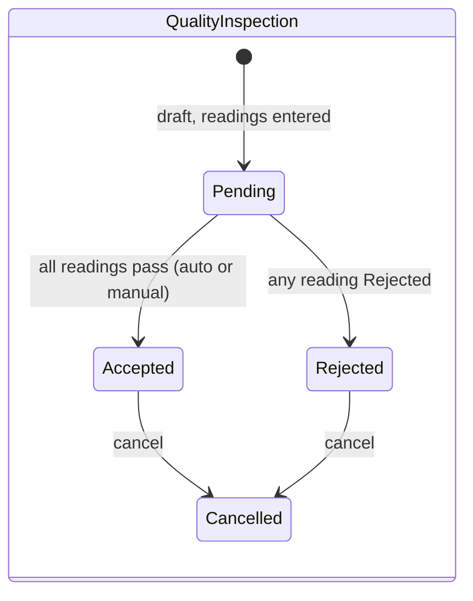

(States High; arrows Medium — derived from `inspect_and_set_status`.)

##### Key business rules / validations / gating

| Rule | Behaviour | Evidence | Confidence |
|---|---|---|---|
| Over-production cap vs Sales Order | WO submission throws `OverProductionError` beyond SO qty + allowance % | `services/status.py:29-47` | High |
| Over-production cap vs Work Order | Manufactured/transferred qty above plan+allowance throws `StockOverProductionError` | `services/status.py:208-224` | High |
| Stopped WO freezes execution | Job Card submit against a Stopped Work Order throws | `job_card.py:904-910` | High |
| Closed WO is terminal | Closed WO cannot be stopped or re-opened | `work_order.py:1131-1132` | High |
| Completed WO protects postings | Cancelling Material Consumption stock entry against Completed WO throws | `stock_entry.py:422-425` | High |
| Cancel guard | WO with submitted Stock Entries cannot be cancelled | `work_order.py:848-860` | High |
| Job Card completeness | Submit requires time logs, not-on-hold, and completed+loss+pending == for_quantity | `job_card.py:912-959` | High |
| Material transfer gate | Job Card without FG cannot submit until materials transferred to WIP | `job_card.py:891-902` | High |
| QI gate (documents) | Rows flagged inspection-required must carry a submitted, non-Rejected QI at submit; severity `Stop`/warn from Stock Settings | `quality_inspection_service.py:71-127` | High |
| QI gate (operations) | BOM `inspection_required` + operation `quality_inspection_required` gates Job Card submit | `job_card.py:843-889` | High |
| Expired batch consumption | SLE against a batch past `expiry_date` throws "Batch … has expired" (outward directions) | `stock_ledger_entry.py:287-299` | High |
| Expired batch picking | Pick List save throws listing expired batches | `pick_list.py:286-311` | High |
| Batch expiry mandatory | Items with `has_expiry_date` must yield an expiry date (shelf-life derivation or manual) or save throws | `batch.py:194-220` | High |
| Operation sequencing | Work Order operation `sequence_id`s must be contiguous | `work_order.py:340-362` | High |
| Capacity window | With capacity planning on, unschedulable operations throw `CapacityError` | `services/operations.py:118-130` | High |
| Negative stock control | `NegativeStockError` unless allowed in settings (also per-batch flag `allow_negative_stock_for_batch`) | `stock_ledger.py:50-51`; `batch.py:97` | High |
| Company isolation | `Company Restriction` doctype validates every transaction's company against allowed companies (global `doc_events` hook) | `hooks.py:368-384` | High |
| Cross-doc status roll-up | Generic `StatusUpdater` maps child-row fulfilment percentages to parent statuses via declarative `status_map` | `controllers/status_updater.py:16-60` | High |

#### D. Technical layer

- **Language/framework**: Python ≥3.14 (`pyproject.toml` `requires-python`), Frappe framework `>=17.0.0-dev,<18.0.0` (`[tool.bench.frappe-dependencies]`), flit build backend, ruff lint (line length 110, target py310). Frontend: server-rendered Frappe Desk + per-DocType JS controllers; some TypeScript (banking bundle). Databases: MariaDB or PostgreSQL via Frappe ORM; Redis for queues/cache (Frappe standard). High.
- **Architecture**: monolithic Frappe app; each DocType = JSON schema + Python controller class + JS form controller in one directory. Shared transaction behaviour in `erpnext/controllers/` (`StockController`, `StatusUpdater`, `AccountsController`). Recent refactors extract service objects (e.g. `work_order/services/{status,operations,required_items,reservation}.py`, `stock/services/quality_inspection_service.py`) wrapped by thin delegating stubs (`work_order.py:1034-1071`). High.
- **Persistence model**: one table per DocType (`tab<DocType>`), child tables as separate DocTypes; document lifecycle via `docstatus` (0 draft / 1 submitted / 2 cancelled); immutable ledgers (Stock Ledger Entry, GL Entry) with cancel-and-repost correction (`repost_item_valuation`); `Bin` as per item/warehouse stock cache. High.
- **Extensibility**: Frappe hooks registry (`erpnext/hooks.py`: `doc_events`, `scheduler_events`, whitelisted overrides); Custom Fields/Property Setters at site level; `patches.txt` sequential migration registry; regional override injection (`erpnext/regional`). High.
- **Test coverage signals**: 515 `test_*.py` files across the app, including manufacturing (`test_work_order.py` ~2,400+ lines) and stock; report smoke tests (`*/report/test_reports.py`). CI: GitHub Actions with `server-tests-mariadb.yml`, `server-tests-postgres.yml`, `linters.yml`, `semantic-commits.yml` (`.github/workflows/`). High.
- **Maintenance activity**: 60,397 commits; sustained upstream activity (~300–1,300 commits/month through 2026-07); local fork delta is minimal (2 commits: a rebrand merge, PR #1). High.

#### E. Non-functional snapshot

- **Security model**: Frappe RBAC — per-DocType, per-role permission matrices shipped in DocType JSON (read/write/create/submit/cancel/amend), user-permission row-level restriction, plus company-level isolation via `Company Restriction` validation on every transaction (`hooks.py:368-384`). Server endpoints guarded by `@frappe.whitelist()` and explicit `frappe.has_permission` checks (e.g. `work_order.py:1122-1127`, `job_card.py:1372-1373`). High.
- **Auditability**: `track_changes: 1` on key DocTypes (Work Order, BOM, Batch) produces field-level version history; immutable SLE/GLE ledgers; submit/cancel/amend discipline preserves document history. **No electronic-signature capability found** (searched `e-sign`, `electronic signature` across `erpnext/` — only unrelated HR/CRM matches). High.
- **Scalability signals**: background-queue reposting of valuation (`repost_item_valuation.run_parallel_reposting`, 15-min cron, `hooks.py:468-472`); `Bin` caching; bulk transaction processing module. Single-process framework scaling is delegated to Frappe (workers/Redis). Medium.
- **Technical health/age**: actively maintained upstream codebase on a current Python (≥3.14) with modern tooling (ruff, type-annotated DocType stubs, service-object refactors), but carrying long legacy tails (`deprecation_dumpster.py`, `oldfieldname` schema remnants, 2.3M-line translation corpus). Overall healthy but very large and generic. Medium.

#### F. Evidence index

| # | File path | Lines | What it proves | Confidence |
|---|---|---|---|---|
| 1 | `pyproject.toml` | 1–40, 44–50 | App identity, Python ≥3.14, Frappe 17.x dependency, deps | High |
| 2 | `erpnext/modules.txt` | 1–21 | 21 shipped modules | High |
| 3 | `erpnext/manufacturing/doctype/work_order/work_order.json` | 124 | Work Order status enum (10 states) | High |
| 4 | `erpnext/manufacturing/doctype/work_order/services/status.py` | 29–47 | SO over-production gate (`OverProductionError`) | High |
| 5 | `erpnext/manufacturing/doctype/work_order/services/status.py` | 107–144 | Status derivation from docstatus/stock entries | High |
| 6 | `erpnext/manufacturing/doctype/work_order/services/status.py` | 182–191 | Stock Reserved / Partially Reserved derivation | High |
| 7 | `erpnext/manufacturing/doctype/work_order/services/status.py` | 208–224 | `StockOverProductionError` qty cap | High |
| 8 | `erpnext/manufacturing/doctype/work_order/work_order.py` | 340–362 | Operation sequence-id contiguity validation | High |
| 9 | `erpnext/manufacturing/doctype/work_order/work_order.py` | 844–860 | Stopped blocks cancel; submitted stock entries block cancel | High |
| 10 | `erpnext/manufacturing/doctype/work_order/work_order.py` | 1122–1133 | `stop_unstop` permission check; Closed is terminal | High |
| 11 | `erpnext/manufacturing/doctype/work_order/services/operations.py` | 105–130 | Capacity planning slot search, `CapacityError` | High |
| 12 | `erpnext/manufacturing/doctype/job_card/job_card.json` | 274 | Job Card status enum (9 states) | High |
| 13 | `erpnext/manufacturing/doctype/job_card/job_card.py` | 843–889 | QI gate on Job Card submit (Stop vs warn) | High |
| 14 | `erpnext/manufacturing/doctype/job_card/job_card.py` | 891–910 | Material-transfer gate; Stopped WO blocks Job Card | High |
| 15 | `erpnext/manufacturing/doctype/job_card/job_card.py` | 916–959 | On-hold block, time-log requirement, completed-qty equality | High |
| 16 | `erpnext/manufacturing/doctype/job_card/job_card.py` | 1280–1336 | Job Card status computation incl. To Manufacture | High |
| 17 | `erpnext/manufacturing/doctype/job_card/job_card.py` | 1371–1397 | pause_job / resume_job (On Hold) | High |
| 18 | `erpnext/manufacturing/doctype/bom/bom.py` | 429–440 | BOM on_submit/on_cancel; is_active/is_default reset | High |
| 19 | `erpnext/manufacturing/doctype/bom/bom.py` | 620–637 | `manage_default_bom` single-default rule | High |
| 20 | `erpnext/manufacturing/doctype/bom/bom.py` | 892–913 | Active-BOM link validation blocks deactivation | High |
| 21 | `erpnext/manufacturing/doctype/production_plan/production_plan.json` | 302 | Production Plan status enum | High |
| 22 | `erpnext/manufacturing/doctype/production_plan/services/material_request.py` | 141 | `get_items_for_material_requests` (MRP netting) | High |
| 23 | `erpnext/manufacturing/doctype/workstation/workstation.json` | 146 | Workstation live status enum (Production/Off/Idle/Problem/Maintenance/Setup) | High |
| 24 | `erpnext/stock/doctype/batch/batch.py` | 97–115 | Batch fields: disabled, expiry, parent_batch, batchwise valuation | High |
| 25 | `erpnext/stock/doctype/batch/batch.py` | 117–143 | Batch naming: series/hash, mandatory ID | High |
| 26 | `erpnext/stock/doctype/batch/batch.py` | 194–220 | Expiry auto-derivation from shelf life; mandatory expiry throw | High |
| 27 | `erpnext/stock/doctype/batch/batch.py` | 296–301 | `get_batches_by_oldest` sorts by expiry date | High |
| 28 | `erpnext/stock/doctype/stock_ledger_entry/stock_ledger_entry.py` | 287–299 | Expired-batch consumption hard stop | High |
| 29 | `erpnext/stock/doctype/pick_list/pick_list.py` | 286–311 | Pick List expired-batches hard stop | High |
| 30 | `erpnext/stock/doctype/stock_settings/stock_settings.json` | 363–370 | `pick_serial_and_batch_based_on`: FIFO/LIFO/Expiry (default FIFO) | High |
| 31 | `erpnext/stock/doctype/serial_and_batch_bundle/serial_and_batch_bundle.py` | 3032–3033 | FEFO ordering of available batches by expiry | High |
| 32 | `erpnext/stock/doctype/serial_and_batch_bundle/serial_and_batch_bundle.py` | 3286–3289 | Query orderby expiry for `Expiry` strategy | High |
| 33 | `erpnext/stock/doctype/stock_reservation_entry/stock_reservation_entry.json` | 175 | SRE status enum (8 states) | High |
| 34 | `erpnext/stock/doctype/stock_reservation_entry/stock_reservation_entry.py` | 530–553 | SRE status derivation from qtys | High |
| 35 | `erpnext/stock/doctype/quality_inspection/quality_inspection.json` | 74, 237 | Inspection types (Incoming/Outgoing/In Process); status enum Accepted/Rejected/Cancelled | High |
| 36 | `erpnext/stock/doctype/quality_inspection/quality_inspection.py` | 265–336 | Auto accept/reject from readings; min/max; `safe_eval` formula | High |
| 37 | `erpnext/stock/services/quality_inspection_service.py` | 21–64 | Doctype→inspection-flag map; purpose allow-lists | High |
| 38 | `erpnext/stock/services/quality_inspection_service.py` | 71–127 | QI presence/submission/rejection gating on submit | High |
| 39 | `erpnext/stock/doctype/stock_entry/stock_entry.py` | 422–425 | Completed WO blocks consumption-entry cancel | High |
| 40 | `erpnext/stock/doctype/item/item.json` | 387–390 | Valuation methods FIFO/Moving Average/LIFO/Standard Cost | High |
| 41 | `erpnext/stock/stock_ledger.py` | 1726–1729 | FIFO/LIFO queue implementation selection | High |
| 42 | `erpnext/stock/doctype/warehouse/warehouse.py` | 21–53 | Warehouse as NestedSet tree (`parent_warehouse`) | High |
| 43 | `erpnext/controllers/status_updater.py` | 16–60 | Generic declarative `status_map` engine | High |
| 44 | `erpnext/hooks.py` | 368–384 | Global doc_events incl. Company Restriction validation | High |
| 45 | `erpnext/hooks.py` | 468–472 | Cron: BOM cost update resume, parallel valuation reposting | High |
| 46 | `erpnext/locale/de.po` | 24502–24503, 62046–62047 | Shipped German translations of state labels ("In Process", "Work Order") | High |
| 47 | `erpnext/manufacturing/doctype/work_order/work_order.py` | 94–130 | Typed Work Order fields (costs, batch_size, has_batch_no) | High |
| 48 | `erpnext/manufacturing/doctype/work_order/work_order.py` | 1034–1071 | Delegating stubs to service objects (refactor pattern) | High |

Re-read pass performed against the checked-out commit; all line ranges verified.

#### G. Capability ratings (for parent merge)

| Capability | Rating | Justification + citation |
|---|---|---|
| Production order lifecycle & state machine | **Rich** | 10-state Work Order with derived transitions, stop/close controls (`work_order.json:124`; `services/status.py:107-191`) |
| Execution gating / hard stops | **Rich** | Stopped-WO block, QI Stop mode, expired-batch throws, over-production errors, transfer gates (`job_card.py:904-910`; `stock_ledger_entry.py:287-299`) |
| Shop-floor execution UI | **Adequate** | Shop Floor + Visual Plant Floor desk pages and workstation live statuses, but desk-based, not operator-terminal grade (`manufacturing/page/shop_floor/`; `workstation.json:146`) |
| BOM/recipe/routing definition | **Rich** | Versioned multi-level BOMs with operations, scrap, costing, Routing templates, BOM Creator/Update Tool (`bom.py`; `manufacturing/doctype/routing/`) |
| Recipe lifecycle governance/approval | **Basic** | Only docstatus submit/cancel + is_active/is_default; no approval workflow, effectivity or revision states (`bom.py:429-440, 620-637`) |
| ISA-88 batch recipes | **Absent** | No procedural recipe/phase/unit-procedure model; searched `erpnext/manufacturing` for `ISA`, `phase`, `recipe` — only weight-based BOM fields |
| Batch/lot master data | **Rich** | Batch with expiry derivation, parent_batch, per-batch valuation, naming series (`batch.py:97-220`) |
| Batch genealogy/traceability (system-of-record) | **Adequate** | Full forward/backward trace reconstructable from SLE + Serial and Batch Bundle + `parent_batch`, plus traceability report; but no first-class genealogy object (`stock/report/serial_no_and_batch_traceability/`; `batch.py:107`) |
| Batch blocking/quarantine | **Basic** | Only `disabled` flag and expiry hard-stop; no QA-status (Released/Quarantined/Blocked) on Batch (`batch.py:101`; `stock_ledger_entry.py:287-299`) |
| Quality inspection engine | **Rich** | Typed inspections, per-reading numeric/value/formula acceptance, templates, transaction gating (`quality_inspection.py:265-336`; `quality_inspection_service.py`) |
| Certificates of analysis | **Absent** | No CoA doctype/print format; searched `erpnext/` for `certificate of analysis`, `coa` — no matches in stock/quality scope |
| Parametric/spec-based QC | **Adequate** | Item QI parameters with min/max and formula criteria per reading; no full spec-versioning (`item_quality_inspection_parameter/`; `quality_inspection.py:284-336`) |
| Warehouse structure (locations/pallets) | **Adequate** | Warehouse tree + warehouse types + putaway rules + inventory dimensions; no pallet/handling-unit object (`warehouse.py:21-53`; `putaway_rule/`) |
| FEFO/FIFO picking | **Rich** | Global FIFO/LIFO/Expiry strategy with expiry-ordered auto-allocation and expired-batch pick blocks (`stock_settings.json:363-370`; `serial_and_batch_bundle.py:3032-3033`) |
| Stock reservations | **Rich** | Stock Reservation Entry incl. serial/batch-level and Work Order auto-reserve, 8-state lifecycle (`stock_reservation_entry.py:530-553`; `work_order/services/reservation.py`) |
| Inventory valuation/costing | **Rich** | FIFO/Moving Average/LIFO/Standard Cost, batchwise valuation, GL-integrated, repost engine (`item.json:387-390`; `stock_ledger.py:1726-1729`) |
| Production planning/MRP | **Rich** | Production Plan with sub-assembly explosion + material requests, Master Production Schedule, Sales Forecast, MRP report (`production_plan/services/material_request.py:141`) |
| Finite capacity scheduling | **Basic** | Slot search against workstation `production_capacity` with CapacityError; no optimising/finite scheduler (`services/operations.py:105-130`) |
| Master data (items/products, work centres, partners) | **Rich** | Item (variants, UOMs, defaults), Workstation/Workstation Type, Customer/Supplier masters (`stock/doctype/item/`; `manufacturing/doctype/workstation/`) |
| Units of measure & conversions | **Rich** | UOM master with whole-number flag, per-item conversion table, stock-UOM integer validation (`uom.json`; `uom_conversion_detail.py:17`; `work_order.py:310`) |
| Hazmat/regulatory data | **Absent** | No hazard/MSDS/UN-number fields; searched `erpnext/` for `hazard`, `dangerous goods`, `msds`, `un number` — no hits (only `customs_tariff_number`, `item.json:678`) |
| SCADA/OPC-UA or device integration | **Absent** | No device-level integration; searched for `OPC`, `SCADA`, `MQTT` in `erpnext/` — no hits |
| External system integration (API/ERP/WMS) | **Adequate** | Frappe REST/RPC on every DocType via `@frappe.whitelist`, Plaid banking sync, EDI code lists; no shipped MES/WMS connectors (`hooks.py`; `erpnext_integrations/doctype/plaid_settings/`) |
| Reporting/analytics | **Rich** | 22 manufacturing reports + ~60 stock reports + dashboards (`erpnext/manufacturing/report/`; `erpnext/stock/report/`; `manufacturing/dashboard_chart/`) |
| Labour/time tracking | **Adequate** | Job Card time logs with employees, pause/resume, enforce-time-logs setting; no full labour/attendance costing in-scope (`job_card_time_log/`; `job_card.py:925-940`) |
| Maintenance management | **Basic** | Maintenance Schedule/Visit doctypes + Downtime Entry; no work-order-based maintenance planning (`erpnext/maintenance/doctype/`; `manufacturing/doctype/downtime_entry/`) |
| Audit trail/e-signatures | **Adequate** | `track_changes` versioning + immutable SLE/GLE + submit/cancel discipline; no e-signature support found (searched `e-sign`, `electronic signature`) (`work_order.json` `track_changes`) |
| Multi-plant support | **Rich** | Multi-company with per-company warehouses/accounts and enforced Company Restriction on all transactions (`hooks.py:368-384`; `company_restriction/`) |
| Localisation/i18n | **Rich** | 36 locale `.po` files (~2.3M lines) incl. full German labels; regional override framework (`erpnext/locale/de.po:24502-24503`; `erpnext/regional/`) |
| Role-based access control | **Rich** | Per-DocType role permission matrices (34 distinct roles), whitelisted endpoints with permission checks (`work_order.json` permissions; `work_order.py:1122-1127`) |

---

### 3.3 Application Dossier: Apache OFBiz (VM_ofbiz-framework) — Plant B

#### A. Identification

| Item | Value |
|---|---|
| Repository | `SachetCognition/VM_ofbiz-framework` |
| Branch / ref | `trunk` |
| Commit SHA | `ecf2990fd62a16431ad08f124260c309230a32f0` (2026-01-22, "Improved: Update jQuery and jquery-migrate to version 4 (OFBIZ-13347)") |
| Analysis date | 2026-07-28 |
| Declared version | `Trunk` (`VERSION` file) — i.e. an unreleased trunk snapshot of Apache OFBiz, not a tagged release |
| First commit in history | 2006-07-01 (`git log --reverse`) |

**Size stats** (lines, `framework/` + `applications/` + `themes/`, excluding `runtime/` and `node_modules/`; wc-based, Confidence: Medium):

| Language | LOC |
|---|---|
| XML (entity models, service defs, screen/form widgets, seed data) | ~451,900 |
| Java | ~367,300 |
| FreeMarker (FTL) | ~66,800 |
| Groovy | ~59,900 |
| JavaScript | ~56,400 |
| CSS | ~23,300 |

**Module count**: 16 framework components (`framework/`: base, entity, service, security, webapp, widget, webtools, …), 12 application components (`applications/`: accounting, commonext, content, datamodel, humanres, manufacturing, marketing, order, party, product, securityext, workeffort), 8 themes (`themes/`). Confidence: High (directory listing at commit).

Scope note: per assignment, this chapter analyses manufacturing-execution-relevant scope (manufacturing, workeffort, product/facility/inventory, framework engines); accounting and order components are summarised only at boundary level.

#### B. Business layer

##### Purpose

Apache OFBiz is a generic, metadata-driven ERP framework. In the Plant B context the relevant footprint is its **discrete-manufacturing job-shop module**: production runs built from routings and BOMs, MRP planning, facility/inventory management with optional lot tracking, and standard/actual cost roll-up hooks into the accounting component. It is a framework first and an application second: nearly all business objects are declared in XML entity models (`applications/datamodel/entitydef/*.xml`) and manipulated through a generic service engine, so Plant B's effective functionality is the shipped seed data plus these generic engines. Confidence: High.

##### Personas / roles (from the shipped permission model)

OFBiz ships a flat permission model: `SecurityPermission` records grouped into `SecurityGroup`s assigned to `UserLogin`s (`framework/security/entitydef/entitymodel.xml:136-232`, entities `SecurityGroup`, `SecurityGroupPermission`, `SecurityPermission`, `UserLoginSecurityGroup`). The manufacturing component seeds exactly five CRUD-style permissions and grants them only to the `SUPER` group:

- `MANUFACTURING_VIEW`, `MANUFACTURING_CREATE`, `MANUFACTURING_UPDATE`, `MANUFACTURING_DELETE`, `MANUFACTURING_ADMIN` (`applications/manufacturing/data/ManufacturingSecurityPermissionSeedData.xml:23-30`). Confidence: High.

There are **no shipped functional personas** (no "shop-floor operator", "planner", "quality inspector" groups) in the manufacturing seed data — role differentiation is left to the implementer. Party roles (`PartyRole`) exist framework-wide but are not used to gate manufacturing services. Confidence: High (searched `applications/manufacturing/data/` for `SecurityGroup` definitions; only permission grants to `SUPER` exist).

##### Business object model

Core manufacturing/inventory objects (entity names as defined in the datamodel component). The central design decision: **a production run is not a dedicated entity — it is a `WorkEffort`** of type `PROD_ORDER_HEADER` with child `WorkEffort` tasks, linked to products via `WorkEffortGoodStandard` typed associations (`applications/datamodel/data/seed/WorkEffortSeedData.xml:63-67`).

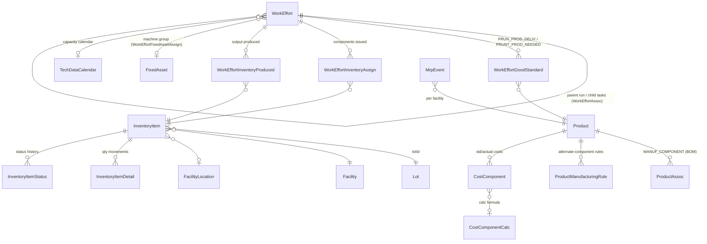

Diagram basis: entity definitions in `applications/datamodel/entitydef/workeffort-entitymodel.xml` (WorkEffort :184-260, WorkEffortInventoryAssign :597, WorkEffortInventoryProduced :616), `product-entitymodel.xml` (InventoryItem :1953, InventoryItemDetail :2125, InventoryItemStatus :2222, Lot :2419, Facility :996, FacilityLocation :1281, ProductAssoc :2935, CostComponent :788), `manufacturing-entitymodel.xml` (ProductManufacturingRule :43, TechDataCalendar :80, MrpEvent :166). Confidence: High (entities), Medium (cardinality arrows inferred from relation declarations).

##### Business consequences of the design

- **Everything-is-a-WorkEffort**: production runs, tasks, routings and routing tasks all share one table/state framework. This gives uniform scheduling, party assignment and status history for free, but means manufacturing semantics (e.g. "a task belongs to a confirmed run") are enforced in service code, not the schema. Confidence: High.
- **Metadata-driven vocabulary**: statuses, types and transitions are seed data rows (`StatusItem`, `StatusValidChange`), so Plant B could have customised the lifecycle without code changes; conversely, nothing in the schema prevents an implementer from weakening the shipped gating. Confidence: High.
- **Lot tracking is optional**: `InventoryItem.lotId` is nullable and `Lot` carries only id/date/quantity/expiration (`product-entitymodel.xml:2419-2427`). Traceability exists only where operators supply lot ids; there is no mandatory genealogy enforcement. Confidence: High.
- **Quality is not a first-class domain**: there is no QC/inspection entity family in the shipped datamodel (see §G); rejects are recorded as a bare `quantityRejected` number on the task (`workeffort-entitymodel.xml:227`). Confidence: High.

#### C. Functional layer

##### Capability inventory

| Capability | Depth description | Evidence | Confidence |
|---|---|---|---|
| Production run lifecycle | Full job-shop lifecycle: create run from product+routing+BOM, schedule, confirm ("doc printed"), start, complete, close, cancel; header status cascades to tasks | `ProductionRunServices.changeProductionRunStatus` (`applications/manufacturing/src/main/java/org/apache/ofbiz/manufacturing/jobshopmgt/ProductionRunServices.java:605`), statuses/transitions in `WorkEffortSeedData.xml:160-177` | High |
| Quick status progression | `quickChangeProductionRunStatus` chains the intermediate transitions to reach a target status | `ProductionRunServices.java:3240` | High |
| BOM definition & explosion | Multi-level BOM as `ProductAssoc` type `MANUF_COMPONENT`; tree explosion, low-level-code maintenance, manufacturing-component resolution, alternate-component substitution rules | `BOMTree.java`, `BOMServices.java:124` (`updateLowLevelCode`), `:352` (`getManufacturingComponents`); assoc type `ProductSeedData.xml:81`; rules `manufacturing-entitymodel.xml:43` | High |
| Routing definition | Routings/tasks as `WorkEffort` types `ROUTING`/`ROU_TASK` linked via `ROUTING_COMPONENT` assocs; product→routing binding via `ROU_PROD_TEMPLATE` | `WorkEffortSeedData.xml:52-53`, `:29`, `:63`; `services_routing.xml`, `RoutingServices.java` | High |
| Capacity calendars | `TechDataCalendar` with week/exception-day structures used to compute task start/end across working time | `manufacturing-entitymodel.xml:80-155`; `TechDataServices.java` | High |
| Material issue & backflush | Components issued to tasks (`issueProductionRunTask`), recorded as `WorkEffortInventoryAssign`; optional `lotId` and `failIfItemsAreNotAvailable` hard stop | `ProductionRunServices.java:939`, `services_production_run.xml:219-228`, `workeffort-entitymodel.xml:597` | High |
| Production declaration | `productionRunProduce` / `productionRunTaskProduce` create `InventoryItem`s and `WorkEffortInventoryProduced` links; auto-creates `Lot` when a new lotId is declared (`createLotIfNeeded`) | `ProductionRunServices.java:1725`, `:1798-1806`, `:2100` | High |
| MRP | Single-facility MRP: `initMrpEvents` builds demand/supply `MrpEvent`s from open orders, requirements and QOH; `executeMrp` nets and emits proposed orders | `MrpServices.java:62`, `:618`; `services_mrp.xml:28-47`; `MrpEvent` entity `manufacturing-entitymodel.xml:166` | High |
| Inventory reservations | Order reservations against `InventoryItem`s with pluggable pick strategy: FIFO/LIFO by received date, FIFO/LIFO by expiry (FEFO), greater/lesser unit cost; default FIFO-received | `applications/product/minilang/product/inventory/InventoryReserveServices.xml:48-69` | High |
| Inventory statuses / holds | Serialized and non-serialized status sets incl. On Hold and Defective (`INV_NS_ON_HOLD`, `INV_NS_DEFECTIVE`); status history in `InventoryItemStatus` | `ProductSeedData.xml:536-549`; `product-entitymodel.xml:2222` | High |
| Physical inventory & variance | `PhysicalInventory` + `InventoryItemVariance` with ATP/QOH variance quantities and reason codes | `product-entitymodel.xml:2428-2436` (PhysicalInventory), `:2309-2330` (InventoryItemVariance) | High |
| Costing hooks | Standard cost roll-up via `CostComponent`/`CostComponentCalc` (custom-method formulas); actual task costs booked at task completion via `createProductionRunTaskCosts` | `product-entitymodel.xml:788-830`; `ProductionRunServices.java:996-1050` | High |
| Facility/warehouse structure | Facility hierarchy (parent facility), typed `FacilityLocation` (area/aisle/section/level/position), product default locations | `product-entitymodel.xml:996-1019`, `:1281-1298` | High |
| Maintenance | `FixedAssetMaint` work orders tied to WorkEffort, meter readings, maintenance-per-order views | `accounting-entitymodel.xml:800`, `:1137` | High |
| Labour/time tracking | `TimeEntry`/`Timesheet` entities linked to WorkEffort; task actual setup/run milliseconds captured | `workeffort-entitymodel.xml:42-111` | High |

##### Core state machines

###### Production run lifecycle (header)

States: **High** confidence — seeded as `StatusItem`s of type `PRODUCTION_RUN` (`WorkEffortSeedData.xml:160-166`). Arrows: **High** confidence — every arrow below is a seeded `StatusValidChange` row (`WorkEffortSeedData.xml:168-177`), enforced generically in `updateWorkEffort` (`applications/workeffort/src/main/groovy/org/apache/ofbiz/workeffort/workeffort/workeffort/WorkEffortServicesScript.groovy:247-253`) and specifically in `changeProductionRunStatus` (`ProductionRunServices.java:605` ff.).

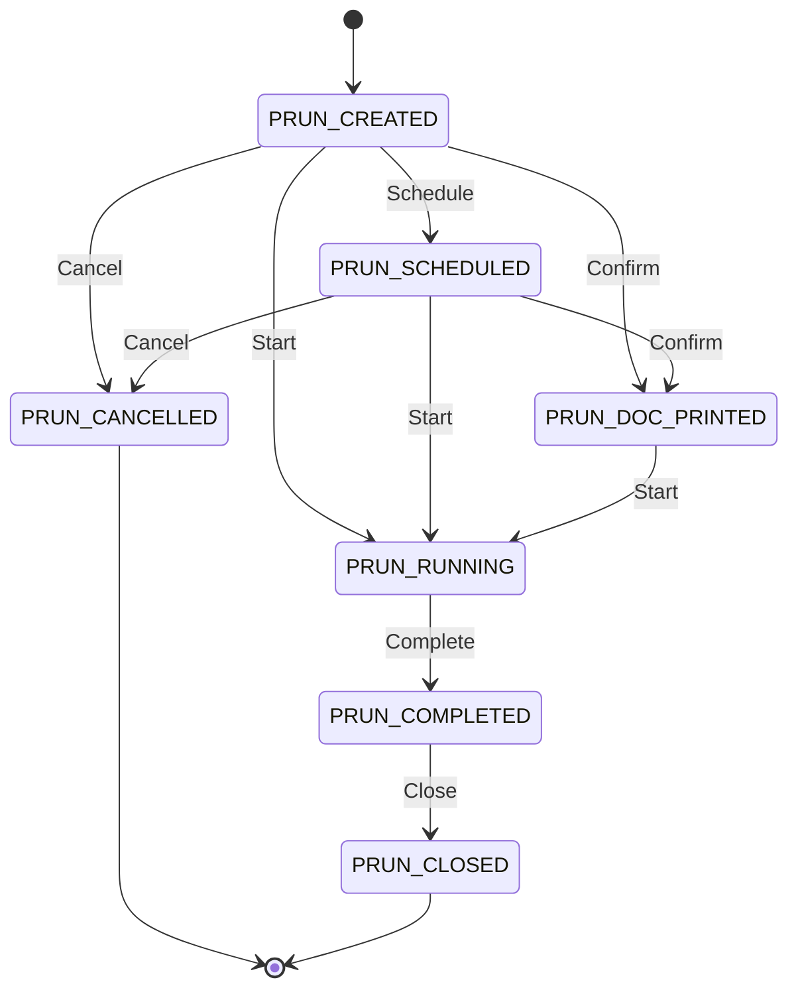

Production run **tasks** reuse the same `PRUN_*` status ids and are cascaded by the header service (each header transition loops over `productionRun.getProductionRunRoutingTasks()` and updates task status — `ProductionRunServices.java:605-700` region). Confidence: High.

###### Routing (process definition) lifecycle

States: **High** — `ROU_ACTIVE` ("Well defined and usable") and `ROU_INACTIVE` ("Not well defined and unusable"), status type `ROUTING_STATUS` (`WorkEffortSeedData.xml:154-155`). Arrows: **Medium** — no `StatusValidChange` rows are seeded for `ROU_*`; toggling is a plain field update, so the arrows below are inferred usage, not enforced transitions. There is **no approval/versioning workflow** for routings or BOMs.

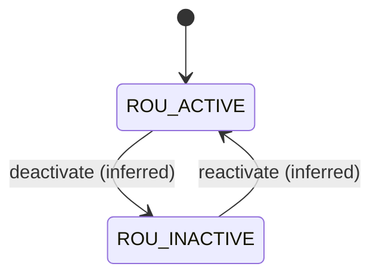

###### Inventory item status (batch blocking proxy)

States: **High** — non-serialized inventory status type `INV_NON_SER_STTS`: `INV_NS_ON_HOLD`, `INV_NS_DEFECTIVE`, `INV_NS_RETURNED` (`ProductSeedData.xml:547-549`); serialized set includes `INV_AVAILABLE`, `INV_PROMISED`, `INV_ON_HOLD`, `INV_DEFECTIVE` etc. (`:536-546`). Arrows: **Medium** — no `StatusValidChange` rows seeded for `INV_*`; transitions are unconstrained field updates via inventory services.

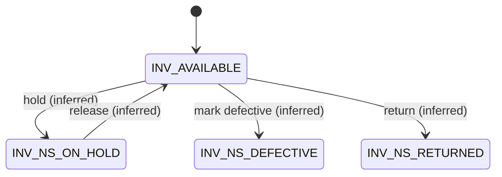

There is **no batch/quality state machine**: `Lot` has no status field at all (`product-entitymodel.xml:2419-2427`), so blocking happens per inventory item, not per lot. Confidence: High.

##### Key business rules / validations / gating

| Rule | Behaviour | Evidence | Confidence |
|---|---|---|---|
| Status-transition whitelist | Any `WorkEffort` status change is rejected unless a matching `StatusValidChange` row exists ("WorkEffortStatusChangeNotValid" error) | `WorkEffortServicesScript.groovy:247-253` | High |
| Hard-coded lifecycle branches | `changeProductionRunStatus` implements each legal `PRUN_*` transition as an explicit branch; unknown transitions fall through to an error | `ProductionRunServices.java:605` ff. | High |
| Status history audit | Every valid transition writes a `WorkEffortStatus` row with timestamp and `setByUserLogin` | `WorkEffortServicesScript.groovy:254-258` | High |
| Component availability hard stop | `issueProductionRunTask` accepts `failIfItemsAreNotAvailable`; when a `lotId` is supplied it is forced to "Y" (cannot issue unavailable lot stock) | `services_production_run.xml:219-228` | High |
| Lot auto-creation on declaration | `productionRunProduce` looks up the declared `Lot`; if missing and `createLotIfNeeded` (default true) it creates one, else errors | `ProductionRunServices.java:1798-1806` | High |
| Reservation pick-order strategy | Reservation order-by is derived from `reserveOrderEnumId` (`INVRO_FIFO_REC` default, `INVRO_FIFO_EXP` = FEFO, LIFO and unit-cost variants) | `InventoryReserveServices.xml:48-69` | High |
| Actual cost booking at task completion | On task completion the service books `CostComponent`s from `ProductCostComponentCalc`/`CostComponentCalc` formulas | `ProductionRunServices.java:996-1050` | High |
| Permission gating | Manufacturing screens/services check `MANUFACTURING_*` permissions via `Security.hasEntityPermission` (`_VIEW`/`_CREATE`/`_UPDATE`/`_DELETE`/`_ADMIN` convention) | `framework/security/src/main/java/org/apache/ofbiz/security/Security.java:89-141`; seed `ManufacturingSecurityPermissionSeedData.xml:23-27` | High |

#### D. Technical layer

**Languages / versions** (from manifests, Confidence: High):
- Java 17 (`build.gradle:156-157`, `sourceCompatibility(JavaVersion.VERSION_17)`), built with Gradle.
- Embedded Apache Tomcat 10.1.47 (`dependencies.gradle:63-64`), Apache Derby 10.16.1.1 as default embedded DB (`dependencies.gradle:99`), any JDBC RDBMS supported via entity engine config.
- Groovy for scripted services/screen logic, FreeMarker for templating, XML for entity/service/widget definitions.

**Architecture**: component-based monolith. Each component (`ofbiz-component.xml`) declares entity models, service definitions, seed data, webapps and screen widgets. Three generic engines dominate:
1. **Entity engine** — metadata ORM: entities declared in XML (`applications/datamodel/entitydef/*.xml`), accessed via `Delegator`; DB-agnostic, supports view-entities (SQL-view-like joins declared in XML). Confidence: High.
2. **Service engine** — all business logic is invoked as named services (`servicedef/*.xml`) through a `Dispatcher`; engines include Java, Groovy, simple/minilang, entity-auto (CRUD generated from entity), SOAP client and HTTP (`framework/service/src/main/java/org/apache/ofbiz/service/engine/` — `SOAPClientEngine.java`, `HttpEngine.java`, `EntityAutoEngine.java`). Service ECAs (`secas.xml`) provide event triggers. Confidence: High.
3. **Widget engine** — screens/forms/menus declared in XML (`applications/manufacturing/widget/manufacturing/*.xml`: `JobshopScreens.xml`, `ProductionRunForms.xml`, `BomScreens.xml`, `MrpScreens.xml`, `RoutingScreens.xml`, `CostScreens.xml`, `ReportScreens.xml`) rendered by themes. Confidence: High.

**Persistence model**: relational, one table per XML entity; optimistic-ish generic CRUD; multi-tenant capable via delegator configuration. Status/type vocabularies are data rows, not enums. Confidence: High.

**Extensibility model**: new components can add entities (extend-entity), services, SECAs and screens without touching core; the plugin system (`plugins/` — empty at this commit, populated via `pullAllPluginsSource.sh`) is the standard extension route. Confidence: High.

**Test coverage signals**: XML test-suites per component (~210 `test-case` elements across `applications/*/testdef` and `framework/*/testdef`) plus ~84 `*Test*.java` files. Manufacturing has one suite: `applications/manufacturing/testdef/productionruntests.xml` driving `minilang/test/ProductionRunTests.xml` — thin coverage relative to module size. Confidence: Medium (counts are static, not executed).

**Maintenance / commit activity**: active upstream project — 186 commits since 2025-01-01; latest commit 2026-01-22; history back to 2006-07-01. Repo is a mirror of Apache trunk with no visible Plant-B-specific commits at this SHA. Confidence: High.

#### E. Non-functional snapshot

- **Security model**: authentication via `UserLogin`; authorisation via flat permission strings in `SecurityGroupPermission` checked with `hasEntityPermission(entity, action, ...)` incl. `_ADMIN` override convention (`framework/security/src/main/java/org/apache/ofbiz/security/Security.java:89-141`). Webapp-level `base-permission` gating per component. No attribute-/row-level security shipped. Confidence: High.
- **Auditability**: (a) per-field audit via `enable-audit-log="true"` writing to `EntityAuditLog` (`framework/entity/entitydef/entitymodel.xml:39`) — but only 17 fields across the whole applications datamodel carry the flag (e.g. `order-entitymodel.xml:545`), none in manufacturing entities; (b) status history rows (`WorkEffortStatus`, `InventoryItemStatus`) with user + timestamp; (c) `InventoryItemDetail` as an append-only quantity ledger. No electronic-signature construct anywhere (searched `signature|e-sign` under `applications/manufacturing` — no hits). Confidence: High.
- **Scalability signals**: stateless service engine, async/job scheduler (`GenericAsyncEngine`), Tomcat-HA dependency (`tomcat-catalina-ha`, `dependencies.gradle:63`), entity-engine connection pooling and multi-datasource support. Single-process monolith otherwise; MRP is single-threaded per facility run. Confidence: Medium.
- **Technical health / age**: codebase dates to 2006 but is actively modernised (Java 17, Tomcat 10.1, jQuery 4 migration in HEAD commit). Large minilang (XML-scripted) surface remains (e.g. inventory reservation logic) — a deprecated technology upstream is migrating away from; Groovy/Java coexist with it. Overall: old but maintained framework; manufacturing module functionally frozen for years (few manufacturing-specific commits in recent history). Confidence: Medium.

#### F. Evidence index

All paths relative to repo root at commit `ecf2990fd62a16431ad08f124260c309230a32f0`. All entries re-read and verified at these lines.

| # | File path | Lines | Proves | Confidence |
|---|---|---|---|---|
| 1 | `VERSION` | 1 | Declared version "Trunk" (unreleased snapshot) | High |
| 2 | `build.gradle` | 156-157 | Java 17 source/target compatibility | High |
| 3 | `dependencies.gradle` | 63-64, 99 | Tomcat 10.1.47, Derby 10.16.1.1 | High |
| 4 | `applications/datamodel/data/seed/WorkEffortSeedData.xml` | 160-166 | Production run status set (`PRUN_CREATED`…`PRUN_CANCELLED`) | High |
| 5 | `applications/datamodel/data/seed/WorkEffortSeedData.xml` | 168-177 | Seeded `StatusValidChange` transition whitelist for `PRUN_*` | High |
| 6 | `applications/datamodel/data/seed/WorkEffortSeedData.xml` | 52-53, 29, 63-67 | Routing/RoutingTask WorkEffort types, `ROUTING_COMPONENT` assoc, `WorkEffortGoodStandard` types (`PRUN_PROD_DELIV`, `PRUNT_PROD_NEEDED`, `ROU_PROD_TEMPLATE`) | High |
| 7 | `applications/datamodel/data/seed/WorkEffortSeedData.xml` | 154-155 | Routing statuses `ROU_ACTIVE`/`ROU_INACTIVE`; no ROU StatusValidChange rows | High |
| 8 | `applications/datamodel/data/seed/WorkEffortSeedData.xml` | 184-186 | `WEGS_*` statuses for WorkEffort-product links | High |
| 9 | `applications/manufacturing/src/main/java/org/apache/ofbiz/manufacturing/jobshopmgt/ProductionRunServices.java` | 605 | `changeProductionRunStatus` service (per-transition branches, task cascade) | High |
| 10 | `applications/manufacturing/src/main/java/org/apache/ofbiz/manufacturing/jobshopmgt/ProductionRunServices.java` | 3240 | `quickChangeProductionRunStatus` chained transitions | High |
| 11 | `applications/manufacturing/src/main/java/org/apache/ofbiz/manufacturing/jobshopmgt/ProductionRunServices.java` | 1725, 1798-1806 | `productionRunProduce`; lot lookup and auto-create (`createLotIfNeeded`) | High |
| 12 | `applications/manufacturing/src/main/java/org/apache/ofbiz/manufacturing/jobshopmgt/ProductionRunServices.java` | 996-1050 | Actual cost booking via `createProductionRunTaskCosts` and `CostComponentCalc` | High |
| 13 | `applications/workeffort/src/main/groovy/org/apache/ofbiz/workeffort/workeffort/workeffort/WorkEffortServicesScript.groovy` | 247-258 | Generic `StatusValidChange` enforcement + `WorkEffortStatus` history write in `updateWorkEffort` | High |
| 14 | `applications/manufacturing/servicedef/services_production_run.xml` | 219-228 | `failIfItemsAreNotAvailable` hard stop; forced when `lotId` supplied | High |
| 15 | `applications/manufacturing/servicedef/services_mrp.xml` | 28-47 | MRP services (`executeMrp`, `initMrpEvents`, `findProductMrpQoh`) | High |
| 16 | `applications/manufacturing/src/main/java/org/apache/ofbiz/manufacturing/mrp/MrpServices.java` | 62, 618 | MRP event initialisation and netting run | High |
| 17 | `applications/manufacturing/src/main/java/org/apache/ofbiz/manufacturing/bom/BOMServices.java` | 124, 352 | Low-level-code maintenance; BOM component resolution | High |
| 18 | `applications/datamodel/entitydef/manufacturing-entitymodel.xml` | 43, 80, 166 | `ProductManufacturingRule`, `TechDataCalendar`, `MrpEvent` entities | High |
| 19 | `applications/datamodel/data/seed/ProductSeedData.xml` | 81 | BOM assoc type `MANUF_COMPONENT` | High |
| 20 | `applications/datamodel/data/seed/ProductSeedData.xml` | 536-549 | Inventory status sets incl. On Hold / Defective (serialized + non-serialized) | High |
| 21 | `applications/datamodel/entitydef/product-entitymodel.xml` | 1953-2010 | `InventoryItem` entity; `lotId` field (1967); FK to `Lot` (2007) | High |
| 22 | `applications/datamodel/entitydef/product-entitymodel.xml` | 2419-2427 | `Lot` entity: only id, creationDate, quantity, expirationDate; no status | High |
| 23 | `applications/datamodel/entitydef/product-entitymodel.xml` | 2125, 2222 | `InventoryItemDetail` ledger; `InventoryItemStatus` history | High |
| 24 | `applications/datamodel/entitydef/product-entitymodel.xml` | 996-1019, 1281-1298 | `Facility` (parent hierarchy), `FacilityLocation` | High |
| 25 | `applications/datamodel/entitydef/product-entitymodel.xml` | 788-830 | `CostComponent` entity, FK to `CostComponentCalc` | High |
| 26 | `applications/datamodel/entitydef/product-entitymodel.xml` | 2935 | `ProductAssoc` entity (BOM carrier) | High |
| 27 | `applications/product/minilang/product/inventory/InventoryReserveServices.xml` | 48-69 | Reservation pick strategies: `INVRO_FIFO_REC` (default), `INVRO_FIFO_EXP` (FEFO), LIFO, unit-cost | High |
| 28 | `applications/datamodel/entitydef/workeffort-entitymodel.xml` | 189, 225-227 | `WorkEffort.currentStatusId`, `quantityToProduce/Produced/Rejected` | High |
| 29 | `applications/datamodel/entitydef/workeffort-entitymodel.xml` | 597, 616 | `WorkEffortInventoryAssign`, `WorkEffortInventoryProduced` (genealogy links) | High |
| 30 | `applications/datamodel/entitydef/workeffort-entitymodel.xml` | 42-111 | `TimeEntry`/`Timesheet` labour tracking | High |
| 31 | `applications/manufacturing/data/ManufacturingSecurityPermissionSeedData.xml` | 23-30 | Five `MANUFACTURING_*` permissions; grant only to `SUPER` group | High |
| 32 | `framework/security/entitydef/entitymodel.xml` | 136-232 | `SecurityGroup`/`SecurityGroupPermission`/`SecurityPermission`/`UserLoginSecurityGroup` model | High |
| 33 | `framework/security/src/main/java/org/apache/ofbiz/security/Security.java` | 89-141 | `hasEntityPermission` incl. `_ADMIN` convention | High |
| 34 | `framework/entity/entitydef/entitymodel.xml` | 39 | `EntityAuditLog` entity (field-level audit) | High |
| 35 | `applications/datamodel/entitydef/order-entitymodel.xml` | 545 | Example `enable-audit-log="true"` field (rare: 17 flags repo-wide) | High |
| 36 | `applications/datamodel/entitydef/accounting-entitymodel.xml` | 630, 800, 1137 | `FixedAsset`, `FixedAssetMaint`, maint-WorkEffort view | High |
| 37 | `framework/common/entitydef/entitymodel.xml` | 507, 548, 569 | `Uom`, `UomConversion`, `UomConversionDated` | High |
| 38 | `applications/manufacturing/testdef/productionruntests.xml` | 20-30 | Sole manufacturing test suite (minilang-driven) | High |
| 39 | `framework/service/src/main/java/org/apache/ofbiz/service/engine/` | dir | Service engines incl. `SOAPClientEngine.java`, `HttpEngine.java`, `EntityAutoEngine.java` | High |
| 40 | `applications/manufacturing/config/ManufacturingUiLabels.xml` | whole file | ~5,100 localized label values across 18 language codes | High |
| 41 | `applications/manufacturing/widget/manufacturing/` | dir | Declarative shop-floor UI screens (`JobshopScreens.xml`, `ProductionRunForms.xml`, `MrpScreens.xml`, `ReportScreens.xml` …) | High |

#### G. Capability ratings (for parent merge)

| Capability | Rating | Justification (one line) |
|---|---|---|
| Production order lifecycle & state machine | **Rich** | 7 seeded states with `StatusValidChange` whitelist + per-transition service logic and task cascade (`WorkEffortSeedData.xml:160-177`; `ProductionRunServices.java:605`). |
| Execution gating / hard stops | **Adequate** | Transition whitelist + optional `failIfItemsAreNotAvailable` (forced for lot issues) (`services_production_run.xml:219-228`); no QC-gated or e-sign-gated steps. |
| Shop-floor execution UI | **Adequate** | Full declarative jobshop screens (start/issue/declare/complete) (`applications/manufacturing/widget/manufacturing/JobshopScreens.xml`, `ProductionRunForms.xml`); desktop web forms, no operator-terminal ergonomics. |
| BOM/recipe/routing definition | **Rich** | Multi-level BOM (`MANUF_COMPONENT`, `ProductSeedData.xml:81`) with low-level codes and substitution rules (`BOMServices.java:124`; `manufacturing-entitymodel.xml:43`), routings as WorkEffort templates (`WorkEffortSeedData.xml:52-53`). |
| Recipe lifecycle governance / approval | **Basic** | Only a two-state active/inactive flag on routings with no enforced transitions or approval workflow (`WorkEffortSeedData.xml:154-155`). |
| ISA-88 batch recipes | **Absent** | No recipe/phase/procedure model; searched `recipe|isa-88|isa88` in `applications/manufacturing` and datamodel entitydefs — no hits. |
| Batch/lot master data | **Basic** | `Lot` entity has only id/creationDate/quantity/expirationDate, no status, vendor batch, or QC fields (`product-entitymodel.xml:2419-2427`). |
| Batch genealogy / traceability (system-of-record) | **Basic** | Consumed/produced inventory linked to tasks (`WorkEffortInventoryAssign`/`Produced`, `workeffort-entitymodel.xml:597,616`) and optional `lotId` on `InventoryItem` (:1967), but lot use is optional so genealogy is not guaranteed complete. |
| Batch blocking / quarantine | **Basic** | Item-level On-Hold/Defective statuses exist (`ProductSeedData.xml:547-549`) but no lot-level state, no seeded transition control, no release workflow. |
| Quality inspection engine | **Absent** | No inspection plan/result entities; searched `quality|inspection` in `applications/datamodel/entitydef/product-entitymodel.xml` and manufacturing component — only `quantityRejected` field (`workeffort-entitymodel.xml:227`). |
| Certificates of analysis | **Absent** | Searched `certificate of analysis|certificateOfAnalysis|CoA` across `applications/` — no hits. |
| Parametric / spec-based QC | **Absent** | No specification/test-parameter entities in the datamodel; no code evidence found (same searches as above). |
| Warehouse structure (locations/pallets) | **Adequate** | Facility hierarchy + typed `FacilityLocation` (area/aisle/section/level/position) (`product-entitymodel.xml:996-1298`); no pallet/handling-unit (container entity exists but unused in manufacturing flows). |
| FEFO/FIFO picking | **Adequate** | Reservation strategies FIFO/LIFO by receipt or expiry incl. `INVRO_FIFO_EXP` = FEFO (`InventoryReserveServices.xml:48-69`); applies to order reservations, not directed putaway/picking. |
| Stock reservations | **Rich** | `OrderItemShipGrpInvRes` reservation flow with strategy, ATP/QOH split and `InventoryItemDetail` ledger (`InventoryReserveServices.xml`; `product-entitymodel.xml:2125`). |
| Inventory valuation / costing | **Adequate** | `CostComponent`/`CostComponentCalc` standard-cost model plus actual task-cost booking (`product-entitymodel.xml:788-830`; `ProductionRunServices.java:996-1050`); unit costs on items; no perpetual FIFO-layer valuation engine in scope. |
| Production planning / MRP | **Adequate** | Working single-facility MRP netting engine producing proposed orders (`MrpServices.java:62,618`); infinite capacity, no optimisation. |
| Finite capacity scheduling | **Basic** | `TechDataCalendar` working-time calendars drive task start/end computation (`manufacturing-entitymodel.xml:80-155`; `TechDataServices.java`), but no capacity levelling or sequencing engine. |
| Master data (items/products, work centres, partners) | **Rich** | Full `Product` model, work centres as `FixedAsset` machine groups (`services_routing.xml:32`; `accounting-entitymodel.xml:630`), unified `Party` model. |
| Units of measure & conversions | **Rich** | `Uom`, `UomConversion`, dated conversions (`framework/common/entitydef/entitymodel.xml:507-569`). |
| Hazmat / regulatory data | **Absent** | Searched `hazmat|hazardous|unNumber|msds` in `applications/datamodel/entitydef/*.xml` — no hits. |
| SCADA/OPC-UA or device integration | **Absent** | Searched `opc|scada|mqtt|modbus` across `framework/` and `applications/` — only incidental substring matches in label files, no integration code. |
| External system integration (API/ERP/WMS) | **Adequate** | Service engine exposes SOAP/HTTP client engines and export flags (`framework/service/src/main/java/org/apache/ofbiz/service/engine/SOAPClientEngine.java`, `HttpEngine.java`); no manufacturing service is marked `export="true"` at this commit (grep count = 0), REST lives in plugins not present here. |
| Reporting / analytics | **Basic** | Declarative report screens (`applications/manufacturing/widget/manufacturing/ReportScreens.xml`) and FTL print-outs; no analytics/warehouse layer in this repo (BIRT is a plugin, absent). |
| Labour / time tracking | **Adequate** | `TimeEntry`/`Timesheet` linked to WorkEffort tasks (`workeffort-entitymodel.xml:42-111`). |
| Maintenance management | **Adequate** | `FixedAssetMaint` work orders, meters, WorkEffort-linked maintenance views (`accounting-entitymodel.xml:800-1140`). |
| Audit trail / e-signatures | **Basic** | Status history + `EntityAuditLog` exist (`framework/entity/entitydef/entitymodel.xml:39`) but only 17 audited fields repo-wide and none in manufacturing; no e-signature support (searched `signature|e-sign` in `applications/manufacturing`). |
| Multi-plant support | **Adequate** | `Facility` hierarchy with parent links and per-facility inventory/MRP (`product-entitymodel.xml:996-1019`; `MrpServices.java:618` facility parameter); no inter-plant orchestration. |
| Localisation / i18n | **Rich** | ~5,100 localized values in 18 languages for manufacturing alone (`applications/manufacturing/config/ManufacturingUiLabels.xml`). |
| Role-based access control | **Basic** | Real group/permission model (`framework/security/entitydef/entitymodel.xml:136-232`) but manufacturing ships only 5 CRUD permissions granted solely to `SUPER` — no functional roles (`ManufacturingSecurityPermissionSeedData.xml:23-30`). |

---

---

## 4. Common capability model

A neutral MES/production capability taxonomy of 30 capabilities in 8 areas, derived from the manufacturing-execution domain (order execution, recipe/BOM, traceability, quality, warehouse, planning, platform, cross-cutting) — deliberately not taken from any one application's vocabulary. Ratings: **Rich / Adequate / Basic / Absent**, each grounded in the citations of the application chapters (Part 3, sections C/F/G of each). Confidence is High unless noted.

| # | Capability | Qcadoo MES (Plant A) | ERPNext (Plant C) | OFBiz (Plant B) |
|---|---|---|---|---|
| **Order execution** | | | | |
| 1 | Production order lifecycle & state machine | **Rich** — 7-state enum with encoded transitions (`OrderState.java:31-81`) | **Rich** — 10 shipped statuses derived from postings (`work_order.json:124`; `services/status.py:107-191`) | **Rich** — 7 seeded states + `StatusValidChange` whitelist (`WorkEffortSeedData.xml:160-177`) |
| 2 | Execution gating / hard stops | **Adequate** — field/stock-level gates at state change (`OrderStateValidationService.java:44-63`) | **Rich** — QI stop, expired-batch throw, over-production errors (`stock_ledger_entry.py:287-299`; `services/status.py:29-47`) | **Adequate** — transition whitelist + availability stop (`services_production_run.xml:219-228`) |
| 3 | Shop-floor execution UI | **Adequate** — kanban dashboards, tracking terminals | **Adequate** — Shop Floor / Visual Plant Floor pages (`manufacturing/page/shop_floor/`) | **Adequate** — declarative jobshop screens (`JobshopScreens.xml`) |
| 4 | Labour / time tracking | **Adequate** — shifts, wage groups, tracking labor time | **Adequate** — Job Card time logs, pause/resume (`job_card.py:1371-1397`) | **Adequate** — `TimeEntry`/`Timesheet` (`workeffort-entitymodel.xml:42-111`) |
| **Recipe / BOM** | | | | |
| 5 | BOM / recipe / routing definition | **Rich** — hierarchical TOC tree (`TechnologyOperationComponentFields.java:34-58`) | **Rich** — versioned multi-level BOM + Routing (`bom.py`) | **Rich** — `MANUF_COMPONENT` BOM + WorkEffort routings (`BOMServices.java`) |
| 6 | Recipe lifecycle governance / approval | **Rich** — 5-state approval + ~20 validators (`TechnologyState.java:33-66`; `TechnologyValidationService.java`) | **Basic** — docstatus + is_active/is_default only (`bom.py:429-440`) | **Basic** — active/inactive flag, unenforced (`WorkEffortSeedData.xml:154-155`) |
| 7 | ISA-88 batch recipes | **Absent** (searched `isa88`, `phase recipe`) | **Absent** (searched `ISA`, `phase`, `recipe`) | **Absent** (searched `recipe`, `isa-88`) |
| **Traceability** | | | | |
| 8 | Batch/lot master data | **Rich** — Batch entity + lot-level resources (`BatchFields.java:32-58`) | **Rich** — Batch with expiry derivation, parent_batch (`batch.py:97-220`) | **Basic** — `Lot` = id/date/qty/expiry only (`product-entitymodel.xml:2419-2427`) |
| 9 | Batch genealogy (system-of-record) | **Rich** — TrackingRecord used/produced tree (`TrackingRecordFields.java:31-49`) | **Adequate** — trace derivable from SLE + bundles; no first-class object (`serial_no_and_batch_traceability/`) | **Basic** — task-level assign/produce links, lot optional (`workeffort-entitymodel.xml:597,616`) |
| 10 | Batch blocking / quarantine | **Adequate** — TRACKED⇄BLOCKED + QC-blocked resources (`BatchState.java:31-44`) | **Basic** — `disabled` flag + expiry stop only (`batch.py:101`) | **Basic** — item-level On-Hold/Defective, no lot state (`ProductSeedData.xml:547-549`) |
| **Quality** | | | | |
| 11 | Quality inspection engine | **Basic** — quality flags/cards, no engine (`ResourceFields.java:84-86`) | **Rich** — typed QIs, templates, gating (`quality_inspection.py:265-336`) | **Absent** (searched `quality|inspection`; only `quantityRejected`) |
| 12 | Parametric / spec-based QC | **Basic** — generic attribute framework, no limits (`AttributeFields.java`) | **Adequate** — per-reading min/max + formula (`quality_inspection.py:284-336`) | **Absent** (no spec entities in datamodel) |
| 13 | Certificates of Analysis | **Absent** (searched `certificate`) | **Absent** (searched `coa`, `certificate of analysis`) | **Absent** (searched `CoA`, `certificate of analysis`) |
| **Warehouse** | | | | |
| 14 | Warehouse structure (locations/pallets) | **Rich** — storage locations, pallets, load units (`storageLocation.xml:37-54`) | **Adequate** — warehouse tree, putaway rules; no pallet object (`warehouse.py:21-53`) | **Adequate** — facility hierarchy + typed locations (`product-entitymodel.xml:996-1298`) |
| 15 | FEFO/FIFO picking | **Rich** — FIFO/LIFO/FEFO/LEFO per warehouse (`WarehouseAlgorithm.java:26-27`) | **Rich** — FIFO/LIFO/Expiry strategy + expiry blocks (`stock_settings.json:363-370`) | **Adequate** — reservation strategies incl. `INVRO_FIFO_EXP` (`InventoryReserveServices.xml:48-69`) |
| 16 | Stock reservations | **Rich** — draft-document + order reservations (`ReservationsService.java:81-247`) | **Rich** — 8-state Stock Reservation Entry incl. batch-level (`stock_reservation_entry.py:530-553`) | **Rich** — reservation flow + `InventoryItemDetail` ledger (`InventoryReserveServices.xml`) |
| 17 | Inventory valuation / costing | **Adequate** — lot prices, cost norms, production balance | **Rich** — FIFO/MA/LIFO/Standard + GL + repost engine (`item.json:387-390`) | **Adequate** — `CostComponent` standard/actual costs (`product-entitymodel.xml:788-830`) |
| **Planning** | | | | |
| 18 | Production planning / MRP | **Adequate** — coverage analysis, min-states (`OrderSuppliesServiceImpl.java`) | **Rich** — Production Plan, MPS, forecast, MRP report (`production_plan/services/material_request.py:141`) | **Adequate** — MRP netting engine (`MrpServices.java:62,618`) |
| 19 | Finite capacity scheduling | **Adequate** — line schedules, TJ/TPZ norms, Gantt (`ScheduleState.java:8-24`) | **Basic** — slot search + CapacityError (`services/operations.py:105-130`) | **Basic** — working-time calendars only (`TechDataCalendar`) |
| **Platform / integration** | | | | |
| 20 | Master data (items, work centres, partners) | **Rich** | **Rich** | **Rich** |
| 21 | Units of measure & conversions | **Adequate** — per-product conversions (`product.xml:55`) | **Rich** — UOM master + per-item table (`uom_conversion_detail.py:17`) | **Rich** — `Uom`/`UomConversion(Dated)` (`framework/common/entitydef/entitymodel.xml:507-569`) |
| 22 | Hazmat / regulatory data | **Absent** (searched `hazard`, `ADR`, `dangerous`) | **Absent** (searched `hazard`, `msds`, `un number`) | **Absent** (searched `hazmat`, `unNumber`, `msds`) |
| 23 | SCADA / OPC-UA / device integration | **Absent** (searched `opc`, `scada`, `mqtt`, `modbus`) | **Absent** (same searches) | **Absent** (same searches) |
| 24 | External system integration (API/ERP/WMS) | **Basic** — external-number sync fields, few REST endpoints | **Adequate** — whitelisted REST/RPC on every DocType | **Adequate** — SOAP/HTTP service engines; nothing exported in manufacturing |
| 25 | Reporting / analytics | **Adequate** — operational PDF/XLSX reports | **Rich** — ~80 manufacturing/stock reports + dashboards | **Basic** — declarative report screens only |
| **Cross-cutting** | | | | |
| 26 | Maintenance management | **Rich** — CMMS 7-state events (`MaintenanceEventState.java:33-86`) | **Basic** — Maintenance Schedule/Visit, Downtime Entry | **Adequate** — `FixedAssetMaint` work orders |
| 27 | Audit trail / e-signatures | **Adequate** — `*StateChange` audit rows; no e-sign | **Adequate** — `track_changes` + immutable ledgers; no e-sign | **Basic** — status history; 17 audited fields repo-wide; no e-sign |
| 28 | Multi-plant support | **Basic** — factory/division entities, one schema | **Rich** — multi-company + Company Restriction (`hooks.py:368-384`) | **Adequate** — facility hierarchy, per-facility MRP |
| 29 | Localisation / i18n | **Rich** — en/pl/fr/de/cn + per-language DB dumps | **Rich** — 36 locales incl. full German | **Rich** — 18 languages in manufacturing labels |
| 30 | Role-based access control | **Rich** — 151 granular roles incl. per-transition | **Rich** — per-DocType role matrices (34 roles) | **Basic** — 5 CRUD permissions to `SUPER` only |

**Rating counts** (Rich / Adequate / Basic / Absent): Qcadoo **11 / 9 / 5 / 5** · ERPNext **14 / 7 / 4 / 5** · OFBiz **5 / 10 / 8 / 7**.

---

## 5. Cross-application comparison

### 5.1 Capability overlap matrix (by area)

| Capability area | Qcadoo | ERPNext | OFBiz | Overlap verdict |
|---|---|---|---|---|
| Order execution & gating | Strong (explicit state machine + listeners) | Strong (posting-derived status + hard stops) | Adequate (seeded whitelist) | Triple overlap — behavioural reconciliation needed |
| Recipe/BOM & governance | Strong (governed technology lifecycle) | Strong BOM, weak governance | Adequate BOM, no governance | Triple overlap; governance depth only in Qcadoo |
| Batch traceability & blocking | Strong (system-of-record genealogy) | Adequate (ledger-derived trace) | Weak (optional lots) | Overlap in intent, not in model |
| Quality | Weak (flags only) | Strong (inspection engine) | Absent | Single real implementation (ERPNext) |
| Warehouse / inventory | Strong physical fidelity | Strong valuation, adequate structure | Adequate | Triple overlap with different centres of gravity |
| Planning / scheduling | Adequate (schedules/Gantt) | Strong (MRP/MPS), weak finite capacity | Adequate MRP | Complementary strengths |
| Maintenance | Strong CMMS | Weak | Adequate | Qcadoo-only depth |
| Platform (RBAC, i18n, multi-plant, extensibility) | Mixed (rich RBAC, single-plant) | Strong across the board | Weak RBAC | ERPNext leads |

### 5.2 Data-model comparison — consolidation-critical concepts

The biggest consolidation risk is **semantic mismatch**: the three systems use overlapping vocabulary for different constructs.

| Concept | Qcadoo MES | ERPNext | OFBiz | Semantic mismatch |
|---|---|---|---|---|
| Production order | `Order` entity, 7-state workflow object; state changed by users, gated by listeners (`OrderState.java`) | `Work Order` submittable document; `status` **derived from stock postings** (`services/status.py:107-144`) | `WorkEffort` row of type `PROD_ORDER_HEADER`; status = seed-data vocabulary (`WorkEffortSeedData.xml:63-67`) | **High** — "status" is user workflow vs posting reflection vs data row; identical words, different truth sources |
| Batch / lot | Two parallel models: genealogy `Batch` (state machine) **and** warehouse `Resource.batch` string (`BatchFields.java`; `ResourceFields.java:48`) | `Batch` master data (no state) + `Serial and Batch Bundle` allocation (`batch.py:97-115`) | `Lot` with no status, optional on `InventoryItem.lotId` (`product-entitymodel.xml:2419,1967`) | **High** — "batch" is a governed lifecycle object vs passive master data vs optional tag; Qcadoo itself has a dual model |
| Stock on hand | Set of lot-level `Resource` rows (each with pallet, location, expiry, price) (`ResourceFields.java:32-90`) | Aggregate `Bin` + immutable `Stock Ledger Entry` stream (`stock_ledger.py`) | `InventoryItem` (serialized or non-serialized qty) + `InventoryItemDetail` ledger (`product-entitymodel.xml:1953,2125`) | **High** — physical-lot rows vs ledger+cache vs item records; migration must pick one truth representation |
| Recipe / process definition | `Technology` = BOM **and** routing in one governed TOC tree (`TechnologyOperationComponentFields.java`) | `BOM` (materials + operations) separate from reusable `Routing` (`bom.py`; `routing/`) | `ProductAssoc` BOM separate from `WorkEffort` routing templates (`ProductSeedData.xml:81`) | **Medium** — unified vs split recipe; Qcadoo approval semantics have no ERPNext/OFBiz counterpart |
| Stock movement | `Document` (5 types) whose acceptance mutates resources (`DocumentType.java:31-35`) | `Stock Entry` submission posts SLEs (`stock_entry.py`) | Service calls writing `InventoryItemDetail` rows | **Medium** — document-centric vs ledger-centric vs service-centric |
| Reservation | `Reservation` rows from draft documents + order reservations (`ReservationsService.java`) | `Stock Reservation Entry` with own 8-state lifecycle (`stock_reservation_entry.json:175`) | `OrderItemShipGrpInvRes` against inventory items | **Medium** — different anchor objects (document vs standalone entry vs order line) |
| Quality result | `qualityRating` / `blockedForQualityControl` flags on resources (`ResourceFields.java:84-86`) | `Quality Inspection` document with readings and Accepted/Rejected status (`quality_inspection.py`) | `quantityRejected` number on task (`workeffort-entitymodel.xml:227`) | **High** — flag vs first-class inspection vs bare count |
| Work centre | `Workstation` / `ProductionLine` in division tree (`basic/model/`) | `Workstation` with live status + capacity (`workstation.json:146`) | `FixedAsset` machine group assigned to WorkEffort (`accounting-entitymodel.xml:630`) | **Medium** — OFBiz models machines as accounting assets |

### 5.3 User-journey comparison

| Journey | Qcadoo MES | ERPNext | OFBiz |
|---|---|---|---|
| Define & approve a recipe | Draft technology → validation battery → `accepted` (immutable, outdated on change) — a real approval journey | Create BOM → submit; activation flags only, no approval step | Define routing + BOM assoc; toggle active flag |
| Plan an order | Master order → order, coverage check, line schedule, Gantt | Production Plan (SO/forecast) → explode sub-assemblies → material requests → Work Orders | Run MRP → proposed requirements → create production run |
| Release to shop floor | `pending → accepted` gated on dates/line/technology; material availability checked at start | Submit WO → reserve stock → transfer materials (WIP warehouse) | `PRUN_CREATED → SCHEDULED → DOC_PRINTED` (confirm = document print) |
| Execute & record | Production tracking records (5-state) per operation/shift; auto warehouse documents | Job Cards per operation with time logs; Manufacture Stock Entry books FG | Start tasks, issue components, declare production per task |
| Trace a defect batch | Genealogy tree browse (`producedFrom` / `usedToProduce`), block batch → propagation via resource filters | Serial/Batch traceability report over SLE + bundles; disable batch | Query `WorkEffortInventoryAssign/Produced` joins — only if lot ids were captured |
| Quality disposition | Block batch / flag resource; no inspection record | Quality Inspection Accepted/Rejected gates the posting document | No journey (no QC entities) |

### 5.4 Business-rule divergence

| Rule domain | Qcadoo | ERPNext | OFBiz | Divergence |
|---|---|---|---|---|
| What blocks order completion | `doneQuantity = 0` blocks completion (`OrderStateValidationService.java:54-63`) | Completion is *automatic* at produced ≥ qty; over-production throws (`services/status.py:208-224`) | `PRUN_RUNNING → PRUN_COMPLETED` allowed regardless of declared qty (only transition whitelist) | Same word "completed", three different guards |
| Expired stock | FEFO ordering only; no hard stop found on issuing expired resources | **Hard stop**: SLE submission throws on expired batch (`stock_ledger_entry.py:287-299`) | Expiry used only as reservation sort key (`INVRO_FIFO_EXP`) | Only ERPNext enforces expiry; consolidation must decide if FEFO is advisory or mandatory |
| Recipe changes after approval | Accepted technology immutable; must be outdated (`TechnologyState.java`) | Submitted BOM replaceable any time via new default | Routing editable in place | Change-control strength differs by an order of magnitude |
| Material availability at release | Checked by listener at order start (`OrderStatesListenerServicePFTD.java:580`) | Not blocking (reservation optional; negative stock configurable) | Optional `failIfItemsAreNotAvailable`, forced for lot issues | Hard vs soft vs optional gate |
| Who may change state | Per-transition roles (e.g. `ROLE_DOCUMENTS_STATES_ACCEPT`) | Per-DocType submit/cancel rights | Any user with `MANUFACTURING_UPDATE` | Granularity gap must be levelled in the target role model |

---

## 6. Fit-gap analysis and golden sources

### 6.1 Scoring criteria and weights

Weights as recorded for the programme in `docs/adr/ADR-001-target-stack.md`: **functional depth 35% · data-model fitness 20% · technical health 20% · extensibility 15% · UX 10%**. Scores 0–4 map from the Part 4 ratings (Absent=0, Basic=1, Adequate=2·5, Rich=4 for functional depth) with data-model/health/extensibility/UX judged from Part 3 sections B/D/E of each chapter. Scoring is per capability *area*, since golden-source decisions are taken at area level.

### 6.2 Golden source per capability area

| Capability area | Golden source | Rationale (weighted) | Runner-up gap |
|---|---|---|---|
| Order lifecycle & execution gating | **Qcadoo (semantics)** | Explicit, role-gated, auditable state machine with listener-enforced gates — the compliance-relevant behaviour (`OrderState.java`; `OrderStateValidationService.java`) | ERPNext statuses are posting reflections; strong hard stops but no user-owned workflow |
| Shop-floor execution recording | **ERPNext** | Job Card time logs, pause/resume, process loss, QI hooks on a healthy platform (`job_card.py`) | Qcadoo tracking records comparable but platform-risky |
| Recipe/BOM definition | **ERPNext** | Versioned multi-level BOM + Routing, costing integration, tooling (`bom.py`) | Qcadoo TOC tree equally capable, less healthy |
| Recipe lifecycle governance | **Qcadoo (semantics)** | 5-state approval with ~20 structural validators and in-use locks (`TechnologyValidationService.java:91-707`) | ERPNext has no approval model at all (Basic) |
| Batch master & genealogy | **Qcadoo (semantics)** | System-of-record TrackingRecord genealogy + batch state machine (`TrackingRecordFields.java`; `BatchState.java`) | ERPNext trace is derived, not first-class |
| Batch blocking / quarantine | **Qcadoo (semantics)** | Reversible blocking propagating into picking exclusions (`ResourceCriteriaModifiers.java:59,70`) | ERPNext only `disabled` flag |
| Quality inspection | **ERPNext** | Only real engine: typed inspections, parametric readings, formula acceptance, configurable transaction gating (`quality_inspection.py:265-336`) | Others Basic/Absent |
| Warehouse physical fidelity | **Qcadoo (semantics)** | Lot-level resources with pallets, storage locations, 4 disposal algorithms, draft-reservations (`ResourceFields.java:32-90`; `WarehouseAlgorithm.java`) | ERPNext lacks pallet/handling-unit object |
| Inventory valuation / costing / GL | **ERPNext** | Perpetual inventory, 4 valuation methods, repost engine, GL integration (`stock_ledger.py`; `repost_item_valuation/`) | Qcadoo costing has no ledger |
| Planning / MRP | **ERPNext** | Production Plan + MPS + forecast + MRP report (`production_plan/`) | OFBiz MRP works but infinite-capacity and frozen |
| Finite capacity scheduling | **Qcadoo (semantics), partial** | Line schedules, changeover norms, TJ/TPZ realization times (`ScheduleState.java`; `OrderRealizationTimeServiceImpl.java`) — still no optimiser anywhere | ERPNext slot search is Basic |
| Master data & UoM | **ERPNext** | Item/variants/UOM depth on the healthiest platform | — |
| Maintenance (CMMS) | **Qcadoo (semantics)** | 7-state role-gated maintenance events, planned events (`MaintenanceEventState.java:33-86`) | ERPNext Basic |
| Platform substrate (RBAC, multi-plant, extensibility, i18n, reporting) | **ERPNext** | Multi-company isolation, per-DocType RBAC, hooks-based extension, CI/test health (`hooks.py`; `.github/workflows/`) | Qcadoo single-schema, ageing |
| Anything from OFBiz | **None** | OFBiz wins no area outright; Adequate everywhere it competes, Absent in quality/traceability depth | Reference + data-migration source only |

"(semantics)" = the winning behaviour is carried as **re-implemented rules/workflows on the target platform**, not as code reuse — the winning implementations are Java listener/enum code (Qcadoo) that cannot be transplanted into a Frappe substrate.

### 6.3 White space — absent in ALL three applications (build or buy)

| Gap | Evidence of absence (searches documented per chapter §G) |
|---|---|
| ISA-88 procedural batch recipes (unit procedures, phases, scaling) | No procedural recipe model in any repo |
| Certificates of Analysis (generation from inspection results) | No CoA doctype/entity/print format anywhere |
| Hazmat / regulatory master data (UN numbers, MSDS/SDS, ADR) | No hazard fields in any product/item model |
| SCADA / OPC-UA / device connectivity | No device-protocol code in any repo |
| Electronic signatures (Part-11-style) on state changes | No e-signature construct in any repo (audit rows/versioning only) |
| Constraint-based finite-capacity optimiser | All three schedule by norms/calendars/slots only |

### 6.4 Fit-gap summary

- **Adopt (platform + breadth):** ERPNext manufacturing/stock/quality substrate — quality engine, planning, valuation, master data, RBAC/multi-plant, reporting.
- **Absorb (depth as re-implemented semantics):** Qcadoo order state machine + gating listeners, technology approval governance, batch genealogy/blocking object model, warehouse physical fidelity (pallets, storage locations, disposal algorithms, draft reservations), CMMS depth.
- **Retire:** OFBiz — no golden capability; treat as data-migration source (parties, products, inventory balances, open production runs) and behavioural reference for Plant B cutover.
- **Build/buy:** the six white-space items above.

This matches the disposition table in `CONSOLIDATION.md`; this dossier supplies the underlying evidence.

---

## 7. Consolidation implications (constraints — explicitly no design)

1. **State-machine reconciliation is unavoidable.** ERPNext derives order status from postings; Qcadoo's compliance behaviour requires user-owned, role-gated transitions. The target must layer an explicit workflow over the anchor's derived statuses without forking anchor DocTypes — every absorbed gate becomes a hook/validator re-implementation with characterisation tests as the parity contract (all Qcadoo rules live in Java listener code and cannot be ported directly).
2. **Two batch models must become one.** Qcadoo's genealogy `Batch` (stateful) and warehouse `Resource.batch` (string) are only conventionally linked, ERPNext's Batch is stateless master data, and OFBiz lots are optional. The consolidated batch object needs: identity, QA state (released/quarantined/blocked), expiry, genealogy links — none of the three provides all four today.
3. **Quarantine semantics exceed every current implementation.** Blocking must propagate through genealogy trees *and* exclude stock from picking; Qcadoo does the latter, none does the former automatically. This is absorbed-plus-extended behaviour, not a port.
4. **Physical-fidelity migration is a data-model migration, not a data copy.** Lot-level `Resource` rows (Plant A) must be decomposed into ERPNext's Bin/SLE/Batch/Bundle representation without losing pallet/storage-location/expiry/price detail; a pallet/handling-unit object does not exist in the anchor and must be added before Plant A stock can be represented at all.
5. **Recipe governance must be grafted onto a governance-free BOM.** ERPNext BOMs are freely replaceable after submit; carrying Qcadoo's approval battery means new workflow states, structural validators and in-use locks on BOM/Routing — with the mismatch that Qcadoo technologies unify BOM+routing while the anchor splits them.
6. **Expiry enforcement policy must be decided estate-wide.** Only ERPNext hard-stops expired consumption; Plant A operates FEFO-advisory. Harmonising to the stricter rule changes Plant A shop-floor behaviour and needs explicit business sign-off, captured as characterisation-test deltas.
7. **Role-model levelling.** Per-transition roles (Qcadoo, 151 roles) must be expressible in the target RBAC; per-DocType matrices alone (ERPNext) cannot express "may accept documents but not corrections". Workflow-state-level permissions are required.
8. **All six white-space capabilities are on the critical path of the chemicals scope** (ISA-88, CoA, hazmat, SCADA, e-signatures, finite-capacity optimisation) — none can be sourced from the estate, so their effort is net-new build/buy regardless of golden-source choices.
9. **OFBiz retirement is a data problem, not a functionality problem.** No capability is lost by retiring it, but Plant B's optional-lot history means backfilled genealogy for pre-cutover stock will be incomplete; the trace boundary date must be recorded and communicated.
10. **Plant A platform risk bounds the timeline.** Qcadoo runs on Java 8/Spring-XML with snapshot dependencies from a third-party Nexus (`nexus.qcadoo.org`) — the longer absorption takes, the longer the estate depends on an unreproducible build chain; archive the artefacts early.

---

## 8. Appendices

### 8.1 Assumptions log

| # | Assumption | Basis / risk |
|---|---|---|
| A1 | The analysed commits are the estate baselines (Plant A = `Chem_mes@81d6bb5`, Plant B = `VM_ofbiz-framework@ecf2990`, Plant C = `Chem_erpnext@31e7970`); plant-specific deltas beyond rebranding are absent from source | Fork history shows only rebrand commits; runtime configuration not inspected |
| A2 | Shipped capability ≈ operated capability; settings-dependent behaviour (ERPNext inspection severity, Qcadoo warehouse algorithms, negative-stock allowances) assessed as capability, not as operated policy | Static analysis limitation (§2.3) |
| A3 | OFBiz optional plugins (REST, BIRT, e-commerce) are out of estate because `plugins/` is empty at the analysed commit | Directory listing at commit |
| A4 | Scoring weights follow ADR-001 (functional 35 / data model 20 / health 20 / extensibility 15 / UX 10); no user-supplied override was provided | Recorded programme decision |
| A5 | ERP-boundary capabilities (finance, buying, selling) are out of MES scope per ADR-002 and were compared only at boundary level | Recorded programme decision |
| A6 | The Qcadoo genealogy `Batch` and warehouse `Resource.batch` refer to the same physical lots in Plant A operations | Model linkage is by convention (chapter 1 §B.4); needs operational confirmation |

### 8.2 Open questions

1. Which ERPNext settings does Plant C actually run (inspection severity Stop vs warn, valuation method per item, negative stock, capacity planning on/off)? These change gating behaviour materially.
2. Does Plant A use the genealogy plugin consistently (TrackingRecords for every production run), or is genealogy partially populated? Determines migration backfill quality.
3. What proportion of Plant B inventory carries `lotId`? Determines the traceability boundary for OFBiz history.
4. Are any Qcadoo customer-specific toggles active in Plant A (e.g. the `ziepiwowarski` plugin toggle found in core order validation)?
5. Which reports from each system are regulatory-required vs convenience — the reporting white-space cannot be sized without this.
6. Is there an external WMS/ERP currently connected to any plant (Qcadoo `externalSynchronized` fields, ERPNext integrations), and must those interfaces survive consolidation?
7. What are Plant B's open production runs / WIP at cutover-planning time (affects W4 backfill scope)?

### 8.3 Evidence index (comparison parts)

Full per-application evidence indices (re-verified at the pinned commits) live in each chapter's Part F. The comparison parts (4–7) cite only evidence already listed there, plus the following parent-verified anchors:

| # | Repo | Path | Lines | Proves | Confidence |
|---|---|---|---|---|---|
| P1 | Chem_mes | `mes-plugins/mes-plugins-orders/src/main/java/com/qcadoo/mes/orders/states/constants/OrderState.java` | 31–81 | 7-state order enum with `canChangeTo` transitions | High |
| P2 | Chem_mes | `mes-plugins/mes-plugins-technologies/src/main/java/com/qcadoo/mes/technologies/states/constants/TechnologyStateStringValues.java` | 33–47 | Technology 5-state vocabulary (draft/accepted/declined/outdated/checked) | High |
| P3 | Chem_mes | `mes-plugins/mes-plugins-advanced-genealogy/src/main/java/com/qcadoo/mes/advancedGenealogy/states/constants/BatchState.java` | 31–44 | Batch TRACKED⇄BLOCKED state machine | High |
| P4 | Chem_mes | `mes-plugins/mes-plugins-material-flow-resources/src/main/java/com/qcadoo/mes/materialFlowResources/constants/WarehouseAlgorithm.java` | 26–27 | FIFO/LIFO/FEFO/LEFO enum | High |
| P5 | Chem_erpnext | `erpnext/manufacturing/doctype/work_order/work_order.json` | 124 | Work Order 10-status enum | High |
| P6 | Chem_erpnext | `erpnext/stock/doctype/batch/batch.py` | 88–115, 192–212 | Batch class fields; expiry derivation | High |
| P7 | Chem_erpnext | `erpnext/quality_management/doctype/` + `erpnext/stock/doctype/quality_inspection/` | dirs | QMS doctypes and Quality Inspection engine exist | High |
| P8 | VM_ofbiz-framework | `applications/datamodel/data/seed/WorkEffortSeedData.xml` | 160–177 | `PRUN_*` statuses and `StatusValidChange` whitelist | High |
| P9 | VM_ofbiz-framework | `applications/datamodel/entitydef/product-entitymodel.xml` | 2007, 2419 | `Lot` entity and `InventoryItem`→`Lot` FK | High |

**Line-number validity note:** all line numbers in this dossier are valid only at the pinned commits listed on the title page.
